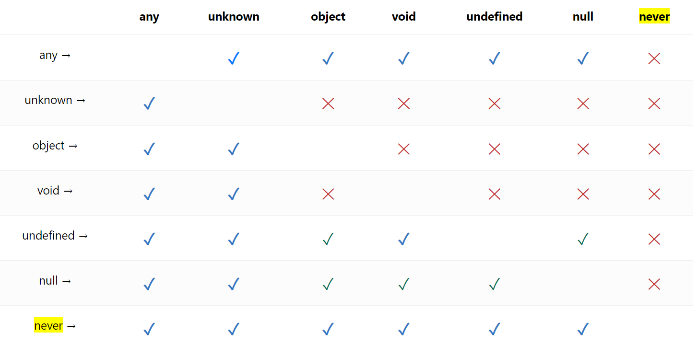
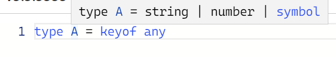
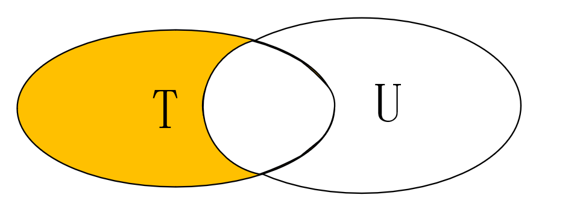
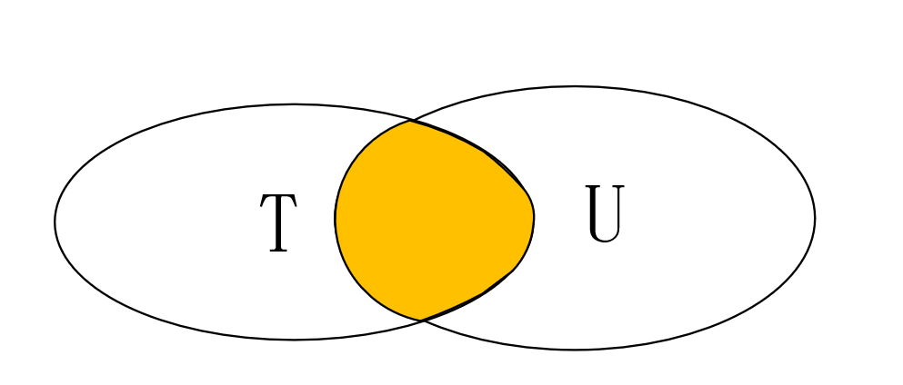
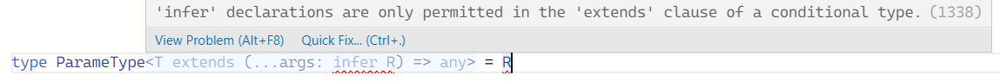

# 泛型

数据结构的本质是什么？

主要包括三个部分：

- 数据本身：
- 数据的形状：例如二叉树中数据以分层的形式排布，每个元素最多由两个子元素。在链表中，数据以链式存储，顺序布局
- 一组保留形状的操作：对链表进行添加，删除节点等操作之后，得到的依然是一个链表

两个专注点：

- 一个是数据，包括数据的类型以及数据结构的实例中保存的实际值
- 另一个是数据的形状和保留形状的操作。

泛型数据结构帮助我们解耦了这些关注点：泛型数据结构处理数据的布局、形状和任何保留形状的操作，它并不关心具体的数据内容，通过将数据布局的职责交付给独立于实际数据内容的泛型数据结构，可以让代码变得组件化。

泛型：泛型为类型提供变量， 一个没有泛型的数组可以容纳任何类型的数组，提供了泛型的数组描述特定类型变量

```ts
type StringArray = Array<string>;
type NumberArray = Array<number>;
```

# Structural Type System

鸭子类型

要求两个对象满足“形状匹配（shape matching）”，而不关心两个对象的具体实现。

```ts
const point3 = { x: 12, y: 26, z: 89 };
logPoint(point3); // logs "12, 26"
 
const rect = { x: 33, y: 3, width: 30, height: 80 };
logPoint(rect); // logs "33, 3"
 
const color = { hex: "#187ABF" };
logPoint(color);
```

另一个例子， {} 创建的字面量对象与类

```ts
class VirtualPoint {
  x: number;
  y: number;
 
  constructor(x: number, y: number) {
    this.x = x;
    this.y = y;
  }
}
 
const newVPoint = new VirtualPoint(13, 56);
logPoint(newVPoint); // logs "13, 56"
```

# interface 与 type的区别

## 官方描述

> Type aliases and interfaces are very similar, and in many cases you can choose between them freely. Almost all features of an `interface` are available in `type`, the key distinction is that a type cannot be re-opened to add new properties vs an interface which is always extendable.

从上面这段话中我们可以得知：

- 几乎`interface`的所有特性都可以用`type`实现
-  `interface`可以添加新的属性，是可扩展的

##　区别一

针对第一点，参考官方对`interface`与`type`的描述：

> - Interfaces are basically a way to describe data shapes, for example, an object.
> - Type is a definition of a type of data, for example, a union, primitive, intersection, tuple, or any other type.

`interface`用来描述数据的形状（data shapes）

> 至于什么是数据的形状呢？ 例如二叉树中数据以分层的形式排布，每个元素最多由两个子元素；在链表中，数据以链式存储，顺序布局，这便是`data shapes`，结合数据本身，以及保留`data shapes`的相关操作（对于链表来说就是对链表节点的添加、删除等，不破坏原有结构），这三者就组成了数据结构。

`type`是数据类型的定义，如**联合类型（A |Ｂ）**、**基本类型**、**交叉类型（Ａ＆B**）、**元组**等，此外type 语句中还可以使用 **`typeof `**获取实例的类型进行赋值。

简而言之，**`interface`右边必须是 `data shapes`, 而`type`右边可以是任何类型。**

> 开头提到`interface`是可扩展的的，也是得益于声明合并，而`type`虽然通过`extends`可以达到类似的效果，但谈不上可扩展。官方描述中也提到:
>
> **`the key distinction is that a type cannot be re-opened to add new properties vs an interface which is always extendable.`**

## 区别二

针对第二点，`interface`支持声明合并（`declaration merging`），`type alias`不支持。

```js
interface Person {
  name: string;
}
interface Person {
  age: number;
}
// 合并为:interface Person { name: string age: number}

type User = {
  name: string;
};
type User = {
  age: number;
};
// error: Duplicate identifier 'User'.
```

## 总结

主要有两点区别：

1. `interface`右边只能是`data shapes`,而`type`右边涵盖的范围更大，还可以是**联合类型（A |Ｂ）**、**基本类型**、**交叉类型（Ａ＆B**）、**元组**等，也可以使用`typeof`
2. `interface`支持声明合并，`type`不支持声明合并。

## 参考

[TS Handbook](https://www.typescriptlang.org/docs/handbook/2/everyday-types.html#interfaces)

# any和unknown有什么区别？

首先是二者的相同点：`unknown`和`any`都是顶层类型，也就是所有类型都可以赋值给`unknown`和`any`

不同点在于**与`any`相比，`unknown`是更符合类型安全原则**的，使用`any`就意味着放弃了类型安全检查，此时你可以对一个`any`类型的的变量进行任何操作，但如果这个变量是`unknown`，你不能直接对它进行操作，因为`unknown`此刻类型是未知的，直接操作可能会出错，需要`unknown`进行**类型收窄**。

> 传统功夫是讲究`化劲儿`的，`any`就是这样一股`化劲儿`，哪里不通怼哪里，`化劲儿`练到最后就可以将`anyscript`修炼到大成，也就是纯正的`Javascript`，即没有类型检查的阶段！

注意观察下面的例子:

> 使用 any 跳过了类型检查，不会报错；

```ts
function sayMyName(callback: any) {
    callback()
}
```

> 同样是顶层类型，unknown 会有类型检查

```ts
function sayMyName(callback: unknown) {
    callback()
} //(parameter) callback: unknown Object is of type 'unknown'.
```

虽然上述例子中，使用`any`时不会爆出类型错误，但是最终运行代码时还是可能会报错，比如运行 `sayMyName(1)`; 但 使用`unknown`时，同样的代码，TS为我们指出了潜在的错误，这也是`TypeScript`的初衷，因此说：**`与`any`相比，`unknown`是更符合类型安全原则的`**。

对使用`unknown`的情形进行类型收窄：

```ts
function sayMyName(callback: unknown) {
    if(typeof callback === 'function') {
        callback()
    }
}
```

将unknown收窄到特定类型，就不会报错了。

也可以使用类型断言达到类似效果

```js
let res: unknown = 123
let a: string = res as string //通过类型检查，但运行报错
const b: number = res as number 

console.log(a.toLocaleLowerCase()) 
// [ERR]: a.toLocaleLowerCase is not a function 
```

# TS中Never有什么作用？

## bottom type

首先, `Never`是一个`bottom type`，这如何体现呢？



注： <p style="color: green">√</p>表示**strictNullChecks**为`false`时的情况

✔

`never`和`unknown`朝着两个相反的方向行进，所有的类型都可以赋值给`unknown`, `never`可以赋值给任何类型；`unknown`不能赋值给除any和自身之外的任何类型，除`Never`本身外，任何类型都不能赋值给`Never`

## 应用场景

1. **用于从来不会返回值的函数**

   这可能有两种情况，一是函数中可能死循环

   ```js
   function loop():never {
       while(true) {
           console.log('I always does something and never ends.')
       }
   }
   ```

   另外一种情况就是这个函数总是会抛出一个错误，因此也总是没有返回值

   ```ts
   function loop():never {
       throw new Error('error!')
   }
   ```

2. **穷尽检查（Exhaustiveness checking）**

   对于一个联合类型，将其类型收窄为`never`

   ```ts
   interface Foo {
     type: 'foo'
   }
   interface Bar {
     type: 'bar'
   }
   type All = Foo | Bar
   ```

   ```ts
   function handleValue(val: All) {
     switch (val.type) {
       case 'foo':
         // 这里 val 被收窄为 Foo
         break
       case 'bar':
         // val 在这里是 Bar
         break
       default:
         // val 在这里是 never
         const exhaustiveCheck: never = val
         break
     }
   }
   ```

   通过case 对可能的类型进行了相应处理，因此`default`处`val`的类型是`never`，这也体现了`never`是一个底层类型：`never`只能赋值给`never`。如果之后联合类型`All`中添加了新的类型，但是在代码中忘记进行相应处理，那么就能提前暴露处错误，提醒开发者进行处理。

   ##　Never和void的区别

   1. 从赋值的角度来看，`undefined`可以赋值给`void`类型的变量，除了`never`本身，任何值都不能赋值给`never`类型，也就是说`never`意味着没有任何值。

      > **strictNullChecks**为`false`时，`null`类型也是可以赋值给`void`的

   2. `void` 表示一个函数并不会返回任何值，当函数并没有任何返回值，或者返回不了明确的值的时候，就应该用这种类型。

      `never`表示一个函数从来不返回值，可能这个函数处于死循环，一直在运行，也可能这个函数运行过程中报错；`never`只能赋值给`never`，可以利用这个特性进行**穷尽检查（Exhaustiveness checking）**。

   
   
   
   
   > **注：**  
   >
   >   当基于上下文的推导，返回类型为`void`时，不会强制返回函数一定不能返回内容，也就是说当这样一个类型`(type vf = () => void)`被应用时，也是可以返回值的，只不过返回的值会被忽略。
   >
   > ```js
   > type voidFunc = () => void;
   >  
   > const f1: voidFunc = () => {
   >   return true;
   > };
   > 
   > let a = f1() //let a: void
   >  
   > const f2: voidFunc = () => true;
   >  
   >  let b = f2()  //let b: void
   > const f3: voidFunc = function () {
   >   return true;
   > };
   > 
   > let c = f3() //let c: void
   > ```
   >
   > 可以看到`a` `b` `c`的类型都是`void`
   >
   > 但当一个函数字面量定义返回一个 `void` 类型，函数是一定不能返回任何东西的
   >
   > ```js
   > function f2(): void {
   >   return true;  //Type 'true' is not assignable to type 'void'.
   > }
   >  
   > const f3 = function (): void {
   >   return true;  //Type 'true' is not assignable to type 'void'.
   > };
   > ```
   
   

# note

ts执行静态类型检查，在代码运行之前暴露出错误，逻辑错误，拼写错误，。。

开启这个命令之后报错就不会生成新的文件

```
tsc --noEmitOnError hello.ts
```

设置目标编译版本

```
tsc test.ts --target es2015
```

# Strictness

tsconfig.json

```
noImplicitAny: true  //隐式推断为any都会报错

```

strictNullChecks为false时， null和undefined可以赋值给很多其他类型（除了never）,另外访问值可能为null或者undefind的变量时也不会报错，为true主要是提醒开发人员不要忘记处理null和undefined，这时可以使用后缀`!`,即非空断言，但不会改变运行时的行为，因此前提是开发者确定此处不为空。

typescript 是结构类型系统，只关心结构是否保持一致


# 类型断言

断言只能把一个类型断言的更具体，或者更不具体，即把对应类型的范围放大或者缩小，而不能将一种具体的类型断言成另一种具体的类型。

可以使用两次断言

```
const a = (expr as any) as T
```

# 字面量类型

通常将其运用于联合类型中

字面量类型的推导可能导致的问题：

```ts
const req = { url: "https://example.com", method: "GET" };
handleRequest(req.url, req.method); //error Argument of type 'string' is not assignable to parameter of type '"GET" | "POST"'.
```

第二个参数需要的是字面量类型，`"GET" | "POST"`, 而req.method此时的类型是`string`

解决办法：

```js
1.
const req = { url: "https://example.com", method: "GET" as "GET"};
2. 
handleRequest(req.url, req.method as 'GET')
3.
const req = { url: "https://example.com", method: "GET" } as const
//将整个对象转换为字面量类型

```

# 函数

写约束的时候保持克制，如无必要，勿增实体。

## 泛型函数

```js
function first<T>(arr: T[]): T | undefined {
    return arr[0]
}
```

## 推断

```js
function map<Input, Output>(arr: Input[], func: (arg: Input) => Output): Output[] {
  return arr.map(func);
}
 
// Parameter 'n' is of type 'string'
// 'parsed' is of type 'number[]'
const parsed = map(["1", "2", "3"], (n) => parseInt(n));
```

## 泛型约束

```js
function longest<Type extends { length: number }>(a: Type, b: Type) {
  if (a.length >= b.length) {
    return a;
  } else {
    return b;
  }
}
 
// longerArray is of type 'number[]'
const longerArray = longest([1, 2], [1, 2, 3]);
// longerString is of type 'alice' | 'bob'
const longerString = longest("alice", "bob");
// Error! Numbers don't have a 'length' property
const notOK = longest(10, 100);
```

使用`extends`语法来约束参数类型，在这里要注意返回类型要和输入类型一致，不仅仅是满足泛型约束的要求

## 指定类型参数

```js
function combine<T>(arr1: T[], arr2: T[]): T[] {
    return arr1.concat(arr2)
}

const res = combine<string | number>([1,2,3], ['abc'])
```

## 函数重载

函数重载或⽅法重载是使⽤相同名称和不同参数数量或类型创建多个⽅法的⼀种能⼒

重载签名至少两个，后面跟实现签名，实现签名对外界来说是不可见的

实现签名必须和重载签名兼容

```ts
function fn(x: string): string;
// Return type isn't right
function fn(x: number): boolean;
This overload signature is not compatible with its implementation signature.
function fn(x: string | number) {
  return "oops";
}
```

## 在函数中声明this

[函数中声明this](https://github.com/mqyqingfeng/Blog/issues/220/#)

## 调用签名、构造签名

# 结合工具类型学习ts中的关键字

## keyof  & in

### 使用

`keyof`操作符接受一个对象类型作为参数，返回该对象属性名组成的**字面量联合类型**

```ts
type Dog = { name: string; age: number;  };
type D = keyof Dog; //type D = "name" | "age"
```

某些类型实现可能用到`keyof any`, 这是什么鬼？鼠标放上去看看就知道了



可以看到`keyof any` 返回的是一个联合类型：`string | number | symbol`，结合前文说到`keyof`是为了取得对象的`key`值组成的联合类型，那么`key`值有可能是什么类型呢？自然就是`string | number | symbol`。

因此，`keyof any` 表示了对象`key`值可能的取值类型。这一点在本文之后的一些工具类型实现也会用到。

此外，要注意：**遇到索引签名时，`typeof`会直接返回其类型**

```ts
type Dog = {  [y:number]: number  };
type dog = keyof Dog;  //type dog = number

type Doggy = {  [y:string]: boolean };
type doggy = keyof Doggy; //type doggy = string | number

type Doggy = {  [y:string]: unknown, [x:number]: boolean};
type doggy = keyof Doggy; //type doggy = string | number
```

可以看到索引类型为`number`时，`keyof` 返回的类型是`string | number`, 这是因为`JavaScript`的对象属性会默认转换为字符串。

主要用来遍历枚举类型

```ts
type Animals = 'pig' | 'cat' | 'dog'

type animals = {
    [key in Animals]: string
}
// type animals = {
//     pig: string;
//     cat: string;
//     dog: string;
// }
```

### Partial & Required

`Partial`：将某个类型里的属性全部变为可选项

思路是先用`keyof`取到该类型所有属性组成的字面量联合类型，然后结合`in` `?`操作符，将每个属性变成可选的

```ts
type Partial<T> = {
    [P in keyof T]?: T[P]
}
```

`Required`：和`Partial`的作用相反，是为了将某个类型里的属性全部变为必选的

```ts
interface Props {
  a?: number;
  b?: string;
}
 
const obj: Props = { a: 5 };
 
const obj2: Required<Props> = { a: 5 };
//Property 'b' is missing in type '{ a: number; }' but required in type 'Required<Props>'.
```

实现思路和前面相似

```ts
type Partial<T> = {
    [P in keyof T]-?: T[P]
}
```

上文对应的`-？`代表着去掉可选，与之对应的还有`+？`，两者正好相反

## readonly

### 使用

字面意思，只读属性，创建之后不能修改值，TS提供了`Readonly`工具类型将每一个属性变为只读。

### Readonly

`Readonly`的实现思路同`Partial`，先用`keyof`取到该类型所有属性组成的字面量联合类型，然后结合`in` `readonly`操作符，将每个属性变成只读的

```js
type Readonly<T> = {
    readonly [P in keyof T]: T[P];
};
```

## extends

[Merge](https://github.com/type-challenges/type-challenges/blob/main/questions/00599-medium-merge/README.md)

条件判断无法作用于： 后面

### 使用

`extends`关键字的出现频率也很高，主要有以下几个作用：

1. 接口继承

   ```ts
   interface Person {
       name: string;
       age: number;
   }
   
   interface Player extends Person {
       item: 'ball' | 'swing';
   }
   ```

2. 类型约束

   通常和泛型一起使用，那么具体应该如何使用呢？

   ```ts
   interface Dog {
     bark: () => void
   }
   
   function dogBark<T extends Dog>(arg: T) {
     arg.bark()
   }
   ```

   我们定义类型`Dog`,它 有一个不返回任何值的`bark`方法，使用`extends`关键字进行泛型约束，传入`dogBark`方法的值必须有`bark`方法，简单的说`extends`关键字在这里的作用：作为一个守门员，只让会狗叫的进，管你是不是🐕，只要会狗叫，就可以进；如果不会，请出门右转。

   ```ts
   let dogA = {
     weight: 12,
     age: 4
   }
   
   let dogB  ={
     weight: 12,
     age: 4,
     bark: () => console.log('dogB is barking')
   }
   
   dogBark(dogA)       
   // error !!!
   // Argument of type '{ weight: number; age: number; }' is not assignable to parameter of type 'Dog'.
   // Property 'bark' is missing in type '{ weight: number; age: number; }' but required in type 'Dog'.
   
   dogBark(dogB)      // success: "dogB is barking" 
   ```

   在使用`extends`关键字实现一些工具类型时，可能会用到如下代码：

   ```ts
   P extends keyof T
   ```

   表示`P`的类型是`keyof T`返回的字面量联合类型，也就是说限制了`P`原本没限制，是`any`，限制之后类型变成了`keyof T`返回的字面量联合类型

3. 条件类型 (Conditional Types )

   常见表现形式为：

   ```js
   T extends U ? 'Y' : 'N'
   ```

   类似`JS`中的三元表达式，可以这样理解：`T`是`U`的子类型，那么返回结果是`'Y'`, 否则是`'N'`.  

   要注意：

   - `extends`在条件类型中的作用和类型约束中的作用不一样
   - 条件类型只支持在`type`中使用

   再来看如下代码：

   ```ts
    type P<T> = T extends 'x' ? string : number;
    type A3 = P<'x' | 'y'> // ?   type A3 = string | number
   ```

   结果为什么不是`number`呢？实际发生的操作类似如下：

   ```ts
    type A3 = P<'x' | 'y'> 
    type A3 = P<'x'>  | P<'y'>
    type A3 = ('x' extends 'x' ? string : number) | ('y' extends 'x' ? string : number)
   // type A3 = string | number
   ```

   这叫分配条件类型（[`Distributive Conditional Types`](https://www.typescriptlang.org/docs/handbook/release-notes/typescript-2-8.html#distributive-conditional-types=)）

   当`T`为泛型时，且传入该泛型的是一个联合类型，那么该联合类型中的每一个类型都要进行上述操作，最终返回上述操作结果组成的新联合类型。换句话说，这里的`分配`是指将上述提到的"三元表达式"操作应用于联合类型中的每个成员。

   要注意的是：

   首先，**`extends`关键字左侧的是一个泛型，且传入泛型的必须是联合类型**，其他类型如交叉类型是没有`分配`效果的。

   如果左侧不是泛型，直接传入一个联合类型，是没有`分配`效果的，只是一个简单的条件判断。

   ```ts
     type A1 = 'x' extends 'x' ? string : number; // string
   
     type A2 = 'x' | 'y' extends 'x' ? string : number; // number
   // 如果分配生效的话，结果应该是 string | number
   ```

   其次，**`分配`操作只有在检查的类型是`naked type parameter`时才生效。**

   那么是什么是`naked type parameter`呢？直接翻译过来怪怪的，参数是`裸`的？

   我的理解是没有对传进来的泛型参数进行一些额外操作，那么就符合`naked type parameter`的要求。

   主要区别在于：不符合`naked type parameter`的话，就不会进行上述的`分配`操作。

   看一下以下的例子，更容易理解。这也是`stackoverflow`上一个高赞回答的[例子](https://stackoverflow.com/questions/51651499/typescript-what-is-a-naked-type-parameter)：

   ```ts
   type NakedUsage<T> = T extends boolean ? "YES" : "NO"
   type WrappedUsage<T> = [T] extends [boolean] ? "YES" : "NO"; // wrapped in a tuple
   
   type Distributed = NakedUsage<number | boolean > // = NakedUsage<number> | NakedUsage<boolean> =  "NO" | "YES" 
   type NotDistributed = WrappedUsage<number | boolean > // "NO"    
   type NotDistributed2 = WrappedUsage<boolean > // "YES"
   ```


### Pick & Record

与`extends`类型约束特性相关的工具类型有`Pick`和`Record`

**`Pick`**

`Pick`表示从一个类型中选取指定的几个字段组合成一个新的类型，用法如下：

```ts
type Person = {
  name: string;
  age: number;
  address: string;
  sex: number;
}

type PickResult = Pick<Person, 'name' | 'address'>
// { name: string; address: string; }
```

实现方式:

```ts
type Pick<T, K extends keyof T> = {
    [P in K]: T[P];
};
```

首先进行了类型限定，`K`一定是`T`的子集，然后用`in`遍历`K`中的每个属性

**Record**

`Record<K, T>`用来将`K`的每一个键(`k`)指定为`T`类型，这样由多个`k/T`组合成了一个新的类型，用法如下：

```ts
type keys = 'Cat'|'Dot'
type Animal = {
  name: string;
  age: number;
}

type RecordResult = Record<keys, Animal>
// result: 
// type RecordResult = {
//     Cat: Animal;
//     Dot: Animal;
// }
```

实现方式：

```ts
type Record<K extends keyof any, T> = {
    [P in K]: T
}
```

`keyof any`是什么鬼？鼠标放上去看看就知道了


因此，`keyof any`即`string | number | symbol`，先对键的取值范围进行了限定，只能是三者中的一个。

### Exclude & Extract & Omit

与`extends`条件类型特性相关的工具类型又有哪些呢？

先看着两个：`Exclude`和`Extract`

`Exclude<T, U>`: 排除`T`中属于`U`的部分



`Extract<T, U>`： 提取`T`中属于`U`的部分，即二者交集



使用方法：

```ts
type ExcludeResult = Exclude<'name'|'age'|'sex', 'sex'|'address'>
//type ExcludeResult = "name" | "age"
```

```ts
type ExcludeResult = Extract<'name'|'age'|'sex', 'sex'|'address'>
//type ExcludeResult = "sex"
```

实现方式：

```ts
type Exclude<T, U> = T extends U ? never : T

type extract<T, U> = T extends U ? T : never
```

实现思路不再赘述，和`extends`分配条件类型处一样

`NonNullable`工具类型可以从目标类型中排除1`null`和`undefined`，和`Exclude`相比，它将`U`限定的更具体

实现也很简单：

```ts
type A = null | undefined | 'dog' | Function

// type nonNullable<T> = Exclude<T , undefined | null>
type nonNullable<T> = T extends null | undefined ? never : T

type res = nonNullable<A>   // type res = Function | "dog"
```


根据已经实现的`Exclude`类型，可以实现`Omit`类型，`Omit<T, K>`:删除`T`中指定的字段，用法如下：

```ts
type Person = {
  name?: string;
  age: number;
  address: string;
}

// 结果：{ name？: string; age: number; }
type OmitResult = Omit<Person, 'address'>
```

**实现思路：**

首先，删除指定字段，字段类型限定在 `string | symbol number`中，然后用`Exclude`从`T`的属性所组成的字面量联合类型中移除指定字段，形成新的联合类型；最后利用`Pick`选取指定字段生成新的类型

**实现方式：**

```
type Omit<T, K extends keyof any> = Pick<T, Exclude<keyof T, K>>
```

## is

## infer

### 作用

`infer`这个词的含义即 推断，实际作用可以用四个字概括：**类型推导**。它会在类型未推导时进行占位，等到真正推导成功后，它能准确地返回正确的类型。

在这个条件语句 `T extends (...args: infer P) => any ? P : T` 中，`infer P` 表示待推断的函数参数。

整句表示为：如果 `T` 能赋值给 `(...args: infer P) => any`，则结果是 `(...args: infer P) => any` 类型中的参数 `P`，否则返回为 `T`。

```ts
interface User {
  name: string;
  age: number;
}

type Func = (user: User) => void;

type Param = ParamType<Func>; // Param = User
type AA = ParamType<string>; // string
```

`infer`这个关键字在各种高级类型实现中出现频率很高，大部分情况下会与`extends`、`keyof`等关键字一起使用。

### 注意点

1. **`infer`只能在 extends 条件语句中使用，声明变量只能在true分支中使用**

比如我想实现上文中`ParamType`类型，他接受一个函数类型，然后返回函数参数的类型。

用如下方式实现：

```ts
type ParameType<T extends (...args: infer R) => any> = R
```

但是会报错



`'infer' declarations are only permitted in the 'extends' clause of a conditional type.`

大意就是`infer`只能在`extends`条件语句中使用，在[extends详解](https://juejin.cn/post/7106038466139389959)中我们提到`extends`关键字的使用场景大概有以下几种：接口继承、类型约束以及条件类型。在上述`ParameType`类型实现中，很明显这是属于类型约束的用法，想要实现该类型需要使用条件类型。

```ts
type Parameters<T extends (...args: any) => any> = T extends (...args: infer P) => any ? P : never;
```

- `T extends (...args: any) => infer P`：如果不看`infer R`，这段代码实际表示： `T`是不是一个函数类型。
- `(...args: any) => infer P`：这段代码实际表示一个函数类型，把它的参数使用`args`来表示，把它的返回类型用`P`来进行占位。 
- 如果`T`满足是一个函数类型，那么我们返回其函数的返回类型，也就是`P`；如果不是一个函数类型，就返回`never`

此外，要注意`infer`声明的变量只能在`true`分支中使用。

2. **对使用了函数重载的函数进行类型推断**

函数重载或⽅法重载是使⽤相同名称和不同参数数量或类型创建多个⽅法的⼀种能⼒。一些 JavaScript 函数在调用的时候可以传入不同数量和类型的参数。举个例子。你可以写一个函数，返回一个日期类型 `Date`，这个函数接收一个时间戳（一个参数）或者一个 月/日/年 的格式 (三个参数)。在 `TypeScript `中，我们可以通过写重载签名 (`overlaod signatures`) 说明一个函数的不同调用方法。 我们需要写一些函数签名 (通常两个或者更多)，然后再写函数体的内容：

```ts
function makeDate(timestamp: number): Date;
function makeDate(m: number, d: number, y: number): Date;
function makeDate(mOrTimestamp: number, d?: number, y?: number): Date {
  if (d !== undefined && y !== undefined) {
    return new Date(y, mOrTimestamp, d);
  } else {
    return new Date(mOrTimestamp);
  }
}
const d1 = makeDate(12345678);
const d2 = makeDate(5, 5, 5);
const d3 = makeDate(1, 3);
```

对使用了函数重载的函数进行类型推断时，以最后一个签名为准，因为一般这个签名是用来处理所有情况的签名。

```ts
type a = Parameters<typeof makeDate>  //type a = [m: number, d: number, y: number]
```

3. **infer的位置会影响到推断的结果**

这涉及到协变与逆变，具体的区别将在之后的文章中进行讲解，这里只需要知道：协变或逆变与 `infer` 参数位置有关。在 TypeScript 中，**对象、类、数组和函数的返回值类型**都是协变关系，而**函数的参数类型**是逆变关系，所以 `infer` 位置如果在函数参数上，就会遵循逆变原则。

- **当`infer`在协变的位置上时，同一类型变量的多个候选类型将会被推断为联合类型，**

- **当`infer`在逆变的位置上时，同一类型变量的多个候选类型将会被推断为交叉类型。**

看例子：

```ts
type Foo<T> = T extends { a: infer U, b: infer U } ? U : never;
type T10 = Foo<{ a: string, b: string }>;  // string
type T11 = Foo<{ a: string, b: number }>;  // string | number
```

按照上文的规则，这应该是属于协变，因此`T11`结果是`string | number`

```ts
type Bar<T> = T extends { a: (x: infer U) => void, b: (x: infer U) => void } ? U : never;
type T20 = Bar<{ a: (x: string) => void, b: (x: string) => void }>;  // string
type T21 = Bar<{ a: (x: string) => void, b: (x: number) => void }>;  // string & number
```

同样地，`x`这里既有可能是`string`,也可能是`number`,但最终却被推断为交叉类型。这就是因为`infer`所处的是逆变的位置，即在推断函数的参数类型，导致最终推导为交叉类型。

### 类型体操实战

> 高质量的类型可以提高项目的可维护性并避免一些潜在的漏洞。【[type-challenges](https://github.com/type-challenges/type-challenges)】旨在让你更好的了解 TS 的类型系统，编写你自己的类型工具，或者只是单纯的享受挑战的乐趣！

【[type-challenges](https://github.com/type-challenges/type-challenges)】中有各种有关类型操作的小挑战，接下来我将挑选其中与`infer`有关的一些挑战。

#### [First of Array](https://github.com/type-challenges/type-challenges/blob/main/questions/00014-easy-first/README.md)

要求：实现一个通用`First<T>`，它接受一个数组`T`并返回它的第一个元素的类型。

实现：

```ts
type First<T extends any[]> = T extends [infer L, ...infer R] ? L : never
```

利用了`infer`声明了`L`和`R`进行占位，其中：

- `infer R`： 表示数组第一个元素的占位。
- `...infer L`: 表示数组剩余元素的占位。
- 通过`extends`判断进入`true`分支时，返回类型`L`，否则返回`never`

当然，上述实现方式是通过占位实现的，也可以通过索引的方式实现。

```ts
type First<T extends any[]> = T extends [] ? never : T[0]
```

#### [Capitalize](https://github.com/type-challenges/type-challenges/blob/main/questions/00110-medium-capitalize/README.md)

要求：实现 `Capitalize<T>` 它将字符串的第一个字母转换为大写，其余字母保持原样。

```ts
type capitalized = Capitalize<'hello world'> // expected to be 'Hello world'
```

实现：

```ts
type Capitalize<S extends string> = S extends `${infer L}${infer R}` ? `${Uppercase<L>}${R}`: S
```

既然有首字母大写，那么相应的首字母小写`Uncapatilize`的实现也类似：

```ts
type UnCapitalize<S extends string> = S extends `${infer L}${infer R}` ? `${Lowercase<L>}${R}`: S
```

无论首字母大写还是首字母小写，核心实现还是用`infer L`去占位，然后对其调用`Uppercase`或者`Lowercase`

#### [Tuple to Union](https://github.com/type-challenges/type-challenges/blob/main/questions/00010-medium-tuple-to-union/README.md)

要求：

实现泛型`TupleToUnion<T>`，返回元组所有值的类型组成的联合类型

```ts
type Arr = ['1', '2', '3']

type Test = TupleToUnion<Arr> // expected to be '1' | '2' | '3'
```

实现：

```ts
type TupleToUnion<T extends any[]> = T[number]
```

- `T[number]`：它会自动迭代元组的数字型索引，然后将所以元素组合成一个联合类型。

这种解法应该是比较简单直接的，`T[number]`的使用比较巧妙，如果是第一次动手实现这样的类型，比较难想到这种解法。

如果想要用`infer`实现的话，应该如何操作呢？

```ts
type TupleToUnion<T extends any[]> = T extends [infer L, ...infer R] ? L | TupleToUnion<R> : never
```

- `L | TupleToUnion<args>`：L表示每一次迭代中的第一个元素，它的迭代过程可以用下面伪代码表示：

```ts
// 第一次迭代
const L = '1'
const R = ['2', '3']
const result = '1' | TupleToUnion<args>

// 第二次迭代
const L = '2'
const R = ['3']
const result = '1' | '2' | TupleToUnion<args>

// 第三次迭代
const L = '3'
const R = ['']
const result = '1' | '2' | '3'
```

说白了就是递归的思想，想通了也不难。

在[深入理解TypeScritp](https://jkchao.github.io/typescript-book-chinese/tips/infer.html#%E4%B8%80%E4%BA%9B%E7%94%A8%E4%BE%8B)中看到一种解法，也很巧妙：

```ts
type TupleToUnion<T extends any[]> = T extends Array<infer R> ? R : never
```

该实现的前提是：**tuple 类型在一定条件下，是可以赋值给数组类型**

```ts
type TTuple = [string, number];
type TArray = Array<string | number>;

type Res = TTuple extends TArray ? true : false; // true
type ResO = TArray extends TTuple ? true : false; // false
```

那么，之后再利用`infer`类型推导的功能，`T extends Array<infer R>`进入`true`分支，就很容易得到想要的结果了。

#### [Union to Intersection](https://github.com/type-challenges/type-challenges/blob/main/questions/00055-hard-union-to-intersection/README.md)

要求：将联合类型转换为交叉类型

```ts
type I = Union2Intersection<'foo' | 42 | true> // expected to be 'foo' & 42 & true
```

这个挑战的标签是`hard`, 还是很有挑战性的。主要涉及到上述注意点中的第三点

具体就是：**当`infer`在逆变的位置上时，同一类型变量的多个候选类型将会被推断为交叉类型。**

直接给出`stackoverflow`上的[解答](https://stackoverflow.com/questions/50374908/transform-union-type-to-intersection-type):

```ts
type UnionToIntersection<U> = (U extends any ? (k: U) => void : never) extends ((k: infer I) => void) ? I : never;
```

具体实现可以分为以下几个步骤：

- 利用`extends`分配条件类型语句将联合类型中的每一个处理成`(x: U) => any`这样的函数类型

- 然后利用当`infer`在逆变的位置上时，同一类型变量的多个候选类型将会被推断为交叉类型，得到想要的结果。

  其中，逆变的过程类似如下：

  ```ts
  type T1 = { name: string };
  type T2 = { age: number };
  
  type Bar<T> = T extends { a: (x: infer U) => void; b: (x: infer U) => void } ? U : never;
  // 处在逆变位置时，推导出来的为交叉类型
  type T21 = Bar<{ a: (x: T1) => void; b: (x: T2) => void }>; // T1 & T2
  ```


- 作用：**类型推导**，在类型未推导时进行占位，等到真正推导成功后，它能准确地返回正确的类型
- 注意点：
  - `infer`只能在 extends 条件语句中使用，声明变量只能在true分支中使用
  - 对使用了函数重载的函数进行类型推断时，以最后一个签名为准，因为一般这个签名是用来处理所有情况的签名。
  - 当`infer`在协变的位置上时，同一类型变量的多个候选类型将会被推断为联合类型；当`infer`在逆变的位置上时，同一类型变量的多个候选类型将会被推断为交叉类型。

## *abstract*

 ConstructorParameters

*type* InstanceType<T *extends* *abstract* new (...*args*: *any*) => *any*> = T *extends* *abstract* new (...*args*: *any*) => infer R ? R : *any*;

*type* InstanceType<T *extends* *abstract* new (...*args*: *any*) => *any*> = T *extends* *abstract* new (...*args*: *any*) => infer R ? R : *any*;

# TS中的类型系统

刚开始

## 子类型与父类型

在`TypeScript`中有很多类型，比如基础的类型`numbers, strings, booleans, functions`,在这些基础的类型之上进行一些操作可以得到新的类型

```ts
let a = []   //此时 a: any[]
a.push('a')
a   // 此时 a: string[]
a.push(0)
a   //此时  a: (string | number)[]
```

那么什么是子类型`subtype`，什么是父类型`supertype`，子类型和子集又有什么关系呢？

首先，一种类型对应很多可能的取值，比如`number`类型对应所有数字，可能是`0, 1 ,2, 3, 800, 700, ......`, 字面量联合类型 `type TypeA = 1 | 2 | 3`描述了取值可能是`1`, `2`或者`3`的这样一种类型.

如何判断谁是父类型，谁是子类型：**与父类型相比，子类型描述的更为具体，且取值范围更小，可能的取值构成的集合是对应父类型可能取值集合的子集**

```ts
type TypeA = 1 | 2 | 3;
type TypeB = 1 | 2 | 3 | 4 | 5;
```

上述描述的`TypeA`和`TypeB`，谁是父类型，谁是子类型呢？答案是TypeA是TypeB的子类型，因为

`TypeB`类型可能的取值范围是`1,2,3,4,5`

子类型相比父类型更加具体，从集合的角度来看，子类型对应的子集更少，父类型对应的子集更多
