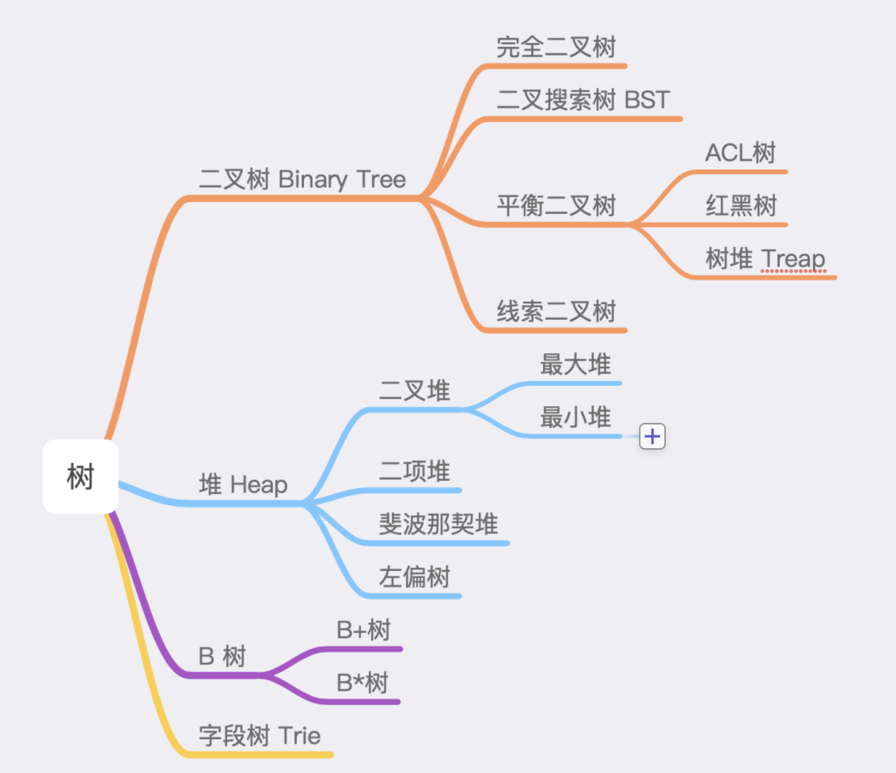

# 内存与数据结构

JS中，有7中基本数据类型，`Boolean, Number, Null, Undefined, String, Symbol, BigInt`,  一种引用数据类型（Object）, 基本数据类型是**按值访问的，其值不可变**，引用数据类型是**按引用访问，其值可以被改变，**引用类型的**引用是指在内存中的地址**，引用类型数据之间的比较其实也是**内存地址之间的比较**。js中基本数据类型也能够访问方法，访问时实际上是先用包装对象创建对象，再用包装对象的实例访问方法，最后销毁包装对象。

## 栈

```js
class Stack {
  constructor() {
    this._i = Symbol('Stack')
      //保护其不被外部访问到
    this[this._i] = {}
    this.length = 0
  }
  push(node) {
    this[this._i][this.length] = node;
    this.length++
  }
  pop() {
    if (this.isEmpty()) {
      return null;
    }
    this.length--
    const r = this[this._i][this.length]
    delete this[this._i][this.length]
    return r
  }
  getItems() {
    return this[this._i]
  }
  // 获取栈顶节点
  peek() {
    if (this.isEmpty()) {
      return null
    }
    return this[this._i][this.length - 1]
  }
  isEmpty() {
    return this.length === 0
  }
  clear() {
    this[this._i] = {}
    this.length = 0
  }
}
```

> 1. Object.getOwnPropertyNames()方法返回一个由指定对象的所有自身属性的属性名（包括不可枚举属性但不包括Symbol值作为名称的属性）组成的数组。    
> 2. `Object.getOwnPropertySymbols()`方法返回一个给定对象自身的所有 Symbol 属性的数组。

```js
let stack = new Stack()
stack.push(5)
stack.push(7)
console.log(stack[Object.getOwnPropertySymbols(stack)[0]])
```

## 堆



掌握二叉堆这种数据结构

```js
class Heap {
  constructor(compare) {
    this.arr = [0]
    this.compare = (typeof compare === 'function') ? compare : this._defaultCompare
    }
    static heapify(data, compare=undefined) {
      let heap = new Heap(compare)
      for(let item of data) {
        heap.push(item)
      }
      return heap
    }

    push(item) {
      let {arr} = this
      arr.push(item)
      this._up(arr.length - 1)
    }

    pop() {
      if(this.size === 0) return null
      let {arr} = this
      this._swap(1, arr.length - 1)
      let res = arr.pop()
      this._down(1)
      return res
    }

    get size() {
      return this.arr.length - 1
    }

    peek() {
      return this.arr[1]
    }

    _up(k) {
      let {arr, compare, _parent} = this
      while(k>1 && compare(arr[k], arr[_parent(k)])) {
        this._swap(_parent(k), k)
        k = _parent(k)
      }
    }

    _down(k) {
      let {arr, compare, _left, _right} = this
      let size = this.size
      while(_left(k) <= size) {
        let child = _left(k)
        if(_right(k) <= size && compare(arr[_right(k)], arr[child])) {
          child = _right(k)
        }
        if(compare(arr[k], arr[child])) return
        this._swap(k, child)
        k = child
      }
    }

    _left(k) { return k*2 }
    _right(k) { return k*2 + 1}
    _parent(k) { return Math.floor(k/2)}
    _swap(i, j) {
      let arr = this.arr;
      [ arr[i], arr[j] ] = [ arr[j], arr[i] ]
    }
    // 默认小顶堆
    _defaultCompare(a, b) {
      return a < b
    }
}
```

除此之外，在实践中，参与比较的可能并非节点本身，而是节点的某个字段。

```javascript
const array = [
  {name: 'Jake', id: 29}, 
  {name: 'Toms', id: 22},
  {name: 'Jone', id: 40},
  ...
]
```

**这个时候，我们要针对这样的数组构建一个二叉堆，比较函数就会按照需求比较 id，而非节点本身**

比如 leetcode  排序K个升序链表。

# 作用域

## 编译

一段源代码在执行前一般需要执行三个步骤，统称编译，对于JavaScript代码来说，通常在执行前进行编译，而不是构建前。

- 分词/词法分析（Tokenining/Lexing）: 将字符组成的字符串分解成有意义的代码块
- 解析/语法分析（Parsing）：将词法单元流（数组）转换成元素逐级嵌套所组成的代表了程序语法结构的树，叫做AST(Abstract Sytax Tree 抽象语法树)
- 代码生成： 将AST转换成可执行代码

## 什么是作用域？

就是定义变量的区域，作用域是一套规则，用去确定在何处以及如何查找变量，确定了当前执行的代码对变量的访问权限。

如果是要赋值，执行LHS查询，如果是要获取变量的值，执行RHS查询。不成功的RHS引用会抛出ReferceError异常，非严格模式下不成功的LHS引用会自动隐式创建全局变量，严格模式下抛出ReferenceError

## 词法作用域

词法作用域就是定义在词法阶段的作用域，也就是说在代码编写阶段就确定了，让词法作用域根据词法关系保持书写时的自然关系不变。

> 某些情况下也是可以改变的

## 欺骗词法

### eval

eval可以执行动态创建的代码，因此可以对所在的词法作用域进行修改

```js
function foo(str, a) {
  eval(str)
  console.log(a, b)
}
var b=2
foo('var b=3;', 1) //1, 3
```

但在非严格模式下，eval有自己的作用域，意味着其中的声明无法修改所在的作用域

```js
function foo(str) {
  "use strict"
  eval(str)
  console.log(a)
}
foo('var b=3;') //ReferenceError
```

> 此外setTimeout setInterval的第一个参数可以是字符串，，可以被解释成一段动态生成的代码片段。

### with

with可以将一个没有或有多个属性的对象处理为一个完全隔离的词法作用域，对象的属性会被处理成在这个词法作用域中的词法标识符。本质上是将对象的引用当作作用域来处理。

非严格模式下可能会污染全局作用域

```js
function foo(obj) {
  with (obj) {
    a = 2
  }
}

var o1 = {
  a: 3,
}
var o2 = {
  b: 2,
}
foo(o1) //执行LHS查询，直到全局作用域，自动隐式创建变量a
console.log(o1.a)

foo(o2)
console.log(o2.a)
console.log(a) //泄漏到全局作用域

```

eval和with使引擎在**编译时**无法对作用域查找进行优化，因此引擎认为优化是无效的，使用上述机制会使得代码运行变慢。

# others

## 判断是否是数组
- Array.isArray()
- Object.prototype.toString.call(arr)
# js
## 原型、原型链


```js
class A{}
class B extends A{}
const a = new A()
const b = new B()
a.__proto__
b.__proto__
B. __proto__
B.prototype.__proto__
b.__proto__.__proto__
```


### prototype

每个函数都有`prototype`属性，它并不指向该函数的原型。实际上，该属性指向一个对象，这个对象是**调用该构造函数而创建的实例的原型。**

### ` __proto__`

指向该对象的原型，对于实例来说，指向构造函数的prototype

### constructor

指向构造函数

### **注意：**

- 某个构造函数的实例本身并没有constructor

  ```js
  function Person() {
  
  }
  var person = new Person();
  console.log(person.constructor === Person); // true
  ```

- ``__proto__``
  并不存在于``prototype``上，可以理解成返回了Object.getPrototypeOf(obj)
- 继承？
   **JavaScript 默认并不会复制对象的属性**，相反，JavaScript 只是在两个对象之间创建一个关联，这样，一个对象就可以通过委托访问另一个对象的属性和函数，
- `Function.__proto__ === Function.prototype //true`
## 词法作用域与动态作用域
[地址](https://github.com/mqyqingfeng/Blog/issues/3)
作用域就是定义变量的区域
JS采用词法作用域，函数的作用域在函数定义时就决定了。

## 执行上下文栈
[地址](https://github.com/mqyqingfeng/Blog/issues/4)

**当 JavaScript 代码执行一段可执行代码(executable code)时，会创建对应的执行上下文(execution context)**。执行上下文可以看成是一个对象。

每个执行上下文都有三个属性：

- 变量对象(Variable object，VO)
- 作用域链(Scope chain)
- this
## 变量对象

变量对象存储了在上下文中定义的变量和函数声明

> 全局上下文

- 全局上下文的变量对象初始化是全局对象

> 函数上下文

- 活动对象是在进入函数上下文时刻被创建的，它通过函数的 arguments 属性初始化。arguments 属性值是 Arguments 对象。
- 函数上下文的变量对象初始化只包括 Arguments 对象
- 在进入执行上下文时会给变量对象添加形参、函数声明、变量声明等初始的属性值
- 在代码执行阶段，会再次修改变量对象的属性值

## 作用域链

> 什么是作用域链？

当查找变量的时候，会先从当前上下文的变量对象中查找，如果没有找到，就会从父级(词法层面上的父级)执行上下文的变量对象中查找，一直找到全局上下文的变量对象，也就是全局对象。这样由多个执行上下文的变量对象构成的链表就叫做作用域链。

> 对于函数来说，作用域链如何变化？

对于一个函数来说，其作用域链的变化分为两个阶段：函数创建和函数激活

函数的作用域在函数定义时就决定了，函数有一个内部属性[scope], 在创建时保存了所有的父变量对象，是所有父变量对象的层级链

当函数激活时，创建VO/AO后，将活动对象添加到这个层级链的前端，就创建了作用域链。

> 分析这段代码的执行过程

```js
var scope = "global scope";
function checkscope(){
    var scope2 = 'local scope';
    return scope2;
}
checkscope();
```

执行过程如下：

1.checkscope 函数被创建，保存作用域链到 内部属性[[scope]]

```
checkscope.[[scope]] = [
    globalContext.VO
];
```

2.执行 checkscope 函数，创建 checkscope 函数执行上下文，checkscope 函数执行上下文被压入执行上下文栈

```
ECStack = [
    checkscopeContext,
    globalContext
];
```

3.checkscope 函数并不立刻执行，开始做准备工作，第一步：复制函数[[scope]]属性创建作用域链

```
checkscopeContext = {
    Scope: checkscope.[[scope]],
}
```

4.第二步：用 arguments 创建活动对象，随后初始化活动对象，加入形参、函数声明、变量声明

```
checkscopeContext = {
    AO: {
        arguments: {
            length: 0
        },
        scope2: undefined
    }，
    Scope: checkscope.[[scope]],
}
```

5.第三步：将活动对象压入 checkscope 作用域链顶端

```
checkscopeContext = {
    AO: {
        arguments: {
            length: 0
        },
        scope2: undefined
    },
    Scope: [AO, [[Scope]]]
}
```

6.准备工作做完，开始执行函数，随着函数的执行，修改 AO 的属性值

```
checkscopeContext = {
    AO: {
        arguments: {
            length: 0
        },
        scope2: 'local scope'
    },
    Scope: [AO, [[Scope]]]
}
```

7.查找到 scope2 的值，返回后函数执行完毕，函数上下文从执行上下文栈中弹出

```
ECStack = [
    globalContext
];
```


**从执行上下文、作用域链的角度分析这两段代码的不同**
[参考 1](https://github.com/kuitos/kuitos.github.io/issues/18)
[参考 2](https://github.com/mqyqingfeng/Blog/issues/8)

```js
var scope = "global scope";
function checkscope(){
    var scope = "local scope";
    function f(){
        return scope;
    }
    return f;
}
var foo = checkscope();
foo();
```

1. 进入全局代码，创建全局执行上下文，压入执行上下文栈

2. 全局执行上下文初始化

3. checkscope函数被创建，保存作用域链到内部属性[scope]

4. 执行函数checkscope，创建checkscope函数的执行上下文，并压入执行上下文栈

5. checkscope函数的执行上下文初始化，创建变量对象、作用域链、this

   > 1. 复制[[scope]]属性创建作用域链
   > 2. 用 arguments 创建活动对象，随后初始化活动对象，加入形参、函数声明、变量声明
   > 3. 将活动对象压入作用域链顶端

6. f函数被创建，保存作用域链到内部属性[[scope]]

7. checkscope函数执行完毕，checkscope执行上下文从执行上下文栈中弹出

8. 执行函数foo,创建foo函数执行上下文，并压入执行上下文栈

9. foo函数执行上下文栈初始化，创建变量对象、作用域链、this

> 1. 复制[[scope]]属性创建作用域链
>
> 2. 用 arguments 创建活动对象，随后初始化活动对象，加入形参、函数声明、变量声明
>
> 3. 将活动对象压入作用域链顶端
 10. foo函数执行完毕，foo函数执行上下文从执行上下文栈中弹出

```js
var scope = "global scope";
function checkscope(){
    var scope = "local scope";
    function f(){
        return scope;
    }
    return f();
}
checkscope();

```

1. 执行全局代码，创建全局执行上下文并压入执行上下文栈
2. 全局执行上下文初始化
3. 执行checkscope函数，创建checkscope函数执行上下文，并压入执行上下文栈
4. checkscope函数执行上下文初始化，创建变量对象，作用域链，this
5. 执行f函数，创建f函数执行上下文，并压入执行上下文栈
6. f函数执行上下文初始化
7. f函数执行完毕，f函数执行上下文从执行上下文栈中弹出
8. checkscope函数执行完毕，checkscope函数执行上下文从执行上下文栈中弹出

**二者的根本区别在于执行上下文栈的变化不一样。**

## this

## 闭包
函数和函数对其词法环境的引用的组合就是闭包，或者说，函数和函数能够访问的自由变量的组合就是闭包

闭包是依靠作用域链实现的

从理论角度讲，所有的js函数都是闭包，
从实践角度来说，要满足以下两点：

1. 即使创建它的上下文对象已经销毁，它依然存在
2. 代码中引用了自由变量

**思考**
[参考链接](https://github.com/mqyqingfeng/Blog/issues/8)
```js
var nAdd;
var t = function() {
    var n = 99;
    nAdd = function() {
    	 n++;
    }
    var t2 = function() {
    	console.log(n)
    }
    return t2;
};

var a1 = t();
var a2 = t();

nAdd();

a1(); //99
a2(); //100
```
## call, apply, bind 的模拟实现

<hr/>

> call和apply的第一个参数是null/undefined时函数内的的this指向window或global

### call

- 在非严格模式下，不传参数或传递 null/undefined，this 都指向 window。
- 传递的是原始值，原始值会被包装。
- 严格模式下，call 的第一个参数是谁就指向谁

```js
Function.prototype.call2 = function(context) {
  // 如果call第一个参数是null/undefined，那么this将指向window
  context = context || window
  // 取得调用call的函数
  context.fn = this
  const args = []
  for(let i=1; i<arguments.length; i++) {
    args.push('arguments['+ i +']')
  }
  let res = eval('context.fn('+ args +')')
  delete context.fn
  return res
}

var value = 2;

var obj = {
    value: 1
}

function bar(name, age) {
  console.log(this.value);
  return {
      value: this.value,
      name: name,
      age: age
  }
}

bar.call2(obj)
```
### apply

> 两者唯一不同的是：apply 的除了一个this指向的参数外，第二个参数是数组[arg1, arg2...]，call的第二参数是列表(arg1, arg2...)

```js
Function.prototype.apply = function(context, arr) {
  var context = Object(context) || window
  context.fn = this

  var result
  if(!arr) result = context.fn()
  else {
    var args = []
    for(var i = 0, len = arr.length; i < len; i++) {
      args.push('arr[' + i +']')
    }
    result = eval('context.fn('+ args +')')
  }
  delete context.fn
  return result
}
```
### bind

> 创建函数

不论怎么调用，这个函数都有同样的 **`this`** 值

> 偏函数

使一个函数拥有预设的初始参数，当绑定函数被调用时，这些参数会被插入到目标函数的参数列表的开始位置，传递给绑定函数的参数会跟在它们后面

```js
// 第三版
Function.prototype.bind = function (context) {
      // 调用bind的不是函数
    if (typeof this !== "function") {
  throw new Error("Function.prototype.bind - what is trying to be bound is not callable");
}
    var self = this;
    var fNOP = function () {};
    var args = Array.prototype.slice.call(arguments, 1);

    var fBound = function () {
        var bindArgs = Array.prototype.slice.call(arguments);
        // 当作为构造函数时，this 指向实例，此时结果为 true，将绑定函数的 this 指向该实例，可以让实例获得来自绑定函数的值
        // 当作为普通函数时，this 指向 window，此时结果为 false，将绑定函数的 this 指向 context
        return self.apply(this instanceof fBound ? this : context, args.concat(bindArgs));
    }
    // 修改返回函数的 prototype 为绑定函数的 prototype，实例就可以继承绑定函数的原型中的值
    fNOP.prototype = this.prototype;
    // 使用空函数作中转，防止修改返回函数的prototyp时也修改了绑定函数的prototyp
    fBound.prototype = new fNOP();
    return fBound;
}
```
## 模拟new实现

### 使用new时发生了什么

**`new`** 关键字会进行如下的操作：

1. 创建一个空的简单JavaScript对象（即`**{}**`）；
2. 为步骤1新创建的对象添加属性**__proto__**，将该属性链接至构造函数的原型对象 ；
3. 将步骤1新创建的对象作为`**this**`的上下文 ；
4. 如果该函数没有返回对象，则返回`**this**`。

**当代码 `new Foo(...)` 执行时，会发生以下事情：**

1. 一个继承自 `*Foo*.prototype` 的新对象被创建。
2. 使用指定的参数调用构造函数 *`Foo`*，并将 `this` 绑定到新创建的对象。`new *Foo*` 等同于 *`new Foo`*`()`，也就是没有指定参数列表，*`Foo`* 不带任何参数调用的情况。
3. 由构造函数返回的对象就是 `new` 表达式的结果。如果构造函数没有显式返回一个对象，则使用步骤1创建的对象。（一般情况下，构造函数不返回值，但是用户可以选择主动返回对象，来覆盖正常的对象创建步骤）

```js
// 实现 new
function myNew(fn, ...args) {
  //创建一个继承自构造函数的原型对象的对象
  var obj = Object.create(fn.prototype);
  //使用指定的参数调用构造函数，并将this绑定到新创建的对象是
  var ret = fn.apply(obj, args);
  return typeof ret === 'object' ? res : obj;
};
```

**注意：**下面这个例子，要能清楚new时发生了什么，同时要注意成员访问运算符(.)的优先级大于`new`,小括号()的优先级又大于(.)

```js
function test() {           
    getName = function() { 
        Promise.resolve().then(() => console.log(0)); 
        console.log(1);               
    };
    return this; 
}
test.getName = function() { 
     setTimeout(() => console.log(2), 0); 
     console.log(3);               
};
test.prototype.getName = function() {    
     console.log(4); 
};       
var getName = function() { 
     console.log(5);             
};
function getName() {
     console.log(6); 
}      
      
test.getName();  // 3   ...2
getName();   //5
test().getName();  //1  ...0  // getName赋值给全局变量getName
getName();  //1  ...0
// new无参数列表的优先级低于成员访问运算符
new test.getName(); //3 ... 2
// new有参数列表 与 成员访问运算符优先级相同
// new test() 返回一个以test.prototype为原型的空对象(假如为obj)，执行obj.getName(),返回4；全局对象中的getName被修改
//此处构造函数this, this指向上述提到的空对象
new test().getName(); // 4
//相当于 new (new test().getName)();
new new test().getName(); //  4
```


## 类数组对象与arguments

### 类数组

#### 定义及方法调用

- 定义：拥有一个 length 属性和若干索引属性的对象
- 调用数组方法 Function.call
```js
var arrayLike = {0: 'name', 1: 'age', 2: 'sex', length: 3 }

Array.prototype.join.call(arrayLike, '&'); // name&age&sex

Array.prototype.slice.call(arrayLike, 0); // ["name", "age", "sex"] 
// slice可以做到类数组转数组

Array.prototype.map.call(arrayLike, function(item){
    return item.toUpperCase();
}); 
// ["NAME", "AGE", "SEX"]
```
#### 类数组转数组方法

```js
var arrayLike = {
  0: 'name', 1: 'age', 2: 'sex', length: 3 
}

let s1 = Array.prototype.slice.call(arrayLike)  //返回新数组
let s2 = Array.prototype.splice.call(arrayLike, 0) //在原数组上进行删除，增加，返回被删除的部分,如果没有删除，则返回[]
let s3 = Array.from(arrayLike)
let s4 = Array.prototype.concat.apply([], arrayLike)
let s5 = Array.prototype.map.call(arrayLike, item => item)
// 最后一种方法成立的基础是类数组对象具有遍历器接口
let s6 = [...arrayLike]

```
### Arguments

#### arguments及其属性

Arguments 对象只定义在函数体中，包括了函数的参数和其他属性。在函数体中，arguments 指代该函数的 Arguments 对象。
- length属性    
  - 实参的长度
- callee属性    
  - 可以调用函数自身。
```js
var data = [];

for (var i = 0; i < 3; i++) {
    (data[i] = function () {
       console.log(arguments.callee.i) 
    }).i = i;
}

data[0]();
data[1]();
data[2]();

// 0
// 1
// 2

```


#### arguments 和对应参数的绑定

- 传入的参数，实参和 arguments 的值会共享，当没有传入时，实参与 arguments 值不会共享

- 除此之外，以上是在非严格模式下，如果是在严格模式下，实参和 arguments 是不会共享的。

```js
function foo(name, age, sex, hobbit) {

    console.log(name, arguments[0]); // name name

    // 改变形参
    name = 'new name';

    console.log(name, arguments[0]); // new name new name

    // 改变arguments
    arguments[1] = 'new age';

    console.log(age, arguments[1]); // new age new age

    // 测试未传入的是否会绑定
    console.log(sex); // undefined

    sex = 'new sex';

    console.log(sex, arguments[2]); // new sex undefined

    arguments[3] = 'new hobbit';

    console.log(hobbit, arguments[3]); // undefined new hobbit

}

foo('name', 'age')

```
## 创建对象的多种方式及优缺点

### 工厂模式

```js
function createPerson(name) {
    var o = new Object();
    o.name = name;
    o.getName = function () {
        console.log(this.name);
    };

    return o;
}

var person1 = createPerson('kevin');

```

> 在内部创建一个对象，将方法、属性挂在在这个对象上，最后将这个对象返回

缺点：可以解决创建多个类似对象的问题，但没有解决对象标识问题（即新创建的对象是什么类型）。所有实例都指向一个原型

所谓的寄生构造函数模式就是比工厂模式在创建对象的时候，多使用了一个new，实际上两者的结果是一样的。

### 构造函数模式

```js
function Person(name, age, job){ 
 this.name = name; 
 this.age = age; 
 this.job = job; 
 this.sayName = function() { 
 console.log(this.name); 
 }; 
} 
let person1 = new Person("Nicholas", 29, "Software Engineer"); 
let person2 = new Person("Greg", 27, "Doctor"); 
person1.sayName(); // Nicholas 
person2.sayName(); // Greg 

```

**优点**：**定义自定义构造函数可以确保实例被标识为特定类型**

**缺点**：构造函数定义的方法在每个实例上都创建一遍

​			要解决这个问题可以把函数放在外部作用域，这解决了函数重复定义的问题，但是这使得外部定义域混乱，如果这个对象需要多个方法，那么就需要在外部作用域定义多个函数。这个问题可以通过原型模式解决

### 原型模式

与构造函数不同的是，将相应的属性和方法添加到函数原型，这些定义在原型上的属性和方法被所有实例共享。

```js
function Person(name) {

}

Person.prototype.name = 'keivn';
Person.prototype.getName = function () {
    console.log(this.name);
};

var person1 = new Person();

```

优点：方法不会重新创建

缺点：1. 所有的属性和方法都共享 2. 不能初始化参数

**包含引用值的属性会在不同实例之间共享，这就是实际开发中通常不单独使用原型模式的原因。**

#### 优化1

```js
function Person(name) {

}

Person.prototype = {
    name: 'kevin',
    getName: function () {
        console.log(this.name);
    }
};

var person1 = new Person();

```

缺点：丢失了constructor属性

#### 优化2

``` js
function Person(name) {

}

Person.prototype = {
    constructor: Person,
    name: 'kevin',
    getName: function () {
        console.log(this.name);
    }
};

var person1 = new Person();

```

以这种方式恢复 constructor 属性会创建一个[[Enumerable]]为 true 的属性。**而 原生 constructor 属性默认是不可枚举的。**

```js
function Person(name) {

}

Person.prototype = {
    constructor: Person,
    name: 'kevin',
    getName: function () {
        console.log(this.name);
    }
};

var person1 = new Person();
Object.defineProperty(Person.prototype, "constructor", {
    enumerable: false,
    value: Person
})
```

### 组合模式

构造函数模式与原型模式双剑合璧。

```js
function Person(name) {
    this.name = name;
}

Person.prototype = {
    constructor: Person,
    getName: function () {
        console.log(this.name);
    }
};

var person1 = new Person();
```

优点：该共享的共享，该私有的私有，使用最广泛的方式

缺点：有的人就是希望全部都写在一起，即更好的封装性

### 动态原型模式

```js
function Person(name) {
    this.name = name;
    if (typeof this.getName != "function") {
        Person.prototype.getName = function () {
            console.log(this.name);
        }
    }
}

var person1 = new Person();

```

使用动态原型模式时，不能用对象字面量重写原型

```js
function Person(name) {
    this.name = name;
    if (typeof this.getName != "function") {
        Person.prototype = {
            constructor: Person,
            getName: function () {
                console.log(this.name);
            }
        }
    }
}

var person1 = new Person('kevin');
var person2 = new Person('daisy');

// 报错 并没有该方法
person1.getName();

// 注释掉上面的代码，这句是可以执行的。
person2.getName();


```

原因见下 注意点

改进：

```js
function Person(name) {
    this.name = name;
    if (typeof this.getName != "function") {
        Person.prototype = {
            constructor: Person,
            getName: function () {
                console.log(this.name);
            }
        }

        return new Person(name);
    }
}

var person1 = new Person('kevin');
var person2 = new Person('daisy');

person1.getName(); // kevin
person2.getName();  // daisy


```


### 注意点

- 原型的动态性

  从原型上搜索值的过程是动态的，所以即使实例在修改原型之前已经存在，任何时候对原型对 象所做的修改也会在实例上反映出来。

  ```js
  let friend = new Person(); 
  Person.prototype.sayHi = function() { 
   console.log("hi"); 
  }; 
  friend.sayHi(); // "hi"，没问题
  ```

  

- 重写整个原型会切断最初原型与构造函数的联系，但实例引用的仍然是最初的原型。

  实例的[[Prototype]]指针是在调用构造函数时自动赋值的，这个指针即使把原型修改为不同 的对象也不会变。重写构造函数上的原型之后再创建的实例才会引用新的原型。而在此之前创建的实例仍然会引用最 初的原型。

  ```js
  function Person() {} 
  let friend = new Person(); 
  Person.prototype = { 
   constructor: Person, 
   name: "Nicholas", 
   age: 29, 
   job: "Software Engineer", 
   sayName() { 
   console.log(this.name); 
   } 
  }; 
  friend.sayName(); // 错误
  ```

  

- 实例只有指向原型的指针，没有指向构造函数的指针。

### ps: 相关方法

- 使用` Object.setPrototypeOf()`可能造成的性能下降，可以通过 `Object.create()`来创 建一个新对象，同时为其指定原型

- `hasOwnPropertyOf`判断属性是实例属性还是原型属性

- in 操作符会在**可 以通过对象访问指定属性时返回 true**，无论该属性是在实例上还是在原型上

- `hasPrototypeProperty`

  ```js
  let person = new Person(); 
  console.log(hasPrototypeProperty(person, "name")); // true
  ```

- 在 for-in 循环中使用 in 操作符时，可以通过对象访问且可以被枚举的属性都会返回，包括实例 属性和原型属性**(枚举顺序不确定)**

- 要获得对象上所有可枚举的实例属性，可以使用 Object.keys()方法**(枚举顺序不确定)**

- ` Object.getOwnPropertyNames()`: 列出所有实例属性，无论是否可以枚举

## 继承

### 原型链继承

> 将父类的实例作为子类实例的原型

```js
function Parent () {
    this.names = ['kevin', 'daisy'];
}

function Child () {

}

Child.prototype = new Parent();

var child1 = new Child();

child1.names.push('yayu');

console.log(child1.names); // ["kevin", "daisy", "yayu"]

var child2 = new Child();

console.log(child2.names); // ["kevin", "daisy", "yayu"]

```
问题：

1. 父类**引用类型**的属性被所有实例共享

2. 创建子类型实例时不能给父类型构造函数传参

   > 可以看到Child其实是 ‘’空’‘ 的，自然无法传参

### 借用构造函数

> 在子类构造函数中调用父类构造函数，可以在子类构造函数中使用`call()`和`apply()`方法

```js
function Parent () {
    this.names = ['kevin', 'daisy'];
}

function Child () {
    Parent.call(this);
}

var child1 = new Child();

child1.names.push('yayu');

console.log(child1.names); // ["kevin", "daisy", "yayu"]

var child2 = new Child();

console.log(child2.names); // ["kevin", "daisy"]

```
优点：

1. 避免了引用类型的属性被所有实例共享

2. 可以在 Child 中向 Parent 传参

缺点：

1. 子类不能访问父类`prototype`（这里即`Parent.prototype`）上的方法
2. 所有方法属性都写在构造函数中，每次创建实例都会初始化

### 组合继承 *

> 基本的思路就是使用原型链继承父类prototype上的属性和方法，而通过构造函数继承父类构造函数的属性，这样既可以实现方法重用，又可以让每个实例都有自己的属性

```js
function Parent (name) {
    this.name = name;
    this.colors = ['red', 'blue', 'green'];
}

Parent.prototype.getName = function () {
    console.log(this.name)
}

function Child (name, age) {

    Parent.call(this, name);
    
    this.age = age;

}

Child.prototype = new Parent();  // Parent执行第一次，Child子类实例的原型上有name, colors
Child.prototype.constructor = Child;

var child1 = new Child('kevin', '18'); // Parent执行第二次，子类实例上有name, colors 

child1.colors.push('black');

console.log(child1.name); // kevin
console.log(child1.age); // 18
console.log(child1.colors); // ["red", "blue", "green", "black"]

var child2 = new Child('daisy', '20');

console.log(child2.name); // daisy
console.log(child2.age); // 20
console.log(child2.colors); // ["red", "blue", "green"]

```
组合继承结合了原型链继承和借用构造函数继承的优点，这很棒，但是也存在一个小问题，在上述过程中父类构造函数执行了两次，带来的后果是什么呢？后果是子类实例和其原型上存在同名属性，最后子类属性会屏蔽原型上的属性，这虽然不影响使用，但却不够优雅，后面的寄生式组合继承会解决这个问题。

### 原型式继承

> 与原型链继承有相似之处

> 就是 ES5 Object.create 的模拟实现，**将传入的对象作为创建的对象的原型**

```js
function createObj(o) {
    function F(){}
    F.prototype = o;
    return new F();
}
```
缺点: 与原型链继承一样, 引用类型的属性会被所有实例共享

### 寄生式继承
创建一个仅用于封装继承过程的函数，该函数在内部以某种形式来做增强对象，最后返回对象。可以看到内部使用了`Object.create()`，因此其本质上是**在原型式继承返回的新对象上增加了新的属性和方法，实现增强效果。**

```js
function createObj (o) {
    var clone = Object.create(o);
    clone.sayName = function () {
        console.log('hi');
    }
    return clone;
}
```
缺点： 同借用构造函数继承，每次都会重新创建方法，且`Object.create()`执行浅复制，多个实例的引用类型指向相同，造成污染。

### 寄生组合式继承 *

> 组合式继承
>
> ```js
> function Parent (name) {
>     this.name = name;
>     this.colors = ['red', 'blue', 'green'];
> }
> 
> Parent.prototype.getName = function () {
>     console.log(this.name)
> }
> 
> function Child (name, age) {
>     Parent.call(this, name);   
>     this.age = age;
> }
> 
> Child.prototype = new Parent();
> Child.prototype.constructor = Child;
> 
> ```

组合式继承中父类构造函数`Parent()`调用了两次

一次是设置子类实例的原型，

```js
Child.prototype = new Parent()
```

 一次是调用子类构造函数，为什么在这里也调用了一次Parent()呢？

```js
let child1 = new Child('kevin', '18');
```

因为首先Child是这样的：

```js
function Child (name, age) {
    Parent.call(this, name); 
    this.age = age;
}
```

在用`new`创建`Child`实例的过程中会经历如下阶段：

- 生成一个以`Child.prototype`为原型的对象
- 使用给定的参数调用构造函数`Child`, 然后将`this`指向新创建的对象
- 返回新创建的对象（`Child`中并没有return语句指定返回哪个对象，因此默认返回新创建的对象）

因此在第二步调用构造函数的过程中又调用了一次父类构造函数`Parent`

而`寄生组合式继承 `就是为了避免重复调用父类构造函数:

```js
Child.prototype = Object.create(Parent.prototype);
// Child.prototype = Parent.prototype
// 直接这样的话会存在隐患，如果修改Child.prototype的话会影响Parent.prototype
Child.prototype.constructor = Child;
```

这样就避免了在设置子类实例的原型时调用父类构造函数。

> Object.create(o)的作用是返回一个新对象，该对象以给定对象`o`为原型
>
> 其实现类似：
>
> ```js
> function createObj(o) {
>     function F(){}
>     F.prototype = o;
>     return new F();
> }
> ```
>
> 可以理解为原型式继承

```js
function Parent (name) {
    this.name = name;
    this.colors = ['red', 'blue', 'green'];
}

Parent.prototype.getName = function () {
    console.log(this.name)
}

function Child (name, age) {
    Parent.call(this, name); 
    this.age = age;
}

Child.prototype = Object.create(Parent.prototype);
// Child.prototype = Parent.prototype
// 直接这样的话会存在隐患，如果修改Child.prototype的话会影响Parent.prototype
Child.prototype.constructor = Child;


// 可以封装一下
// function prototype(child, parent) {
//   var prototype = Object.create(parent.prototype);
//   prototype.constructor = child;
//   child.prototype = prototype;
// }

// // 当我们使用的时候：
// prototype(Child, Parent);
```

### class 实现继承

```js
class Animal {
    constructor(name) {
        this.name = name
    } 
    getName() {
        return this.name
    }
}
class Dog extends Animal {
    constructor(name, age) {
        super(name)
        this.age = age
    }
}

```

### ES5继承与ES6继承的区别

ES5的继承实质上是先创建子类的实例对象，然后再将父类的方法添加到this上（Parent.call(this)）.

ES6的继承有所不同，实质上是先创建父类的实例对象this，然后再用子类的构造函数修改this。因为子类没有自己的this对象，所以必须先调用父类的super()方法，否则新建实例报错。

## 类型判断

### typeof

不足：对于`Object`下的细分类型不能进行判断（ps: 细分类型下的function是可以判断的）

```
var date = new Date();
var error = new Error();
console.log(typeof date); // object
console.log(typeof error); // object
```

```js
typeof function() {} === 'function';
typeof class C {} === 'function'
typeof Math.sin === 'function';
```

```js
// JavaScript 诞生以来便如此
typeof null === 'object';
```


在 JavaScript 最初的实现中，JavaScript 中的值是由一个表示类型的标签和实际数据值表示的。对象的类型标签是 0。由于 `null` 代表的是空指针（大多数平台下值为 0x00），因此，null 的类型标签是 0，`typeof null` 也因此返回 `"object"`。

### instanceof

**`instanceof`** **运算符**用于检测构造函数的 `prototype` 属性是否出现在某个实例对象的原型链上。

```js
var myNonObj  = Object.create(null);
myNonObj instanceof Object; // 返回 false, 一种创建非 Object 实例的对象的方法
```


### Object.prototype.toString

```js
var number = 1;          // [object Number]
var string = '123';      // [object String]
var boolean = true;      // [object Boolean]
var und = undefined;     // [object Undefined]
var nul = null;          // [object Null]
var obj = {a: 1}         // [object Object]
var array = [1, 2, 3];   // [object Array]
var date = new Date();   // [object Date]
var error = new Error(); // [object Error]
var reg = /a/g;          // [object RegExp]
var func = function a(){}; // [object Function]
console.log(Object.prototype.toString.call(Math)); // [object Math]
console.log(Object.prototype.toString.call(JSON)); // [object JSON]

function a() {
    console.log(Object.prototype.toString.call(arguments)); // [object Arguments]
}
a();
```

### type API

```js
let class2type = {}
"Boolean Number String Function Array Date RegExp Object Error".split(" ").map(item => class2type[`[object ${item}]`] = item.toLowerCase()) 

function type(obj) {
  if(obj == null) return obj + ""
  return typeof obj === "object" || typeof obj === "function" ?
    class2type[Object.prototype.toString.call(obj)] || "object" :
  // 此处class2type[Object.prototype.toString.call(obj)] || "object" 例如新增的Map, Set类型就会返回object
    typeof obj
}
```

上述是jquery中的实现，Object.prototype.toString还可以对window, window.history , window.location进行判断

```js
function type(obj) {
  return Object.prototype.toString.call(obj).slice(8, -1).toLowerCase()
}
```

> 判断window对象

```js
function isWindow(obj) {
	return obj !== null && obj === obj.window
}
```

> 判断类数组对象

```js
function isWindow(obj) {
	return obj !== null && obj === obj.window
}

function isArrayLike(obj) {
  let length = !!obj && "length" in obj && obj.length
  if(typeof obj === 'function' || isWindow(obj)) {
    return false
  }
  
  return Array.isArray(obj) || length === 0 || typeof length === 'number' && length > 0 && (length - 1) in obj
}
```

为什么length = 0就为true?  主要是为了下面这个例子

```js
function a(){
    console.log(isArrayLike(arguments))
}
a();
// arguments是一个类数组对象
```

> 判断DOM元素

```js
isElement = function(obj) {
    return !!(obj && obj.nodeType === 1);
};

```

### 其他

```js
NaN 相关：

NaN == NaN // false
NaN === NaN // false

// indexOf方法无法识别数组的NaN成员
[NaN].indexOf(NaN) // -1

// 向 Set 数据结构中加入值时认为NaN等于自身
let set = new Set();
set.add(NaN);
set.add(NaN);
console.log(set); // Set {NaN}

// Object.is()方法认为NaN等于NaN
Object.is(NaN, NaN) // true
+0 === -0 //true
Object.is(+0, -0) // false

// ES7中新增的数组实例方法，includes()方法认为NaN等于自身
[1, 2, NaN].includes(NaN) // true
```


## [类型转换](https://github.com/mqyqingfeng/Blog/issues/159)

### 基本类型之间的转换

#### 原始值转布尔

```js
console.log(Boolean()) // false

console.log(Boolean(false)) // false

console.log(Boolean(undefined)) // false
console.log(Boolean(null)) // false
console.log(Boolean(+0)) // false
console.log(Boolean(-0)) // false
console.log(Boolean(NaN)) // false
console.log(Boolean("")) // false

```

其余值返回true

#### 原始值转数字

根据规范，如果 Number 函数不传参数，返回 +0，如果有参数，调用 `ToNumber(value)`。	

| 参数类型  | 结果                                           |
| --------- | ---------------------------------------------- |
| Undefined | NaN                                            |
| Null      | +0                                             |
| Boolean   | 如果参数是 true，返回 1。参数为 false，返回 +0 |
| Number    | 返回与之相等的值                               |
| String    | 这段比较复杂，看例子                           |

```js
console.log(Number()) // +0

console.log(Number(undefined)) // NaN
console.log(Number(null)) // +0

console.log(Number(false)) // +0
console.log(Number(true)) // 1

console.log(Number("123")) // 123
console.log(Number("-123")) // -123
console.log(Number("1.2")) // 1.2
console.log(Number("000123")) // 123
console.log(Number("-000123")) // -123

console.log(Number("0x11")) // 17

console.log(Number("")) // 0
console.log(Number(" ")) // 0

console.log(Number("123 123")) // NaN
console.log(Number("foo")) // NaN
console.log(Number("100a")) // NaN

```

**一般使用`parseInt`  `parseFloat`:  跳过任意数量的前导空格**，尽可能解析更多数值字符，并忽略后面的内容。如果第一个非空格字符是非法的数字直接量，将最终 返回 NaN：

#### 原始值转字符

`String` 函数不传参数，返回空字符串，如果有参数，调用 `ToString(value)`，而 `ToString` 也给了一个对应的结果表。表如下：

| 参数类型  | 结果                                                     |
| --------- | -------------------------------------------------------- |
| Undefined | "undefined"                                              |
| Null      | "null"                                                   |
| Boolean   | 如果参数是 true，返回 "true"。参数为 false，返回 "false" |
| Number    | 又是比较复杂，可以看例子                                 |
| String    | 返回与之相等的值                                         |

```js
console.log(String()) // 空字符串

console.log(String(undefined)) // undefined
console.log(String(null)) // null

console.log(String(false)) // false
console.log(String(true)) // true

console.log(String(0)) // 0
console.log(String(-0)) // 0
console.log(String(NaN)) // NaN
console.log(String(Infinity)) // Infinity
console.log(String(-Infinity)) // -Infinity
console.log(String(1)) // 1

```

#### 对象转布尔

**所有对象(包括数组和函数)都转换为 true**。对于包装对象也是这样，举个例子：

```js
console.log(Boolean(new Boolean(false))) // true
```

#### 对象转字符串和数字

| 参数类型 | 结果                                                         |
| -------- | ------------------------------------------------------------ |
| Object   | 1. primValue = ToPrimitive(input, String) 2. 返回ToString(primValue). |

从对象到数字的转换也是一样：

| 参数类型 | 结果                                                         |
| -------- | ------------------------------------------------------------ |
| Object   | 1. primValue = ToPrimitive(input, Number) 2. 返回ToNumber(primValue)。 |

**除了 null 和 undefined 之外的任何值都具有 `toString` 方法**

- **`toString` 方法的作用在于返回一个反映这个对象的字符串**

```js
Object.prototype.toString.call({a: 1}) // "[object Object]"
({a: 1}).toString() // "[object Object]"
({a: 1}).toString === Object.prototype.toString // true

```

当调用对象的 toString 方法时，其实调用的是 Object.prototype 上的 toString 方法。

JavaScript 下的很多类根据各自的特点，定义了更多版本的 toString 方法。例如:

1.  数组的 toString 方法将每个数组元素转换成一个字符串，并在元素之间添加逗号后合并成结果字符串。
2.  函数的 toString 方法返回源代码字符串。
3.  日期的 toString 方法返回一个可读的日期和时间字符串。
4.  RegExp 的 toString 方法返回一个表示正则表达式直接量的字符串。

- **另一个转换对象的函数是 valueOf，表示对象的原始值。**

默认的 valueOf 方法返回这个对象本身，数组、函数、正则简单的继承了这个默认方法，也会返回对象本身。日期是一个例外，它会返回它的一个内容表示: 1970 年 1 月 1 日以来的毫秒数。

```
var date = new Date(2017, 4, 21);
console.log(date.valueOf()) // 1495296000000
```

:boom:使用String方法转换一个值时，如果该值是基本类型，按照原始值转字符的方法进行，如果不是基本类型，先调用ToPrimitive方法将其转换为基本类型，再进行转换

:boom:Number转换类似

**总结：**  要转字符串的话就先调用toString, 要转数字的话就先调用valueOf

- 对象转字符串
  1. 如果对象具有 toString 方法，则调用这个方法。如果他返回一个原始值，JavaScript 将这个值转换为字符串，并返回这个字符串结果。
  2. 如果对象没有 toString 方法，或者这个方法并不返回一个原始值，那么 JavaScript 会调用 valueOf 方法。如果存在这个方法，则 JavaScript 调用它。如果返回值是原始值，JavaScript 将这个值转换为字符串，并返回这个字符串的结果。
  3. 否则，JavaScript 无法从 toString 或者 valueOf 获得一个原始值，这时它将抛出一个类型错误异常。
- 对象转数字
  1. 如果对象具有 valueOf 方法，且返回一个原始值，则 JavaScript 将这个原始值转换为数字并返回这个数字
  2. 否则，如果对象具有 toString 方法，且返回一个原始值，则 JavaScript 将其转换并返回。
  3. 否则，JavaScript 抛出一个类型错误异常。

```js
console.log(Number({})) // NaN
console.log(Number({a : 1})) // NaN

console.log(Number([])) // 0
console.log(Number([0])) // 0
console.log(Number([1, 2, 3])) // NaN
console.log(Number(function(){var a = 1;})) // NaN
console.log(Number(/\d+/g)) // NaN
console.log(Number(new Date(2010, 0, 1))) // 1262275200000
console.log(Number(new Error('a'))) // NaN

```

### 隐式类型转换

#### 一元操作符 +

​	调用toNumber方法

> > 1. 如果 `obj` 为基本类型，直接返回
> > 2. 否则，调用 `valueOf` 方法，如果返回一个原始值，则 `JavaScript` 将其返回。
> > 3. 否则，调用 `toString` 方法，如果返回一个原始值，则`JavaScript` 将其返回。
> > 4. 否则，`JavaScript` 抛出一个类型错误异常。


#### 二元操作符 +

> > 按照规范的步骤进行分析：
>>
> > 1. lprim = ToPrimitive(value1)
> >
> > 2. rprim = ToPrimitive(value2)
> >
> > 3. 如果 lprim 是字符串或者 rprim 是字符串，那么返回 ToString(lprim) 和 ToString(rprim)的拼接结果
> >
> > 4. 返回 ToNumber(lprim) 和 ToNumber(rprim)的运算结果
> >
> >    ```js
> >     console.log(null + 1); //1
> >    console.log([] + []); //""
> >    // 两者结果一致
> >    console.log([] + {});
> >    console.log({} + []); //"[object Object]"
> >                                                          
> >    ```
> >                      
> >    ps: {} + []  在开发者工具中直接运行为0，因为 {} 被当作一个代码块

#### == 相等

> > null 和 undefined
>
> ```js
> console.log(null == undefined); //true
> ```
> 
> > 字符串与数字
>
> 均转换为数字进行比较
>
> > 布尔值与其他类型
>
> 对布尔值进行ToNumber处理
>
>  ```js
> console.log(true == '2')
>  ```
> 
> > 对象与非对象
>
> ```js
>console.log( 42 == ['42'])  //true
> ```

更多案例：

```js
console.log(false == undefined)  // false
console.log(false == []) // true
console.log([] == ![]) // false
console.log(false == "0") // true
console.log(false == 0) // true
console.log(false == "") // true

[null] == ''      // true
[null] == 0       // true
[undefined] == '' // true
[undefined] == 0  // true

[[]] == 0  // true
[[]] == '' // true  *

console.log("" == 0) // true
console.log("" == []) // true
console.log([] == 0) // true
console.log("" == [null]) // true  ***
console.log("" == [undefined]) //true *** 
console.log("" == [null, undefined]) // false ***
console.log(0 == "\n") // true  ** Number转换的时候会忽略所有前导的 0和前序的空格
```

> 特殊

```js
NaN === NaN; // -> false

```

### PS

#### Object.is()  && == && ===

`Object.is()` 方法判断两个值是否为[同一个值](https://developer.mozilla.org/zh-CN/docs/Web/JavaScript/Equality_comparisons_and_sameness)。如果满足以下条件则两个值相等:

- 都是 [`undefined`](https://developer.mozilla.org/zh-CN/docs/Web/JavaScript/Reference/Global_Objects/undefined)
- 都是 [`null`](https://developer.mozilla.org/zh-CN/docs/Web/JavaScript/Reference/Global_Objects/null)
- 都是 `true` 或 `false`
- 都是相同长度的字符串且相同字符按相同顺序排列
- 都是相同对象（意味着每个对象有同一个引用）
- 都是数字且
  - 都是 `+0`
  - 都是 `-0`
  - 都是 [`NaN`](https://developer.mozilla.org/zh-CN/docs/Web/JavaScript/Reference/Global_Objects/NaN)
  - 或都是非零而且非 [`NaN`](https://developer.mozilla.org/zh-CN/docs/Web/JavaScript/Reference/Global_Objects/NaN) 且为同一个值

与[`==` (en-US)](https://developer.mozilla.org/en-US/docs/Web/JavaScript/Reference/Operators) 运算*不同。* `==` 运算符在判断相等前对两边的变量(如果它们不是同一类型) 进行强制转换 (这种行为的结果会将 `"" == false` 判断为 `true`), 而 **`Object.is`不会强制转换两边的值。**

与[`===` (en-US)](https://developer.mozilla.org/en-US/docs/Web/JavaScript/Reference/Operators) 运算也不相同。 **`===` 运算符 (也包括 `==` 运算符) 将数字 `-0` 和 `+0` 视为相等 ，而将[`Number.NaN`](https://developer.mozilla.org/zh-CN/docs/Web/JavaScript/Reference/Global_Objects/Number/NaN) 与[`NaN`](https://developer.mozilla.org/zh-CN/docs/Web/JavaScript/Reference/Global_Objects/NaN)视为不相等.**

```js
Object.is(NaN, NaN); // -> true
NaN === NaN; // -> false

Object.is(-0, 0); // -> false
-0 === 0; // -> true

Object.is(NaN, 0 / 0); // -> true
NaN === 0 / 0; // -> false

```

#### 如何判断NaN (严格)

Number.isNaN (ES6)

```js
Number.isNaN(NaN) // true
Number.isNaN(1) // false
复制代码
```

Object.is (ES6)

```js
function isNaNVal(val){
    return Object.is(val, NaN);
}
isNaNVal(NaN) // true
isNaNVal(1) // false
```

自身比较 (ES5)

最为简单的一种方式。

```js
function isNaNVal(val){
    return val !== val;
}
isNaNVal(NaN) // true
isNaNVal(1) // false
复制代码
```

typeof + NaN  (ES5)

**这是MDN推荐的垫片，有些兼容低版本的库就是这么实现的, 也是ES标准的精准表达**

```js
function isNaNVal(val){
    return typeof val === 'number' && isNaN(val)
}
复制代码
```

综合的垫片

```js
if(!("isNaN" in Number)) {
    Number.isNaN = function (val) {
      return typeof val === 'number' && isNaN(val)
    }
}
```

#### isNaN和Number.isNaN的区别

Number.isNaN是严格判断, 必须严格等于`NaN`。**`是不是NaN这个值`**

isNaN是通过内部的 toNumber 转换结果来判定的。**`Number转换的返回值是不是NaN`**

Number.isNaN是ES6的语法，固然存在一定的兼容性问题。

// todo

document.all == undefined

document.ll == undefined

[Why is `0` less than `Number.MIN_VALUE` in JavaScript?”](https://stackoverflow.com/questions/26614728/why-is-0-less-than-number-min-value-in-javascript)

#### parseInt

```js
parseInt(021)  //17
parseInt('021') //21
parseInt('021', 8) //17
```

**parseInt(string, radix)**  解析一个**字符串**并返回**指定基数**的**十进制整数**， `radix` 是**2-36**之间的整数，表示被解析字符串的基数。

- 解析的目标值是**字符串**，如果不是的话，会先进行`toString`转换(默认转换为十进制)，如果不能转换为数字，返回`NaN`

- 返回值是一个**十进制整数** 或者 **`NaN`**

- 在任何情况下都最好指定基数，范围是2-36

- 如果 `parseInt `遇到的字符不是指定 `radix `参数中的数字，它将忽略该字符以及所有后续字符，并返回到该点为止已解析的整数值。 `parseInt` 将数字截断为整数值。 允许前导和尾随空格。

  ```js
  parseInt("15e2", 10); //15
  parseInt("15px", 10); //15
  parseInt(4.7, 10); //4
  parseInt(4.7 * 1e22, 10); // 非常大的数值变成 4
  parseInt(0.00000000000434, 10); // 非常小的数值变成 4
  ```

  > 如果 `radix` 是 `undefined`、`0`或未指定的
  >
  > 1. 在解析以0开头的字符串时，有很多实现环境仍然把以 0 开头的数值字符串（numeric string）解释为一个八进制数，但**ECMAScript 5 已经禁止了这种做法**
  >
  > ```js
  > parseInt("0e0");
  > // 0
  > 
  > parseInt("08");
  > // 8
  > ```
  >
  > 2. 如果输入的 `string`以 "`0x`"或 "`0x`"（一个0，后面是小写或大写的X）开头，那么radix被假定为16，字符串的其余部分被当做十六进制数去解析

```js
parseInt(021)  //17
// (021).toString() -->  '17' --> 17
parseInt('021') //21
//未指定radix, 默认radix=10
parseInt('021', 8) //17
//指定 radix=8,
```

#### void

void是一元运算符，它出现在操作数之前，操作数可以是任意类型，操作数会照常计算，但忽略计算结果并返回undefined。由于void会忽略操作数的值，因此在操作数具有副作用的时候使用void来让程序更具语义

#### 0.1+0.2 !== 0.3

在JS中，使用浮点运算时，将隐式采用二进制浮点运算，而二进制只能精确表达2除尽的数字如1/2, 1/4, 1/8，例如0.1(1/10)和0.2(1/5)，在二进制中都无法精准表示时，需要根据精度舍入。

## 迭代器与生成器

可以应用 `for..of` 的对象被称为 **可迭代的**。

- 技术上来说，可迭代对象必须实现`Symbol.iterator`方法。

  - `obj[Symbol.iterator]()` 的结果被称为 **迭代器（iterator）**。由它处理进一步的迭代过程。
  - 一个迭代器必须有 `next()` 方法，它返回一个 `{done: Boolean, value: any}` 对象，这里 `done:true` 表明迭代结束，否则 `value` 就是下一个值。
  
- `Symbol.iterator` 方法会被 `for..of` 自动调用，但我们也可以直接调用它。

- 内置的可迭代对象例如字符串和数组，都实现了 `Symbol.iterator`。

```js
let range = {
  from: 1,
  to: 5
};

// 1. for..of 调用首先会调用这个：
range[Symbol.iterator] = function() {

  // ……它返回迭代器对象（iterator object）：
  // 2. 接下来，for..of 仅与此迭代器一起工作，要求它提供下一个值
  return {
    current: this.from,
    last: this.to,

    // 3. next() 在 for..of 的每一轮循环迭代中被调用
    next() {
      // 4. 它将会返回 {done:.., value :...} 格式的对象
      if (this.current <= this.last) {
        return { done: false, value: this.current++ };
      } else {
        return { done: true };
      }
    }
  };
};

// 现在它可以运行了！
for (let num of range) {
  alert(num); // 1, 然后是 2, 3, 4, 5
}
```

```js
let range = {
  from: 1,
  to: 5,

  [Symbol.iterator]() {
    this.current = this.from;
    return this;
  },

  next() {
    if (this.current <= this.to) {
      return { done: false, value: this.current++ };
    } else {
      return { done: true };
    }
  }
};

for (let num of range) {
  alert(num); // 1, 然后是 2, 3, 4, 5
}
```

- Generator 是通过 generator 函数 `function* f(…) {…}` 创建的。
- 在 generator（仅在）内部，存在 `yield` 操作。
- 外部代码和 generator 可能会通过 `next/yield` 调用交换结果

> 不适用于 `for in` 循环，并且不能直接用数字下标来访问属性：`generator[0] = undefined`

```js

function* fibonacci() {
  let f1 = 0
  let f2 = 1
  while(true) {
    let cur = f1
    f1 = f2
    f2 = cur + f1
    let reset = yield cur
    if(reset) {
      f1 = 0 
      f2 = 1
    }
  }
}

var sequence = fibonacci();
// for(let num of sequence) {
//   console.log(num)
// }

console.log(sequence.next().value);     // 0
console.log(sequence.next().value);     // 1
console.log(sequence.next().value);     // 1
console.log(sequence.next().value);     // 2
console.log(sequence.next().value);     // 3
console.log(sequence.next().value);     // 5
console.log(sequence.next().value);     // 8
console.log(sequence.next(true).value); // 0
console.log(sequence.next().value);     // 1
console.log(sequence.next().value);     // 1
console.log(sequence.next().value);     // 2
```

```js
function* makeRangeIterator(start = 0, end = Infinity, step = 1) {
  for(let i = 0; i < end; i += step) {
    yield i
  }
}
```

### yield 委托迭代

带星号的 `yield` 可以将它的工作委托给另一个生成器。通过这种方式，将多个生成器连接在一起。

```
yield` 默认是 `undefined
```

```js
function* generateSequence(start, end) {
  for (let i = start; i <= end; i++) yield i;
}

function* generatePasswordCodes() {

  // 0..9
  yield* generateSequence(48, 57);

  // A..Z
  yield* generateSequence(65, 90);

  // a..z
  yield* generateSequence(97, 122);

}

let str = '';

for(let code of generatePasswordCodes()) {
  str += String.fromCharCode(code);
}

alert(str); // 0..9A..Za..z
```

### throw 方法

```js
function * generator() {
  yield 1;
  yield 2;
  yield 3;
}

const gen = generator();

gen.throw('Something bad'); // 会报错 Error Uncaught Something bad
gen.next(); // {value: undefined, done: true}

```

```js
function* gen() {
  try {
    let ask1 = yield '今天周几？'
    console.log(`今天周${ask1}`)
    let ask2 = yield '明天周几？'
    console.log(`明天周${ask2}`)
    let ask3 = yield '后天周几？'
  } catch(err) {
    console.log(err)
  }
}
let generator = gen()
let question = generator.next().value
console.log(question)
question = generator.next('三').value
console.log(question)
console.log(generator.next('四').value)
console.log(generator.throw('我不太清楚').done)
```

### **return() 方法**

```js
function * generator() {
  yield 1;
  yield 2;
  yield 3;
}

const gen = generator();

gen.return(); // {value: undefined, done: true}
gen.return('Heeyyaa'); // {value: "Heeyyaa", done: true}

gen.next(); // {value: undefined, done: true} - 在 return() 之后的所有 next() 调用都会返回相同的输出

```

`return()` 将会忽略生成器中的任何代码。它会根据传值设定 `value`，并将 `done` 设为 `true`。任何在 `return()` 之后进行的 `next()` 调用都会返回 `done` 属性为 `true` 的对象。

#### 自定义方法实现

```js
function * generator() {
  yield 1;
}

generator.prototype.__proto__; // Generator {constructor: GeneratorFunction, next: ƒ, return: ƒ, throw: ƒ, Symbol(Symbol.toStringTag): "Generator"}

// 由于 Generator 不是一个全局变量，因此我们只能这么写：
generator.prototype.__proto__.math = function(e = 0) {
  return e * Math.PI;
}

generator.prototype.__proto__; // Generator {math: ƒ, constructor: GeneratorFunction, next: ƒ, return: ƒ, throw: ƒ, …}

const gen = generator();
gen.math(1); // 3.141592653589793

```

### 生成器的用途

> 解决回调地狱

```js
ajax(url, () => {
    // 处理逻辑
    ajax(url1, () => {
        // 处理逻辑
        ajax(url2, () => {
            // 处理逻辑
        })
    })
})
```

```js
function *fetch() {
    yield ajax(url, () => {})
    yield ajax(url1, () => {})
    yield ajax(url2, () => {})
}
let it = fetch()
let result1 = it.next()
let result2 = it.next()
let result3 = it.next()
```


1. 创建一个无限循环

```js
function * randomFrom(...arr) {
  while (true)
    yield arr[Math.floor(Math.random() * arr.length)];
}

const getRandom = randomFrom(1, 2, 5, 9, 4);

getRandom.next().value; // 返回随机的一个数

```

2. 解决之前需要递归的问题

```js
function * fibonacci(seed1, seed2) {
  while (true) {
    yield (() => {
      seed2 = seed2 + seed1;
      seed1 = seed2 - seed1;
      return seed2;
    })();
  }
}

const fib = fibonacci(0, 1);
fib.next(); // {value: 1, done: false}
fib.next(); // {value: 2, done: false}
fib.next(); // {value: 3, done: false}
fib.next(); // {value: 5, done: false}
fib.next(); // {value: 8, done: false}

```

3. 操作html

```js
const strings = document.querySelectorAll('.string');
const btn = document.querySelector('#btn');
const className = 'darker';

function * addClassToEach(elements, className) {
  for (const el of Array.from(elements))
    yield el.classList.add(className);
}

const addClassToStrings = addClassToEach(strings, className);

btn.addEventListener('click', (el) => {
  if (addClassToStrings.next().done)
    el.target.classList.add(className);
});

```


## 事件循环

 [这一次，彻底弄懂 JavaScript 执行机制](https://juejin.cn/post/6844903512845860872)

 [一次弄懂 Event Loop](https://juejin.cn/post/6844903764202094606)、

### 例子

```js
const p1 = () => (new Promise((resolve, reject) => {
    console.log(1); //同步
    let p2 = new Promise((resolve, reject) => {
     console.log(2); //同步
     const timeOut1 = setTimeout(() => {//宏任务
      console.log(3); 
      resolve(4); 
     }, 0)
     resolve(5); 
 });
    resolve(6)

 p2.then((arg) => { //微任务
     console.log(arg,'5555555'); 
 });

}));

const timeOut2 = setTimeout(() => { //宏任务
    console.log(8);  //宏的同步
    const p3 = new Promise(resolve => { 
     resolve(9);
 }).then(res => {  //宏的微任务
     console.log(res); 
 })
}, 0)
    
p1().then((arg) => { //微任务
   console.log(arg,'66666');
})
console.log(10);//同步
```


## 柯里化

柯里化是一种函数的转换，它是指将一个函数从可调用的 `f(a, b, c)` 转换为可调用的 `f(a)(b)(c)`

[柯里化（Currying](https://zh.javascript.info/currying-partials)

[JavaScript专题之函数柯里化](https://github.com/mqyqingfeng/Blog/issues/42#)

[【译】理解JavaScript中的柯里化](https://www.cnblogs.com/GeniusLyzh/p/9937829.html)

[一文搞懂Javascript中的函数柯里化（currying）](https://zhuanlan.zhihu.com/p/120735088)

```js
let curry = (fn, ...args) =>
  fn.length <= args.length
    ? fn(...args)
    : curry.bind(null, fn, ...args)
```

```js
const p1 = () => (new Promise((resolve, reject) => {
  console.log(1); //同步
  let p2 = new Promise((resolve, reject) => {
    console.log(2); //同步
    const timeOut1 = setTimeout(() => {//宏任务
    console.log(3); 
    resolve(4); 
  }, 0)
  resolve(5); 
});
  resolve(6)

p2.then((arg) => { //微任务
  console.log(arg,'5555555'); 
});

}));

const timeOut2 = setTimeout(() => { //宏任务
  console.log(8);  //宏的同步
  const p3 = new Promise(resolve => { 
  resolve(9);
}).then(res => {  //宏的微任务
  console.log(res); 
})
}, 0)
  
p1().then((arg) => { //微任务
  console.log(arg,'66666');
})

console.log(10);//同步
```

## 数组去重

### indexOf

```js
let arr = [1, 2, 3, 3]

function unique(array) {
  let res = []
  for(let i = 0; i < array.length; i++) {
    if(res.indexOf(array[i]) === -1) res.push(array[i])
  }
  return res
}

console.log(unique(arr))
```

对象、NaN不去重

简化：使用filter简化外层循环

```js
function unique(arr) {
  return arr.filter((item, index, arr) => arr.indexOf(item) ===index)
}
```

使用reduce

```js
function unique(arr) {
  return arr.reduce((acc, item, index) => [].concat(acc, arr.indexOf(item) === index ? item : []))
}
```


**对象不能去重**，忽略NaN

### 先排序再去重 :bug:

```js
let arr = [1, 2, 3, 3,'234','23','23']

function unique(array) {
  let res = []
  let pre
  let sortedArray = array.concat().sort()  
  for(let i = 0; i < sortedArray.length; i++) {
    if(!i || pre !== sortedArray[i]) res.push(sortedArray[i])
    pre = sortedArray[i]
  }
  return res
}

console.log(unique(arr))
```

对象、NaN不能去重，:bug:``let arr =  [2, '2', 2]``， 这样的情况其实用这种方法是不行的

使用filter简化

```js
function unique(arr) {
  return arr.concat().sort().filter((item, index, arr) => !index || item !== arr[index-1])
}
```

对象、NaN不能去重，:bug:``let arr =  [2, '2', 2]``， 这样的情况其实用这种方法是不行的

### Objext键值对(用ES6 map 方法更简单)

```js
function unique(arr) {
  let obj = {}
  return arr.filter((item, index, arr) => {
    return obj.hasOwnProperty(typeof item + JSON.stringify(item)) ? false : (obj[typeof item + JSON.stringify(item)] = true)
  })
}
```

完美！！！！！:performing_arts:

### ES6

#### set

```js
function unique(arr) {
  // return Array.from(new Set(arr))
  return [...new Set(arr)]
}

let unique = (arr) => [...new Set(arr)]
```

对象不能去重

#### map

```js
function unique(arr) {
  let map = new Map()
  return arr.filter(item => !map.has(item) && map.set(item, 1))
}
```

对象不能去重

## JSON

### JSON.stringify()

**JSON.stringify()**方法将一个 JavaScript 对象或值转换为 JSON 字符串，如果指定了一个 replacer 函数，则可以选择性地替换值，或者指定的 replacer 是数组，则可选择性地仅包含数组指定的属性。

```js
JSON.stringify(value[, replacer [, space]])
```

- 转换值如果有 toJSON() 方法，该方法定义什么值将被序列化。

>  如果一个被序列化的对象拥有 `toJSON` 方法，那么该 `toJSON` 方法就会覆盖该对象默认的序列化行为：不是该对象被序列化，而是调用 `toJSON` 方法后的返回值会被序列化，

- 非数组对象的属性不能保证以特定的顺序出现在序列化后的字符串中。
- 布尔值、数字、字符串的包装对象在序列化过程中会自动转换成对应的原始值。

```js
console.log(JSON.stringify([new Number(3), new String('false'), new Boolean(false)]));
// expected output: "[3,"false",false]"
```

- `undefined`、任意的函数以及 symbol 值，在序列化过程中会被忽略（出现在非数组对象的属性值中时）或者被转换成 `null`（出现在数组中时）。函数、undefined 被单独转换时，会返回 undefined，如`JSON.stringify(function(){})` or `JSON.stringify(undefined)`.

```js
console.log(JSON.stringify({ x: [10, undefined, function(){}, Symbol('')] }));
// expected output: "{"x":[10,null,null,null]}"

JSON.stringify({x: undefined, y: Object, z: Symbol("")});
// '{}'

JSON.stringify([undefined, Object, Symbol("")]);
// '[null,null,null]'

JSON.stringify({[Symbol("foo")]: "foo"});
// '{}'
```

- 对包含循环引用的对象（对象之间相互引用，形成无限循环）执行此方法，会抛出错误。
- 所有以 symbol 为属性键的属性都会被完全忽略掉，即便 `replacer` 参数中强制指定包含了它们。

```js
JSON.stringify({[Symbol.for("foo")]: "foo"}, [Symbol.for("foo")]);
// '{}'

JSON.stringify(
    {[Symbol.for("foo")]: "foo"},
    function (k, v) {
        if (typeof k === "symbol"){
            return "a symbol";
        }
    }
);
```

- Date 日期调用了 toJSON() 将其转换为了 string 字符串（同Date.toISOString()），因此会被当做字符串处理。
- NaN 和 Infinity 格式的数值及 null 都会被当做 null。
- 其他类型的对象，包括 Map/Set/WeakMap/WeakSet，仅会序列化可枚举的属性。

```js
// 不可枚举的属性默认会被忽略：
JSON.stringify(
    Object.create(
        null,
        {
            x: { value: 'x', enumerable: false },
            y: { value: 'y', enumerable: true }
        }
    )
);
```


# 模块化

CommonJS 服务器端的模块规范

 CommonJS2 使用module.exports, CommonJS使用exports

AMD、CMD 主要用于浏览器端, AMD 推崇依赖前置、提前执行，CMD推崇依赖就近、延迟执行。

AMD 是异步模块定义规范，RequireJS 是 AMD 规范的实现。，SeaJS是CMD的实现

## CommonJS

Node.js是commonJS规范的主要实践者，它有四个重要的环境变量为模块化的实现提供支持：`module`、`exports`、`require`、`global`。实际使用时，用`module.exports`定义当前模块对外输出的接口（不推荐直接用`exports`），用`require`加载模块。

> commonJS用同步的方式加载模块。在服务端，模块文件都存在本地磁盘，读取非常快

## AMD和require.js

AMD规范采用异步方式加载模块，模块的加载不影响它后面语句的运行。所有依赖这个模块的语句，都定义在一个回调函数中，等到加载完成之后，这个回调函数才会运行。这里介绍用require.js实现AMD规范的模块化：用`require.config()`指定引用路径等，用`define()`定义模块，用`require()`加载模块。

> 引用模块的时候，我们将模块名放在`[]`中作为`reqiure()`的第一参数；如果我们定义的模块本身也依赖其他模块,那就需要将它们放在`[]`中作为`define()`的第一参数。

## CMD和sea.js

CMD是另一种js模块化方案，它与AMD很类似，不同点在于：AMD 推崇依赖前置、提前执行，CMD推崇依赖就近、延迟执行。此规范其实是在sea.js推广过程中产生的。

## AMD 和 CMD的区别

链接：https://juejin.cn/post/6844903541853650951

最明显的区别就是在模块定义时对依赖的处理不同

**1、AMD推崇依赖前置、提前执行，在定义模块的时候就要声明其依赖的模块** 
**2、CMD推崇就近依赖、延迟执行，只有在用到某个模块的时候再去require** 
这种区别各有优劣，只是语法上的差距，而且requireJS和SeaJS都支持对方的写法

AMD和CMD最大的区别是**对依赖模块的执行时机处理不同**，注意不是加载的时机或者方式不同

同样都是异步加载模块，AMD在加载模块完成后就会执行该 模块，所有模块都加载执行完后会进入require的回调函数，执行主逻辑，这样的效果就是依赖模块的执行顺序和书写顺序不一定一致，看网络速度，哪个先下载下来，哪个先执行，但是主逻辑一定在所有依赖加载完成后才执行

CMD加载完某个依赖模块后并不执行，只是下载而已，在所有依赖模块加载完成后进入主逻辑，遇到require语句的时候才执行对应的模块，这样模块的执行顺序和书写顺序是完全一致的

## ES6 Module

`export`命令用于规定模块的对外接口，`import`命令用于输入其他模块提供的功能。

> import 实现按需加载
>
> ```js
> function foo() {
>   import('./config.js')
>     .then(({ api }) => {
> 
>     });
> }
> 
> const modulePath = './utils' + '/api.js';
> import(modulePath);
> ```


import命令具有提升效果，且是静态执行，因此不能使用表达式和变量，这些只有在运行时才能得到结果的语法结构。

### import()

- 运行时执行
- 异步加载
- 返回一个Promise对象

适用场合：

- 按需加载
- 条件加载
- 动态加载: 允许模块路径动态生成

```js
import(f())
.then(...);
```


## ES6 模块与 CommonJS 模块的差异

1.  **CommonJS 模块输出的是一个值的拷贝，不存在动态更新，ES6 模块输出的是值的引用，可以取到模块内部实时的值。**

- CommonJS 模块输出的是值的拷贝，也就是说，一旦输出一个值，模块内部的变化就影响不到这个值。
- ES6 模块的运行机制与 CommonJS 不一样。JS 引擎对脚本静态分析的时候，遇到模块加载命令`import`，就会生成一个**只读引用**。等到脚本真正执行时，再根据这个只读引用，到被加载的那个模块里面去取值。换句话说，ES6 的`import`有点像 Unix 系统的“符号连接”，原始值变了，`import`加载的值也会跟着变。因此，**ES6 模块是动态引用，并且不会缓存值，模块里面的变量绑定其所在的模块。**ES6 输入的模块变量，只是一个“符号连接”，所以**这个变量是只读的**，对它进行重新赋值会报错。

2.  **CommonJS 模块是运行时加载，ES6 模块是编译时输出接口。**

- CommonJS 加载的是一个对象（即`module.exports`属性），该对象只有在脚本运行完才会生成。而 ES6 模块不是对象，它的对外接口只是一种静态定义，在代码静态解析阶段就会生成。

3. **CommonJS 模块的`require()`是同步加载模块，ES6 模块的`import`命令是异步加载，有一个独立的模块依赖的解析阶段。**

## CommonJS与AMD

1. CommonJS 是服务器端模块规范，AMD 是浏览器端模块规范。
2. CommonJS 加载模块是同步的，即执行`var a = require('./a.js');`时，在 a.js 文件加载完成后，才执行后面的代码。AMD 加载模块是异步的，所有依赖加载完成后以回调函数的形式执行代码。
3. [如下代码]`fs`和`chalk`都是模块，不同的是，`fs`是 node 内置模块，`chalk`是一个 npm 包。这两种情况在 CommonJS 中才有，AMD 不支持。

```javascript
var fs = require('fs');
var chalk = require('chalk');
```

# ES6

## var、let 及 const 区别？

- 全局申明的 var 变量会挂载在 window 上，而 let 和 const 不会

- var 声明变量存在变量提升，let 和 const 不会

  > 在函数作用域或者全局作用域通过var声明的变量会被当作当前作用域顶部声明的变量

- let、const 的作用范围是块级作用域，而 var 的作用范围是函数作用域

  > 块级作用域存在于函数内部和字符{}之间

- 同一作用域下 let 和 const 不能声明同名变量，而 var 可以

- 同一作用域下在 let 和 const 声明前使用会存在暂时性死区

  > 暂时性死区 其实指的就是let和const 相对于 var 声明的变量不具提升效果

- const

  - 一旦声明必须赋值,不能使用 null 占位
  - 声明后不能再修改
  - 如果声明的是复合类型数据，可以修改其属性

## proxy   TODO

# 浏览器

## 事件

## 冒泡和捕获

[DOM 事件](http://www.w3.org/TR/DOM-Level-3-Events/)标准描述了事件传播的 3 个阶段：

1. 捕获阶段（Capturing phase）—— 事件（从 Window）向下走近元素。
2. 目标阶段（Target phase）—— 事件到达目标元素。
3. 冒泡阶段（Bubbling phase）—— 事件从元素上开始冒泡。

**对于一个点击事件发生在具有父元素的元素上，现代浏览器运行两个阶段：捕获和冒泡。**

**捕获阶段：浏览器检查元素的最外层祖先<html>是否注册了一个捕获阶段的onClick事件,如果是，运行它。接着来到html中单击元素的下一个祖先元素，执行相同的操作，直到到达目标元素。**

**在冒泡阶段，恰恰相反:**

- **浏览器检查实际点击的元素是否在冒泡阶段中注册了一个`onclick`事件处理程序，如果是，则运行它**
- **然后它移动到下一个直接的祖先元素，并做同样的事情，然后是下一个，等等，直到它到达`<html>`元素。**

>  当一个事件发生时 —— 发生该事件的嵌套最深的元素被标记为“目标元素”（`event.target`）。
>
> - 然后，事件从文档根节点向下移动到 `event.target`，并在途中调用分配了 `addEventListener(..., true)` 的处理程序（`true` 是 `{capture: true}` 的一个简写形式）。
> - 然后，在目标元素自身上调用处理程序。
> - 然后，事件从 `event.target` 冒泡到根，调用使用 `on<event>`、HTML 特性（attribute）和没有第三个参数的，或者第三个参数为 `false/{capture:false}` 的 `addEventListener` 分配的处理程序。
>
> 每个处理程序都可以访问 `event` 对象的属性：
>
> - `event.target` —— 引发事件的层级最深的元素。
> - `event.currentTarget`（=`this`）—— 处理事件的当前元素（具有处理程序的元素）
> - `event.eventPhase` —— 当前阶段（capturing=1，target=2，bubbling=3）。

**为了在捕获阶段捕获事件，我们需要将处理程序的 `capture` 选项设置为 `true`：**

```javascript
elem.addEventListener(..., {capture: true})
// 或者，用 {capture: true} 的别名 "true"
elem.addEventListener(..., true)
```

```html
<!DOCTYPE html> 
<html> 
 
  <head> 
    <meta charset="UTF-8"> 
    <title></title> 
    <style type="text/css"> 
      #box { 
        width: 300px; 
        height: 300px; 
        background: red; 
        display: none; 
      } 
    </style> 
  </head> 
 
  <body> 
    <Form>Form
      <div>DIV
        <p>P
        </p>
      </div>
    </Form>
  </body> 
<style>
  div, Form, p {
    border: solid black 2px
  }
</style>
<script>
  for(let item of document.querySelectorAll("*")) {
    item.addEventListener('click', (e) => console.log(`capturing:${item.tagName}--${event.eventPhase}`), true)
    item.addEventListener('click', (e) => console.log(`bubbling:${item.tagName}--${event.eventPhase}`))
  }
</script>
</html> 
```

- `event.target` —— 引发事件的层级最深的元素。
- `event.currentTarget`（=`this`）—— 处理事件的当前元素（具有处理程序的元素）
- `event.eventPhase` —— 当前阶段（capturing=1，target=2，bubbling=3）。

阻止事件 冒泡的方法：

```js
event.stopPropagation()
event.cancelBubble = true
```

## 浏览器默认行为

# 垃圾回收 & 内存管理

[深入理解Chrome V8垃圾回收机制](https://github.com/yacan8/blog/issues/33#)

[V8 是怎么跑起来的 - V8 的 JavaScript 执行管道 2021](https://juejin.cn/post/7021714551330570247)

[v8-perf](https://github.com/thlorenz/v8-perf/blob/master/gc.md#techniques-to-improve-gc-performance)

## 定义

javaScript是在创建变量（对象，字符串等）时自动进行了内存分配，并且在不使用它们时“自动”释放，释放的过程称为垃圾回收。

## 生命周期

1. 内存分配
2. 内存使用
3. 内存释放

在JavaScript中，数据类型分为两类，简单类型和引用类型，对于简单类型，内存是保存在栈（stack）空间中，复杂数据类型，内存是保存在堆（heap）空间中。

- 基本类型：这些类型在内存中分别占有固定大小的空间，他们的值保存在**栈空间**，我们通过**按值来访问**的
- 引用类型：引用类型，值大小不固定，栈内存中**存放地址指向堆内存中的对象**。是**按引用访问**的。

而对于栈的内存空间，只保存简单数据类型的内存，由操作系统自动分配和自动释放。而堆空间中的内存，由于大小不固定，系统无法进行自动释放，这个时候就需要JS引擎来手动的释放这些内存。

## 为什么需要垃圾回收？  todo

在Chrome中，v8被限制了内存的使用（64位约1.4G/1464MB ， 32位约0.7G/732MB），针对栈内的内存，操作系统会自动进行内存分配和内存释放，而堆中的内存，由JS引擎（如Chrome的V8）手动进行释放，当我们的代码没有按照正确的写法时，会使得JS引擎的垃圾回收机制无法正确的对内存进行释放（内存泄露），从而使得浏览器占用的内存不断增加，进而导致JavaScript和应用、操作系统性能下降。  


## 垃圾回收算法

- 引用计数垃圾收集

 如果有**零个指向它**的引用，则该对象被认为是“可垃圾回收的”。

缺点：循环引用问题

- 标记清除算法

1.根节点：一般来说，根是代码中引用的全局变量。例如，在 JavaScript 中，可以充当根节点的全局变量是“window”对象。Node.js 中的全局对象被称为“global”。完整的根节点列表由垃圾收集器构建。

 2.然后算法检查所有根节点和他们的子节点并且把他们标记为活跃的（意思是他们不是垃圾）。任何根节点不能访问的变量将被标记为垃圾。

 3.最后，垃圾收集器释放所有未被标记为活跃的内存块，并将这些内存返回给操作系统。

**因为“有零引用的对象”总是不可获得的，但是相反却不一定，参考“循环引用”**

##  Chrome垃圾回收

在 V8 中会把堆分为`新生代`和`老生代`两个区域，新生代中存放的是生存时间短的对象，老生代中存放的生存时间久的对象。

新生区通常只支持 1～8M 的容量，而老生区支持的容量就大很多了。对于这两块区域，V8 分别使用两个不同的垃圾回收器，以便更高效地实施垃圾回收。

- **副垃圾回收器 - Scavenge：**主要负责新生代的垃圾回收。
- **主垃圾回收器 - Mark-Sweep & Mark-Compact**：主要负责老生代的垃圾回收。

> 不论什么类型的垃圾回收器，它们都有一套共同的执行流程。
>
> 1. 第一步是标记空间中活动对象和非活动对象。所谓活动对象就是还在使用的对象，非活动对象就是可以进行垃圾回收的对象。
> 2. 第二步是回收非活动对象所占据的内存。其实就是在所有的标记完成之后，统一清理内存中所有被标记为可回收的对象。
> 3. 第三步是做内存整理。一般来说，频繁回收对象后，内存中就会存在大量不连续空间，我们把这些不连续的内存空间称为`内存碎片`，。当内存中出现了大量的内存碎片之后，如果需要分配较大连续内存的时候，就有可能出现内存不足的情况。所以最后一步需要整理这些内存碎片。(这步其实是可选的，因为有的垃圾回收器不会产生内存碎片).


### 新生代中的垃圾回收 - Scavenge

在JavaScript中，任何对象的声明分配到的内存，将会先被放置在新生代中，而因为大部分对象在内存中存活的周期很短，所以需要一个效率非常高的算法。在新生代中，主要使用`Scavenge`算法进行垃圾回收，`Scavenge`算法是一个**典型的牺牲空间换取时间的复制算法**，在占用空间不大的场景上非常适用。

Scavange算法将新生代堆分为两部分，分别叫`from-space`和`to-space`，工作方式也很简单，就是将`from-space`中存活的活动对象复制到`to-space`中，并将这些对象的内存有序的排列起来，然后将`from-space`中的非活动对象的内存进行释放，完成之后，将`from space` 和`to space`进行互换，这样可以使得新生代中的这两块区域可以重复利用。


简单的描述就是：

 - 标记活动对象和非活动对象  (如何判断？)
 - 复制 from space 的活动对象到 to space 并对其进行排序
 - 释放 from space 中的非活动对象的内存
 - 将 from space 和 to space 角色互换

> 有一个概念叫对象的可达性，表示从初始的根对象（window，global）的指针开始，这个根指针对象被称为根集（root set），从这个根集向下搜索其子节点，被搜索到的子节点说明该节点的引用对象可达，并为其留下标记，然后递归这个搜索的过程，直到所有子节点都被遍历结束，那么没有被标记的对象节点，说明该对象没有被任何地方引用，可以证明这是一个需要被释放内存的对象，可以被垃圾回收器回收。

新生代中的对象什么时候变成老生代的对象呢？

> 在新生代中，还进一步进行了细分，分为`nursery`子代和`intermediate`子代两个区域，一个对象第一次分配内存时会被分配到新生代中的`nursery`子代，如果进过下一次垃圾回收这个对象还存在新生代中，这时候我们移动到 `intermediate` 子代，再经过下一次垃圾回收，如果这个对象还在新生代中，副垃圾回收器会将该对象移动到老生代中，这个移动的过程被称为晋升。

为了执行效率，一般新生区的空间会被设置得比较小,也正是因为新生区的空间不大，所以很容易被存活的对象装满整个区域。为了解决这个问题，JavaScript 引擎采用了`对象晋升策略`,也就是经过两次垃圾回收依然还存活的对象，会被移动到老生区中。

### 老生代中的垃圾回收 -  Mark-Sweep & Mark-Compact

新生代空间中的对象满足一定条件后，晋升到老生代空间中，在老生代空间中的对象都已经至少经历过一次或者多次的回收所以它们的存活概率会更大

**如果这个时候再使用`scavenge`算法的话，会出现两个问题：**

- scavenge为复制算法，重复复制活动对象会使得效率低下
- scavenge是牺牲空间来换取时间效率的算法，而老生代支持的容量较大，会出现空间资源浪费问题

所以在老生代空间中采用了 Mark-Sweep（标记清除） 和 Mark-Compact（标记整理） 算法。

#### Mark-Sweep

Scavenge算法是复制活动对象，而由于在老生代中活动对象占大多数，所以**Mark-Sweep在标记了活动对象和非活动对象之后，直接把非活动对象清除**。

- 标记阶段：对老生代进行第一次扫描，标记活动对象
- 清理阶段：对老生代进行第二次扫描，清除未被标记的对象，即清理非活动对象

#### Mark-Compact

Mark-Sweep之后会出现内存碎片问题

> 由于Mark-Sweep完成之后，老生代的内存中产生了很多内存碎片，若不清理这些内存碎片，如果出现需要分配一个大对象的时候，这时所有的碎片空间都完全无法完成分配，就会提前触发垃圾回收，而这次回收其实不是必要的。

相比Mark-Sweep，**Mark-Compact添加了活动对象整理阶段，将所有的活动对象往一端移动，移动完成后，直接清理掉边界外的内存。**

### 全停顿 - Stop-The-World

由于 JavaScript 是运行在主线程之上的，一旦执行垃圾回收算法，都需要将正在执行的 JavaScript 脚本暂停下来(:question: **避免JavaScript应用逻辑和垃圾回收器的内存资源竞争导致的不一致性问题**)，待垃圾回收完毕后再恢复脚本执行。我们把这种行为叫做`全停顿`。

> 在 V8 新生代的垃圾回收中，因其空间较小，且存活对象较少，所以全停顿的影响不大，但老生代就不一样了。如果执行垃圾回收的过程中，占用主线程时间过久，主线程是不能做其他事情的。比如页面正在执行一个 JavaScript 动画，因为垃圾回收器在工作，就会导致这个动画在垃圾回收过程中无法执行，这将会造成页面的卡顿现象。

## 优化 Orinoco

orinoco为V8的垃圾回收器的项目代号，为了提升用户体验，解决全停顿问题，它利用了增量标记、懒性清理、并发、并行来降低主线程挂起的时间。

### 增量标记 - Incremental marking

让JavaScript执行逻辑和标记任务交替执行


> 为了降低全堆垃圾回收的停顿时间，增量标记将原本的标记全堆对象拆分为一个一个任务，让其穿插在JavaScript应用逻辑之间执行，它允许堆的标记时的5~10ms的停顿。增量标记在堆的大小达到一定的阈值时启用，启用之后每当一定量的内存分配后，脚本的执行就会停顿并进行一次增量标记。

从实现机制上，由于每个小的增量标记之间执行了JavaScript代码，堆中的对象指针可能发生了变化，需要使用`写屏障`（Write-barrier）技术来记录这些引用关系的变化

缺点：

- 并没有减少主线程的总暂停的时间，甚至会略微增加
- 由于写屏障（Write-barrier）机制的成本，增量标记可能会降低应用程序的吞吐量

### 惰性清理 - Lazy sweeping

增量标记只是对活动对象和非活动对象进行标记，惰性清理用来真正的清理释放内存。

- **延迟清理：**当增量标记完成后，假如当前的可用内存足以让我们快速的执行代码，其实我们是没必要立即清理内存的，可以将清理的过程延迟一下，让JavaScript逻辑代码先执行
- **按需清理**：无需一次性清理完所有非活动对象内存，垃圾回收器会按需逐一进行清理，直到所有的页都清理完毕。

### 并发 - Concurrent

主线程和垃圾回收线程同时进行

> 并发式GC允许在在垃圾回收的同时不需要将主线程挂起，两者可以同时进行，只有在个别时候需要短暂停下来让垃圾回收器做一些特殊的操作。但是这种方式也要面对增量回收的问题，就是在垃圾回收过程中，由于JavaScript代码在执行，堆中的对象的引用关系随时可能会变化，所以也要进行`写屏障`操作。


### 并行 - Parallel

并行式GC允许主线程和辅助线程同时执行同样的GC工作，这样可以让辅助线程来分担主线程的GC工作，使得垃圾回收所耗费的时间等于总时间除以参与的线程数量（加上一些同步开销）。

[](https://raw.githubusercontent.com/yacan8/blog/master/images/深入理解Chrome V8垃圾回收机制/image-20200926004058072.png)

## V8当前垃圾回收机制

2011年，V8应用了增量标记机制。直至2018年，Chrome64和Node.js V10启动并发标记（Concurrent），同时在并发的基础上添加并行（Parallel）技术，使得垃圾回收时间大幅度缩短。

### 副垃圾回收器

V8在新生代垃圾回收中，使用并行（parallel）机制，在整理排序阶段，也就是将活动对象从`from-to`复制到`space-to`的时候，启用多个辅助线程，并行的进行整理。由于多个线程竞争一个新生代的堆的内存资源，可能出现有某个活动对象被多个线程进行复制操作的问题**，为了解决这个问题，V8在第一个线程对活动对象进行复制并且复制完成后，都必须去维护复制这个活动对象后的指针转发地址，以便于其他协助线程可以找到该活动对象后可以判断该活动对象是否已被复制。**

**副垃圾回收器在清理时，实际上执行三个步骤：标记，移动活动对象，和更新对象的指针；这些都是交错进行，而不是在不同阶段。**

[](https://raw.githubusercontent.com/yacan8/blog/master/images/深入理解Chrome V8垃圾回收机制/image-20200926103100834.png)

### 主垃圾回收器

V8在老生代垃圾回收中，如果堆中的内存大小超过某个阈值之后，会启用并发（Concurrent）标记任务。每个辅助线程都会去追踪每个标记到的对象的指针以及对这个对象的引用，而在JavaScript代码执行时候，并发标记也在后台的辅助进程中进行，当堆中的某个对象指针被JavaScript代码修改的时候，写入屏障（[write barriers](https://link.zhihu.com/?target=https%3A//dl.acm.org/citation.cfm%3Fid%3D2025255)）技术会在辅助线程在进行并发标记的时候进行追踪。

当并发标记完成或者动态分配的内存到达极限的时候，主线程会执行最终的快速标记步骤，这个时候主线程会挂起，主线程会再一次的扫描根集以确保所有的对象都完成了标记，由于辅助线程已经标记过活动对象，主线程的本次扫描只是进行check操作，确认完成之后，某些辅助线程会进行清理内存操作，某些辅助进程会进行内存整理操作，由于都是并发的，并不会影响主线程JavaScript代码的执行。

[](https://raw.githubusercontent.com/yacan8/blog/master/images/深入理解Chrome V8垃圾回收机制/image-20200926105712369.png)

## JavaScript 常见的四种内存泄漏

1.  **全局变量**

- 引用未声明的变量
- 由this创建

当引用一个未声明的变量时，在 *global* 对象中创建一个新变量。在浏览器中，全局对象将是 `window`，这意味着

```js
function foo(arg) {
    bar = "some text";
}

```

等同于:

```js
function foo(arg) {
    window.bar = "some text";
}
```

另一种意外的全局变量可能由 `this` 创建：

```
function foo() {
    this.variable = "potential accidental global";
}

// Foo 调用自己，this 指向了全局对象（window）
// 而不是 undefined
foo();
```

在 JavaScript 文件的开头添加 `'use strict';` 来避免这些后果，这将开启一种更严格的 JavaScript 解析模式，从而防止意外创建全局变量

> 需要特别注意用于**临时存储和处理大量信息的全局变量**。如果你必须使用全局变量来存储数据，当你这样做的时候，要保证一旦完成使用就把他们**赋值为 null 或重新赋值** 。

2. 被忘记的定时器或者回调函数

3. 闭包

```js
var theThing = null;
var replaceThing = function () {
  var originalThing = theThing;
  var unused = function () {
    if (originalThing) // a reference to 'originalThing'
      console.log("hi");
  };
  theThing = {
    longStr: new Array(1000000).join('*'),
    someMethod: function () {
      console.log("message");
    }
  };
};
setInterval(replaceThing, 1000);

```

[Meteor 的博文](http://info.meteor.com/blog/an-interesting-kind-of-javascript-memory-leak) 解释了如何修复此种问题。在 `replaceThing` 的最后添加 `originalThing = null`

3. 超出dom的引用

在数据结构中存储 DOM 节点。假设你想快速更新表格中几行的内容。如果在字典或数组中存储对每个 DOM 行的引用，就会产生两个对同一个 DOM 元素的引用：一个在 DOM 树中，另一个在字典中。如果你决定删除这些行，你需要记住让两个引用都无法访问。如果你在代码中保留对表格单元格（`td` 标记）的引用，并决定从 DOM 中删除该表格但保留对该特定单元格的引用，则可以预见到严重的内存泄漏。你可能会认为垃圾收集器会释放除了那个单元格之外的所有东西。但情况并非如此。由于单元格是表格的子节点，并且子节点保持对父节点的引用，所以**对表格单元格的这种单引用会把整个表格保存在内存中**。

## 识别方法

https://www.cnblogs.com/LuckyWinty/p/11739573.html

## 避免内存泄露的方法

1. 少用全局变量，避免意外产生全局变量
2. 使用闭包要及时注意，有Dom元素的引用要及时清理。
3. 计时器里的回调没用的时候要记得销毁。
4. 为了避免疏忽导致的遗忘，我们可以使用 `WeakSet` 和 `WeakMap`结构，它们对于值的引用都是不计入垃圾回收机制的，表示这是弱引用。


# 前端安全

## XSS 跨站脚本攻击

### 定义

通过在目标网站上注入恶意脚本，使之在用户的浏览器上运行。利用这些恶意脚本，攻击者可获取用户的敏感信息如 Cookie、SessionID 等，进而危害数据安全。

### 分类

#### 存储型 XSS

> 存储型 XSS 的攻击步骤：
>
> 1. 攻击者将恶意代码提交到目标网站的数据库中。
> 2. 用户打开目标网站时，网站服务端将恶意代码从数据库取出，拼接在 HTML 中返回给浏览器。
> 3. 用户浏览器接收到响应后解析执行，混在其中的恶意代码也被执行。
> 4. 恶意代码窃取用户数据并发送到攻击者的网站，或者冒充用户的行为，调用目标网站接口执行攻击者指定的操作。

这种攻击常见于带有用户保存数据的网站功能，如论坛发帖、商品评论、用户私信等。

#### 反射型 XSS

> 反射型 XSS 的攻击步骤：
>
> 1. 攻击者构造出特殊的 URL，其中包含恶意代码。
> 2. 用户打开带有恶意代码的 URL 时，网站服务端将恶意代码从 URL 中取出，拼接在 HTML 中返回给浏览器。
> 3. 用户浏览器接收到响应后解析执行，混在其中的恶意代码也被执行。
> 4. 恶意代码窃取用户数据并发送到攻击者的网站，或者冒充用户的行为，调用目标网站接口执行攻击者指定的操作。

**反射型 XSS 跟存储型 XSS 的区别是：存储型 XSS 的恶意代码存在数据库里，反射型 XSS 的恶意代码存在 URL 里。**

反射型 XSS 漏洞常见于通过 URL 传递参数的功能，如网站搜索、跳转等。

**由于需要用户主动打开恶意的 URL 才能生效，攻击者往往会结合多种手段诱导用户点击。**

POST 的内容也可以触发反射型 XSS，只不过其触发条件比较苛刻（需要构造表单提交页面，并引导用户点击），所以非常少见。

#### DOM 型 XSS

> DOM 型 XSS 的攻击步骤：
>
> 1. 攻击者构造出特殊的 URL，其中包含恶意代码。
> 2. 用户打开带有恶意代码的 URL。
> 3. 用户浏览器接收到响应后解析执行，前端 JavaScript 取出 URL 中的恶意代码并执行。
> 4. 恶意代码窃取用户数据并发送到攻击者的网站，或者冒充用户的行为，调用目标网站接口执行攻击者指定的操作。

**DOM 型 XSS 跟前两种 XSS 的区别：DOM 型 XSS 攻击中，取出和执行恶意代码由浏览器端完成，属于前端 JavaScript 自身的安全漏洞，而其他两种 XSS 都属于服务端的安全漏洞。**

### 防范

#### 输入过滤

对于明确的输入类型，例如数字、URL、电话号码、邮件地址等等内容，进行输入过滤还是必要的。

既然输入过滤并非完全可靠，我们就要通过“防止浏览器执行恶意代码”来防范 XSS。这部分分为两类：

- 防止 HTML 中出现注入。
- 防止 JavaScript 执行时，执行恶意代码。

#### 预防存储型和反射型 XSS 攻击

存储型和反射型 XSS 都是在服务端取出恶意代码后，插入到响应 HTML 里的，攻击者刻意编写的“数据”被内嵌到“代码”中，被浏览器所执行。

预防这两种漏洞，有两种常见做法：

- 改成纯前端渲染，把代码和数据分隔开。

  > 但纯前端渲染还需注意避免 DOM 型 XSS 漏洞（例如 `onload` 事件和 `href` 中的 `javascript:xxx` 等

- 对 HTML 做充分转义。

  > 在不同的上下文里要使用相应的转义规则。

#### 预防 DOM 型 XSS 攻击

DOM 中的内联事件监听器，如 `location`、`onclick`、`onerror`、`onload`、`onmouseover` 等，`<a>` 标签的 `href` 属性，JavaScript 的 `eval()`、`setTimeout()`、`setInterval()` 等，都能把字符串作为代码运行。如果不可信的数据拼接到字符串中传递给这些 API，很容易产生安全隐患

```js
<!-- 内联事件监听器中包含恶意代码 -->


<!-- 链接内包含恶意代码 -->
<a href="UNTRUSTED">1</a>

<script>
// setTimeout()/setInterval() 中调用恶意代码
setTimeout("UNTRUSTED")
setInterval("UNTRUSTED")

// location 调用恶意代码
location.href = 'UNTRUSTED'

// eval() 中调用恶意代码
eval("UNTRUSTED")
</script>

```

#### 其他

- 对于不受信任的输入，都应该限定一个合理的长度

- HTTP-only Cookie: 禁止 JavaScript 读取某些敏感 Cookie，攻击者完成 XSS 注入后也无法窃取此 Cookie。

- 验证码：防止脚本冒充用户提交危险操作。

- ### Content Security Policy

## CSRF 跨站攻击伪造

[前端安全系列之二：如何防止CSRF攻击？](https://juejin.cn/post/6844903689702866952)

防范攻击要抓住攻击的特点，第三方发起以及冒用用户凭证，针对前者使用同源策略, SamesiteCookie，针对后者使用csrf token, 双重cookie

总结：

### 定义

跨站请求伪造：攻击者诱导受害者进入第三方网站，在第三方网站中，向被攻击网站发送跨站请求。利用受害者在被攻击网站已经获取的注册凭证，绕过后台的用户验证，达到冒充用户对被攻击的网站执行某项操作的目的。


关键是用户保存了被攻击用户的登录凭证， 即cookie

### 常见类型

> get类型

如利用img标签

```js
  
```

> post类型

通常是一个自动提交的表单

```js
 <form action="http://bank.example/withdraw" method=POST>
    <input type="hidden" name="account" value="xiaoming" />
    <input type="hidden" name="amount" value="10000" />
    <input type="hidden" name="for" value="hacker" />
</form>
<script> document.forms[0].submit(); </script> 
```

> 链接类型

诱导用户点击

```js
  <a href="http://test.com/csrf/withdraw.php?amount=1000&for=hacker" taget="_blank">
  重磅消息！！
  <a/>
```

### 攻击特点

- 一般发起在第三方，被攻击的网站无法防止攻击

  > 本域下有容易被利用的功能，比如可以发图和链接的论坛和评论区，攻击可以直接在本域下进行，而且这种攻击更加危险。

- 攻击方无法窃取用户的登录凭证只是冒用

- 方式多样

  > 图片URL、超链接、CORS、Form提交等等。部分请求方式可以直接嵌入在第三方论坛、文章中，难以进行追踪。

### 防范策略

#### 同源检测

通过Origin Header 和 Referer Header，后者可以进行修改、隐藏，前者在以下两个情况下不会带Origin头

**IE11同源策略：** IE 11 不会在跨站CORS请求上添加Origin标头，Referer头将仍然是唯一的标识。最根本原因是因为IE 11对同源的定义和其他浏览器有不同，有两个主要的区别，可以参考[MDN Same-origin_policy#IE_Exceptions](https://link.juejin.cn?target=https%3A%2F%2Fdeveloper.mozilla.org%2Fen-US%2Fdocs%2FWeb%2FSecurity%2FSame-origin_policy%23IE_Exceptions)

**302重定向：** **在302重定向之后Origin不包含在重定向的请求中，因为Origin可能会被认为是其他来源的敏感信息。**对于302重定向的情况来说都是定向到新的服务器上的URL，因此浏览器不想将Origin泄漏到新的服务器上。

当然这两个有可能都不存在，无法确定来源

#### CSRF Token

可以要求所有的用户请求都携带一个CSRF攻击者无法获取到的Token。服务器通过校验请求是否携带正确的Token，来把正常的请求和攻击的请求区分开，也可以防范CSRF的攻击。

> 使用Session存储，读取和验证CSRF Token会引起比较大的复杂度和性能问题，目前很多网站采用Encrypted Token Pattern方式。这种方法的Token是一个计算出来的结果，而非随机生成的字符串。

缺点：此方法的实现比较复杂，需要给每一个页面都写入Token（前端无法使用纯静态页面），每一个Form及Ajax请求都携带这个Token，后端对每一个接口都进行校验，并保证页面Token及请求Token一致。这就使得这个防护策略不能在通用的拦截上统一拦截处理，而需要每一个页面和接口都添加对应的输出和校验。这种方法工作量巨大，且有可能遗漏。

#### 双重cookie验证

利用CSRF攻击不能获取到用户Cookie的特点，我们可以要求Ajax和表单请求携带一个Cookie中的值。

> 在用户访问网站页面时，向请求域名注入一个Cookie，内容为随机字符串（例如`csrfcookie=v8g9e4ksfhw`）。
>
> 在前端向后端发起请求时，取出Cookie，并添加到URL的参数中（接上例`POST https://www.a.com/comment?csrfcookie=v8g9e4ksfhw`）。
>
> 后端接口验证Cookie中的字段与URL参数中的字段是否一致，不一致则拒绝。

用双重Cookie防御CSRF的优点：

- 无需使用Session，适用面更广，易于实施。
- Token储存于客户端中，不会给服务器带来压力。
- 相对于Token，实施成本更低，可以在前后端统一拦截校验，而不需要一个个接口和页面添加。

缺点：

- Cookie中增加了额外的字段。
- 如果有其他漏洞（例如XSS），攻击者可以注入Cookie，那么该防御方式失效。
- 难以做到子域名的隔离。
- 为了确保Cookie传输安全，采用这种防御方式的最好确保用整站HTTPS的方式，如果还没切HTTPS的使用这种方式也会有风险。

#### SamesiteCookie

如果SamesiteCookie被设置为Strict**，浏览器在任何跨域请求中都不会携带Cookie，新标签重新打开也不携带，所以说CSRF攻击基本没有机会。**

但是跳转子域名或者是新标签重新打开刚登陆的网站，之前的Cookie都不会存在。尤其是有登录的网站，那么我们新打开一个标签进入，或者跳转到子域名的网站，都需要重新登录。对于用户来讲，可能体验不会很好。

如果SamesiteCookie被设置为Lax，那么其他网站通过页面跳转过来的时候可以使用Cookie，可以保障外域连接打开页面时用户的登录状态。但相应的，其安全性也比较低。

而且，SamesiteCookie目前有一个致命的缺陷：不支持子域。例如，种在topic.a.com下的Cookie，并不能使用a.com下种植的SamesiteCookie。这就导致了当我们网站有多个子域名时，不能使用SamesiteCookie在主域名存储用户登录信息。每个子域名都需要用户重新登录一次。

# 前端性能优化

## 加载时性能优化

### 加载性能指标

#### 白屏时间

白屏时间：指的是从输入网址， 到页面开始显示内容的时间。

#### 首屏时间

白屏时间：指的是从输入网址， 到页面开始显示内容的时间。

在`window.onload`事件中执行以下代码，可以获取首屏时间：

```js
new Date().getTime() - performance.timing.navigationStart
```

### 1. DNS预解析

`DNS Prefetching`是具有此属性的域名不需要用户点击链接就在后台解析，而域名解析和内容载入是串行的网络操作，所以这个方式能减少用户的等待时间，提升用户体验。

浏览器对网站第一次的域名DNS解析查找流程依次为：

```
浏览器缓存 ->系统缓存 ->路由器缓存 ->ISP DNS缓存 ->递归搜索
```

**DNS预解析的实现：**

用meta信息来告知浏览器, 当前页面要做DNS预解析:

```
<meta http-equiv="x-dns-prefetch-control" content="on" />
```

在页面header中使用link标签来强制对DNS预解析:

```
<link rel="dns-prefetch" href="http://bdimg.share.baidu.com" />
```

> 注意：dns-prefetch需慎用，多页面重复DNS预解析会增加重复DNS查询次数。

### 2. 使用HTTP2

头部压缩、二进制格式、字节流、多路复用、服务器推送

#### 3. 减少HTTP请求数量

- 尽量减少重定向次数
- 合并请求
- 延迟发送请求

> 尽量减少重定向次数

减少重定向次数，服务器上的一个资源可能由于迁移、维护等原因从url转移到url2后，而客户端并不知道，客户端此时并不会不会简单粗暴的返回错误，而是通过302响应码和Location头部，告诉客户端该资源已经迁移到url2上了，于是客户端需要再次发送url2请求以获取到服务器资源。那么如果重定向的次数过多了，每次客户端都要多次发起HTTP请求，每一次的HTTP请求得经过网络，这无疑会降低网络性能。

301: Moved Permanently  资源永久重定向到另外一个URI

302: Found/Moved Temporarily 资源临时重定向到另外一个URI中

> 合并请求

可以将多个小文件的请求合并为一个大的请求，虽然传输的总资源是一定的，但是减少了请求的次数，这就意味着减少了重复发送HTTP头部。

**图片优化**

雪碧图的核心原理在于设置不同的背景偏移量，大致包含两点：

- 不同的图标元素都会将 `background-url` 设置为合并后的雪碧图的 uri；

- 不同的图标通过设置对应的 `background-position` 来展示大图中对应的图标部分。

  > 将雪碧图的生成集成到前端自动化构建工具中，例如在 `webpack` 中使用 `webpack-spritesmith`，或者在 `gulp` 中使用 `gulp.spritesmith`。它们两者都是基于 `spritesmith` 这个库。

> 延迟发送请求 / 按需加载

按需访问资源，只访问当前⽤户看得到/⽤得到的资源，当客户往下滑动，再访问接下来的资源，以此达到延 迟请求，也就减少了同⼀时间的 HTTP 请求次数

**图片懒加载**

实现方式就是先不给图片设置路径，当图片出现在浏览器可视区域时才设置真正的图片路径。

```js
const img = document.querySelector('img')
img.src = img.getAttribute("original-src")
//aFarkas/lazysizes、verlok/lazyload、tuupola/lazyload 等。
```

**css中图片懒加载**

最常见的场景就是 `background-url`。

```css
.login {
    background-url: url(/static/img/login.png);
}
```

对于上面这个样式规则，如果不应用到具体的元素，浏览器不会去下载该图片。所以你可以通过切换 `className` 的方式，放心得进行 CSS 中图片的懒加载。

#### 4. 减少http请求大小

压缩文件 -> 减少HTTP请求大小,可以减少请求时间

对html、css、js以及图片资源进行压缩处理，现在可以很方便的使用 webpack 实现文件的压缩：

> - js压缩：UglifyPlugin
> - CSS压缩：MiniCssExtractPlugin
> - HTML压缩：HtmlWebpackPlugin
> - 图片压缩：image-webpack-loader

提取公共代码

> 可以使用 webpack4 的 `splitChunk` 插件 `cacheGroups` 选项。

采用svg图片或者字体图标

> 放大不会失真，而且渲染速度快。字体图标使用时就跟字体一样，可以设置属性，例如 font-size、color 等等，非常方便，还有一个优点是生成的文件特别小。

1. 服务器端渲染
2. 静态资源使用CDN
3. 资源缓存，不重复加载相同的资源

减少冗余代码

> 一方面避免不必要的转义：`babel-loader`用 `include` 或 `exclude` 来帮我们避免不必要的转译，不转译`node_moudules`中的js文件,其次在缓存当前转译的js文件，设置`loader: 'babel-loader?cacheDirectory=true'`
>
> 其次减少ES6 转为 ES5 的冗余代码：Babel 转化后的代码想要实现和原来代码一样的功能需要借助一些帮助函数，比如：
>
> ```
> class Person {}
> ```
>
> 会被转换为：
>
> ```
> "use strict";
> 
> function _classCallCheck(instance, Constructor) {
>   if (!(instance instanceof Constructor)) {
>     throw new TypeError("Cannot call a class as a function");
>   }
> }
> 
> var Person = function Person() {
>   _classCallCheck(this, Person);
> };
> ```
>
> 这里 `_classCallCheck` 就是一个 `helper` 函数，如果在很多文件里都声明了类，那么就会产生很多个这样的 `helper` 函数。
>
> 这里的 `@babel/runtime` 包就声明了所有需要用到的帮助函数，而 `@babel/plugin-transform-runtime` 的作用就是将所有需要 `helper` 函数的文件，从 `@babel/runtime`包 引进来：
>
> ```
> "use strict";
> var _classCallCheck2 = require("@babel/runtime/helpers/classCallCheck");
> var _classCallCheck3 = _interopRequireDefault(_classCallCheck2);
> 
> function _interopRequireDefault(obj) {
>   return obj && obj.__esModule ? obj : { default: obj };
> }
> 
> var Person = function Person() {
>   (0, _classCallCheck3.default)(this, Person);
> };
> ```
>
> 这里就没有再编译出 `helper` 函数 `classCallCheck` 了，而是直接引用了`@babel/runtime` 中的 `helpers/classCallCheck`。
>
> - 安装
>
> `npm i -D @babel/plugin-transform-runtime @babel/runtime`使用 在 `.babelrc` 文件中
>
> ```
> "plugins": [
>         "@babel/plugin-transform-runtime"
> ]
> ```

### 5. 服务端渲染

客户端渲染: 获取 HTML 文件，根据需要下载 JavaScript 文件，运行文件，生成 DOM，再渲染。

服务端渲染：服务端返回 HTML 文件，客户端只需解析 HTML。

优点：首屏渲染快，SEO 好。缺点：配置麻烦，增加了服务器的计算压力。

### 6. 使用 Defer 加载JS

- **所有放在 head 标签里的 CSS 和 JS 文件都会堵塞渲染。**如果这些 CSS 和 JS 需要加载和解析很久的话，那么页面就空白了。
- css要放在头部，避免用户第一时间看到的页面是没有样式的

给 script 标签加上 defer 属性就可以了，异步下载，延迟执行。

### 7. 静态资源使用 CDN

用户与服务器的物理距离对响应时间也有影响, 在多个位置部署服务器，让用户离服务器更近，从而缩短请求时间。

### 8. 图片优化


## 运行时性能优化

### 1. 减少重绘与重排

1. 解析HTML生成DOM树
2. 解析CSS生成CSSOM规则树
3. 将DOM树与CSSOM规则树合并生成Render(渲染)树
4. 遍历Render(渲染)树开始布局， 计算每一个节点的位置大小信息
5. 将渲染树每个节点绘制到屏幕上

**重排触发时机**

重排发生后的根本原理就是元素的几何属性发生改变， 所以从能够改变几何属性的角度入手：

- 添加|删除可见的DOM元素

- 元素位置发生改变

- 元素本身的尺寸发生改变

- 内容变化

- 页面渲染器初始化

- 浏览器窗口大小发生改变

- 激活CSS伪类（例如：:hover）

- 查询某些属性或调用某些方法

  > - `clientWidth、clientHeight、clientTop、clientLeft`
  > - `offsetWidth、offsetHeight、offsetTop、offsetLeft`
  > - `scrollWidth、scrollHeight、scrollTop、scrollLeft`
  > - `scrollIntoView()、scrollIntoViewIfNeeded()`
  > - `getComputedStyle()`
  > - `getBoundingClientRect()`
  > - `scrollTo()`

**优化**

##### CSS

- 避免使用table布局。
- 尽可能在DOM树的最末端改变class。
- 避免设置多层内联样式。
- 对具有复杂动画的元素使用绝对定位（position属性为absolute或fixed的元素上。），使它脱离文档流，否则会引起父元素及后续元素频繁回流。
- **千万不要使用table布局**。因为可能很小的一个小改动会造成整个table的重新布局。
- 避免使用CSS表达式（例如：calc()）。

##### JavaScript

- 避免频繁操作样式，最好一次性重写style属性，或者将样式列表定义为class并一次性更改class属性。
- 避免频繁操作DOM，创建一个documentFragment，在它上面应用所有DOM操作，最后再把它添加到文档中。
- 也可以先为元素设置display: none，(有一次reflow)操作结束后再把它显示出来。因为在display属性为none的元素上进行的DOM操作不会引发回流和重绘。
- 避免频繁读取会引发回流/重绘的属性，如果确实需要多次使用，就用一个变量缓存起来。

## 2. 减少页面卡顿

## 3. 长列表优化

虚拟列表是一种用来优化长列表的技术。它可以保证在列表元素不断增加，或者列表元素很多的情况下，依然拥有很好的滚动、浏览性能。它的核心思想在于：只渲染可见区域附近的列表元素。下图左边就是虚拟列表的效果，可以看到只有视口内和临近视口的上下区域内的元素会被渲染。

Virtual List.png

具体实现步骤如下所示：

- 首先确定长列表所在父元素的大小，父元素的大小决定了可视区的宽和高
- 确定长列表每一个列表元素的宽和高，同时初始的条件下计算好长列表每一个元素相对于父元素的位置，并用一个数组来保存所有列表元素的位置信息
- 首次渲染时，只展示相对于父元素可视区内的子列表元素，在滚动时，根据父元素的滚动的`offset`重新计算应该在可视区内的子列表元素。这样保证了无论如何滚动，真实渲染出的dom节点只有可视区内的列表元素。
- 假设可视区内能展示5个子列表元素，及时长列表总共有1000个元素，但是每时每刻，真实渲染出来的dom节点只有5个。
- 补充说明，这种情况下，父元素一般使用`position：relative`，子元素的定位一般使用：`position：absolute`或`sticky`

除了自己实现外， 常用的框架也有不错的开源实现， 例如：

- 基于React的 `react-virtualized`
- 基于Vue 的 `vue-virtual-scroll-list`
- 基于Angular的 `ngx-virtual-scroller`

## 4. 滚动事件性能优化

对应滚动这个场景，可以采用`防抖`和`节流`来处理。

当一个事件频繁触发，而我们希望间隔一定的时间再触发相应的函数时， 就可以使用节流（throttle）来处理。比如判断页面是否滚动到底部，然后展示相应的内容；就可以使用节流，在滚动时每300ms进行一次计算判断是否滚动到底部的逻辑，而不用无时无刻地计算。

当一个事件频繁触发，而我们希望在事件触发结束一段时间后（此段时间内不再有触发）才实际触发响应函数时会使用防抖（debounce）。例如用户一直点击按钮，但你不希望频繁发送请求，你就可以设置当点击后 200ms 内用户不再点击时才发送请求。

## 5. 使用 Web Workers

前面提到了大量数据的渲染环节我们可以采用虚拟列表的方式实现,但是大量数据的计算环节依然会产生浏览器假死或者卡顿的情况.CPU密集型的任务交给webworker.

Web Worker 是一个独立的线程（独立的执行环境），这就意味着它可以完全和 UI 线程（主线程）并行的执行 js 代码，从而不会阻塞 UI，它和主线程是通过 onmessage 和 postMessage 接口进行通信的, 当计算完成，将计算结果返回给主线程，由主线程更新 DOM 元素。

## 6. 其他

#### 6.1 使用事件委托

看一下下面这段代码：

```js
<ul>
  <li>字节跳动</li>
  <li>阿里</li>
  <li>腾讯</li>
  <li>京东</li>
</ul>

// good
document.querySelector('ul').onclick = (event) => {
  const target = event.target
  if (target.nodeName === 'LI') {
    console.log(target.innerHTML)
  }
}

// bad
document.querySelectorAll('li').forEach((e) => {
  e.onclick = function() {
    console.log(this.innerHTML)
  }
}) 
```

绑定的事件越多， 浏览器内存占有就越多，从而影响性能，利用事件代理的方式就可节省一些内存。

#### 6.2 if-else | switch

当判定条件越来越多时， 越倾向于使用switch,而不是if-else,但是有的情况下`switch`也做不到`if-else`的事情, 例如有多个判断条件的情况下，无法使用`switch`

#### 6.3 采用flex布局

