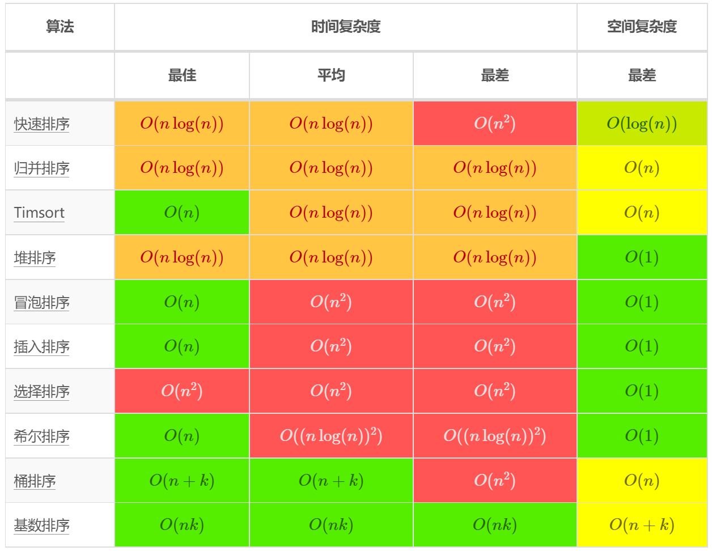

# 双指针

## [283. 移动零](https://leetcode-cn.com/problems/move-zeroes/)

```js
var moveZeroes = function(nums) {
    let i=0, j=0
    while(j<nums.length) {
        if(nums[j]) {
            [nums[i], nums[j]] = [nums[j], nums[i]]
            i++
        }
        j++
    }
};
```

## [15. 三数之和](https://leetcode-cn.com/problems/3sum/)

```js
var threeSum = function(nums) {
    let res = []
    // 如果不存在或者数量小于3, 不满足题意，直接返回[]
    if(!nums || nums.length < 3) return []
    // 升序排列
    nums.sort((a,b) => a-b)
    for(let i=0; i<nums.length; i++) {
        // 数组已经升序排列，当前值大于0，继续向后遍历也不会有满足题意的解
        if(nums[i]>0) return res
        // 去除重复值
        if(i>0 && nums[i] === nums[i-1]) continue
        // 双指针
        let L = i+1, R = nums.length - 1
        while(L<R) {
            if(nums[i]+nums[L]+nums[R] === 0) {
                res.push([nums[i], nums[L], nums[R]])
                // 去重
                while(L<R && nums[L] === nums[L+1]) L++
                while(L<R && nums[R] === nums[R-1]) R--
                L++
                R--
            } else if (nums[i]+nums[L]+nums[R] < 0) L++
            else R--
        }
    }
    return res
};
```

## [31. 下一个排列](https://leetcode-cn.com/problems/next-permutation/)

```js
var nextPermutation = function(nums) {
    let n = nums.length
    // 排除特殊情况
    if(n<2) return
    // 初始化
    let i=n-2, j=n-1, k=n-1
    // 从后向前找到第一个升序对nums[i]<nums[j]
    while(i>=0 && nums[i]>=nums[j]) {
        i--
        j--
    }
    // i>=0 表明找到了符合条件的升序对，如果找不到，按照上方while循环条件，此时i=-1,j=0
    // 即此时原数组为降序排列,因此跳过下方的if代码块，直接进行反转
    if(i>=0) {
        // 从后向前进行查找，直到找到第一对num[i]<nums[k]
        while(nums[i]>=nums[k]) {
            k--
        }
        [nums[i], nums[k]] = [nums[k], nums[i]]
    }

    // 反转[j,n-1]（闭区间）这一段
    for(let m=n-1; j<m; j++, m--) {
        [nums[j], nums[m]] = [nums[m], nums[j]]
    }
};
```

## [844. 比较含退格的字符串](https://leetcode.cn/problems/backspace-string-compare/)

```js
//  栈
var backspaceCompare = function(s, t) {
    function getStr(str) {
        let stack = []
        for(let c of str) {
            if(c==='#') {
                stack.pop()
            } else {
                stack.push(c)
            }
        }
        return stack.join('')
    }

    return getStr(s) === getStr(t)
};

// 双指针
var backspaceCompare = function(s, t) {
    // 一个字符是否被删除只取决于它右侧的字符是否是`#`，因此逆序遍历
    let i=s.length-1, j = t.length-1
    // 记录需要删除的字符个数
    let skipS = 0, skipT = 0
    while(i>=0 || j>=0) {
        while(i>=0) {
            if(s[i] === '#') {
                i--
                skipS++
            } else if(skipS>0) {
                i--
                skipS--
            } else {
                break
            }
        }
        while(j>=0) {
            if(t[j] === '#') {
                j--
                skipT++
            } else if (skipT>0) {
                j--
                skipT--
            } else {
                break
            }
        }
        if(i>=0 && j>=0) {
            if(s[i] !== t[j]) {
                return false
            }
        } else {
            if(i>=0 || j>=0) {
                return false
            }
        }
        i--
        j--
    }
    return true
}
```

## [209. 长度最小的子数组](https://leetcode.cn/problems/minimum-size-subarray-sum/)

```js
var minSubArrayLen = function(target, nums) {
    let l = 0, r = 0
    let sum = 0
    let len = Number.MAX_SAFE_INTEGER
    while(r<nums.length) {
        sum += nums[r++]
        while(sum>=target) {
            len = len < r-l ? len : r-l
            sum -= nums[l++]
        }
    }
    return len === Number.MAX_SAFE_INTEGER ? 0 : len
};
```


# 排序

[912. 排序数组](https://leetcode-cn.com/problems/sort-an-array/)


[cheetsheet](https://liam.page/2016/06/20/big-O-cheat-sheet/)



## 选择排序 :heavy_check_mark:

升序排列：在未排序的那一部分中选出最小的那个数的索引，与开头的数进行交换，不断地重复这一过程。

```js
//前半部分排好序
function selectSort(arr) {
  for(let i=0; i<arr.length; i++){
    let minIndex = i
    for(let j=i; j<arr.length; j++) {
      if(arr[j] < arr[minIndex]) {
        minIndex = j
      }
    }
    [arr[i], arr[minIndex]] = [arr[minIndex], arr[i]]
  }
  return arr
}
//后半部分排好序
function selectSort(arr) {
  for(let i=arr.length-1; i>=0; i--){
    let maxIndex = i
    for(let j=i; j>=0; j--) {
      if(arr[j] > arr[maxIndex]) {
        maxIndex = j
      }
    }
    [arr[i], arr[maxIndex]] = [arr[maxIndex], arr[i]]
  }
  return arr
}

const arr = [6, 4, 2, 3, 1, 5]
console.log(selectSort(arr))
```

## 插入排序:heavy_check_mark:

插入排序的插入是指从未排序的序列中选择一个（一般是第一个）插入到前方已经排好的序列中

时间复杂度：O(n^2)

空间复杂度：O(1)

```js
function insertionSort(arr) {
  for(let i=0; i<arr.length; i++) {
    // j-1>=0, 保证前面至少有一个元素，如果前面没有元素，没有必要进行比较了
    for(let j=i; j-1>=0; j--) {
      if(arr[j] < arr[j-1]) {
        [arr[j], arr[j-1]] = [arr[j-1], arr[j]]
      } else break
    }
  }
  return arr
}

// 优化
function insertionSort(arr) {
  for(let i=0; i<arr.length; i++) {
    // j-1>=0, 保证前面至少有一个元素，如果前面没有元素，没有必要进行比较了
    let j
    // 暂存准备插入的元素，能够减少赋值的操作，但总体复杂度不变
    let temp = arr[i]
    for(j=i; j-1>=0 && temp<arr[j-1]; j--) {
      arr[j] = arr[j-1]
    }
    arr[j] = temp
  }
  return arr
}


//后半部分有序
function insertionSort(arr) {
  for(let i=arr.length-1; i>=0; i--) {
    let j
    let temp = arr[i]
    for(j=i;j<=arr.length-1 && temp>arr[j+1]; j++) {
      arr[j] = arr[j+1]
    }
    arr[j] = temp
  }
  return arr
}

const arr = [6, 4, 2, 3, 1, 5]
console.log(insertionSort(arr))
```

### 插入排序的重要特性

对于选择排序来说， 它的时间时间复杂度稳定在O(n^2)，其内部 循环每次都是从头循环到尾，即使内部循环的的第一个数就是最小的那个数，而对于插入排序来说，其内部排序是可以中途退出的，即内部循环找到了待插入值的位置后就结束了，那么对于一个有序数组来说，插入排序的时间复杂度可以到O(n)，但其总体复杂度还是不变的，如果一个数组总体有序的话可以考虑插入排序。

## 归并排序 :heavy_check_mark:

时间复杂度：O(nlogn)

空间复杂度：O(n)

### 自顶向下的归并排序 :heavy_check_mark:

运用递归的思想，先分成左、右部分，对左右部分递归地进行merge排序，这样左右部分是有序的，然后再将有序的两部分进行合并

```js
const mergeSort = (arr) => {
  const merge = (arr, l, mid, r) => {
    const temp = arr.slice(l, r + 1)
    let i = l,
      j = mid + 1
    // 思考为什么要减去l?temp与原数组是存在偏差的
    // 截取的数组第一个位置为0，但在原数组中位置是l
    // 因此偏差为l，每次要减去l 
    for (let k = l; k <= r; k++) {
      // 左半部分越界
      if (i > mid) {
        arr[k] = temp[j - l]
        j++
        // 右半部分越界
      } else if (j > r) {
        arr[k] = temp[i - l]
        i++
      } else if (temp[i - l] < temp[j - l]) {
        arr[k] = temp[i - l]
        i++
      } else {
        arr[k] = temp[j - l]
        j++
      }
    }
  }
  const sort = (arr, l, r) => {
    if(l >= r) return
    let mid = Math.floor((l+r)/2)
    sort(arr,l,mid)
    sort(arr,mid+1, r)
    merge(arr, l, mid, r)
  }
  sort(arr, 0, arr.length-1)
}

const arr = [1,3,53,9,8,5,4]
mergeSort(arr)
console.log(arr)

```

优化一：

```js
  const sort = (arr, l, r) => {
    if(l >= r) return
    let mid = Math.floor((l+r)/2)
    sort(arr,l,mid)
    sort(arr,mid+1, r)
    // 两端已经有序，如果arr[mid]<=arr[mid+1]，那么这两段就没有必要进行归并
    if(arr[mid]>arr[mid+1]) {
      merge(arr, l, mid, r)
    }
  }
```

优化二：还是对sort进行优化，在数据量小的时候插入排序的性能优于归并排序，但对于js, python来说，可能用处不大设置有反效果，了解即可。

```js
function insertionSort(arr, l, r) {
  for(let i=l; i<=r; i++) {
    let j
    let temp = arr[i]
    for(j=i; j-1>=l && temp<arr[j-1]; j--) {
      arr[j] = arr[j-1]
    }
    arr[j] = temp
  }
  return arr
}

const mergeSort = (arr) => {
  const merge = (arr, l, mid, r) => {
    const temp = arr.slice(l, r + 1)
    let i = l,
      j = mid + 1
    //思考为什么要减去l?temp与原数组是存在偏差的
    // 截取的数组第一个位置为0，但在原数组中位置是l
    // 因此偏差为l，每次要减去l
    for (let k = l; k <= r; k++) {
      // 左半部分越界
      if (i > mid) {
        arr[k] = temp[j - l]
        j++
        // 右半部分越界
      } else if (j > r) {
        arr[k] = temp[i - l]
        i++
      } else if (temp[i - l] < temp[j - l]) {
        arr[k] = temp[i - l]
        i++
      } else {
        arr[k] = temp[j - l]
        j++
      }
    }
  }
  
  const sort = (arr, l, r) => {
    // 优化前返回条件
    // if(l >= r) return
    // 优化后返回条件, 当数据量较小时，插入排序的性能优于归并排序
    if(r-l<=15) {
      insertionSort(arr, l, r)
      // 注意此处，已经排序完毕，立即返回
      return
    }
    let mid = Math.floor((l+r)/2)
    sort(arr,l,mid)
    sort(arr,mid+1, r)
    // 两端已经有序，如果arr[mid]<=arr[mid+1]，那么这两段就没有必要进行归并
    if(arr[mid]>arr[mid+1]) {
      merge(arr, l, mid, r)
    }
  }
  sort(arr, 0, arr.length-1)
}

const arr = [1,3,53,9,8,5,4]
mergeSort(arr)
console.log(arr)

```

### 自底向上的归并排序 :question:

```js
// 自底向上的归并排序
const mergeSort = (arr) => {
  const merge = (arr, l, mid, r) => {
    const temp = arr.slice(l, r + 1)
    let i = l,
      j = mid + 1
    //思考为什么要减去l?temp与原数组是存在偏差的
    // 截取的数组第一个位置为0，但在原数组中位置是l
    // 因此偏差为l，每次要减去l
    for (let k = l; k <= r; k++) {
      // 左半部分越界
      if (i > mid) {
        arr[k] = temp[j - l]
        j++
        // 右半部分越界
      } else if (j > r) {
        arr[k] = temp[i - l]
        i++
      } else if (temp[i - l] < temp[j - l]) {
        arr[k] = temp[i - l]
        i++
      } else {
        arr[k] = temp[j - l]
        j++
      }
    }
  }
  const sort = (arr) => {
    for (let sz = 1; sz < arr.length; sz += sz) {
      for (let i = 0; i + sz < arr.length; i += sz + sz) {
        // 合并两个区间，这个时候mid=i+sz-1, i+sz<n，说明第二个区间存在
        // 但是极端情况下第二个区间可能只有arr[i+sz]这一个数字
        // 为防止越界，r=Math.min(i+sz+sz-1, arr.lenth-1)
        merge(arr, i, i + sz - 1, Math.min(i + sz + sz - 1, arr.length - 1))
      }
    }
  }
  sort(arr)
}
const arr = [1, 3, 53, 9, 8, 5, 4]
mergeSort(arr)
console.log(arr)

```

[剑指 Offer 51. 数组中的逆序对](https://leetcode-cn.com/problems/shu-zu-zhong-de-ni-xu-dui-lcof/)

```js
/**
 * @param {number[]} nums
 * @return {number}
 */

//套用归并排序的方法
var reversePairs = function(nums) {
    let count = 0
    const merge = (arr, l, mid, r) => {
        const temp = arr.slice(l, r+1)
        let i=l, j =mid+1
        for(let k=l; k<=r; k++) {
            if(i>mid) {
                arr[k] = temp[j-l]
                j++
            } else if(j>r) {
                arr[k] = temp[i-l]
                i++
            } else if(temp[i-l]<=temp[j-l]){
                arr[k] = temp[i-l]
                i++
            } else {
                arr[k] = temp[j-l]
                j++
                count+=mid-i+1
            }
        }
    }
    const sort = (arr, l, r) => {
        if(l>=r) return
        let mid = Math.floor((l+r)/2)
        sort(arr, l, mid)
        sort(arr, mid+1, r)
        if(arr[mid]>arr[mid+1]) {
            merge(arr, l, mid, r)
        }
    }
    sort(nums, 0, nums.length-1)
    return count
};
```

## 快速排序 :heavy_check_mark:

partition: 将目标数移动到指定位置，将原数组分为三个部分，小于等于目标数的部分，目标数，大于目标数的部分

关键是partition的实现

> 第一版

```js
const quickSort = (arr, l, r) => {
  // partition将数组分成两部分
  // l, r分别代表数组的左右边界
  // 默认将arr[l]作为标志位
  // [l+1, j] 部分小于arr[l]
  // [j+1,i-1]部分大于arr[l] （闭区间）
  const partition = (arr, l, r) => {
    let j=l
    for(i=l+1; i<=r; i++) {
      if(arr[i]<arr[l]) {
        j++
        [arr[i], arr[j]] = [arr[j], arr[i]]
      }
    }
    [arr[l], arr[j]] = [arr[j], arr[l]]
    return j
  }
  if(l>=r) return
  let mid = partition(arr, l, r)
  quickSort(arr,l,mid-1)
  quickSort(arr,mid+1,r)
}

const arr = [1, 3, 53, 9, 8, 5, 4]
quickSort(arr, 0, arr.length-1)
console.log(arr)
```

第一版快速排序的主要问题在于partition的实现，针对有序数组的话可能会栈溢出

> 第二版  增加随机性

```js
const quickSort = (arr, l, r) => {
  const partition = (arr, l, r) => {
    let p = l + Math.floor(Math.random()*(r-l));  //灵魂分号！！！ FBI warning!!!
    [arr[p], arr[l]] = [arr[l], arr[p]]
    let j = l
    for(i=l+1; i<=r; i++) {
      if(arr[i]<arr[l]) {
        j++
        [arr[i], arr[j]] = [arr[j], arr[i]]
      }
    }
    [arr[l], arr[j]] = [arr[j], arr[l]]
    return j
  }
  if(l>=r) return // 递归推出条件
  let mid = partition(arr, l, r)
  quickSort(arr,l,mid-1)
  quickSort(arr,mid+1,r)
}
```

## 冒泡排序:heavy_check_mark:

第i轮开始，arr[n-i, n)已排好序
第i轮:通过冒泡在arr[n-i- 1]位置放上合适的元素
第i轮结束: arr[n-i- 1, n)已排好序


冒泡排序并不是仅仅简单的将最大（小）的数字移到最后，而是在这过程中不断将逆序对减少，每冒泡一次，逆序对的数量就会减少，直到减为0，排序完成

```js
// 冒泡排序
var sortArray = function(nums) {
    for(let i=0; i<nums.length; i++) {
        for(let j=0; j<nums.length-i; j++) {
            if(nums[j]>nums[j+1]) {
                [nums[j], nums[j+1]] = [nums[j+1], nums[j]]
            }
        }
    }
    return nums
}
```

## 希尔排序:heavy_check_mark:

基本思想：让数组越来越有序，同时不止处理相邻的逆序对，

对元素间距为n/2的所有数组做插入排序
对元素间距为n/4的所有数组做插入排序
对元素间距为n/8的所有数组做插入排序
. ..
对元素间距为1的所有数组做插入排序

```js
// 希尔排序
var sortArray = function(nums) {
  let space = Math.floor(nums.length/2)
  while(space >= 1) {
    // 对间隔为space的数组进行插入排序
      for(let start = 0; start < space; start++) {
        // 进行插入排序的逻辑
        for(let i=start+space; i<nums.length; i+=space) {
            let temp = nums[i]
            let j
            for(j=i; j-space>=0 && temp < nums[j-space]; j-=space) {
                nums[j] = nums[j-space]
            }
            nums[j] = temp
        }
      }
      space = Math.floor(space/2)
  }
  return nums
}

// 改进  si'chong
var sortArray = function(nums) {
    let space = Math.floor(nums.length/2)
    while(space >= 1) {
        //   现在第space个元素就是第一个子序列对应的第二个元素
        for(let i=space; i<nums.length; i++) {
            let temp = nums[i]
            let j
            for(j=i; j-space>=0 && temp < nums[j-space]; j-=space) {
                nums[j] = nums[j-space]
            }
            nums[j] = temp
        }
        space = Math.floor(space/2)
    }
    return nums
}
```


## 综合

### [23. 合并K个升序链表](https://leetcode-cn.com/problems/merge-k-sorted-lists/)

堆

```js
class Heap {
    constructor() {
        this.arr = []
        this.f = (a,b) => a<b
    }
    static heapify(data) {
        let heap = new Heap()
        for(let item of data) {
            if(item) {
                heap.push(item)
            }
        }
        return heap
    }
    get size() {
        return this.arr.length
    }
    push(item) {
        this.arr.push(item)
        this.shiftUp(this.size-1)
    }
    pop() {
        let {size, _swap, arr} = this
        if(size === 0) return null
        _swap(arr, 0, size-1)
        let res = arr.pop()
        this.shiftDown(0)
        return res
    }
    shiftUp(k) {
        let {arr, _swap, _parent, f} = this
        while(k>0 && f(arr[k].val, arr[_parent(k)].val)) {
            _swap(arr, k, _parent(k))
            k = _parent(k)
        }
    }
    shiftDown(k) {
        let {arr, _swap, _child, size, f} = this
        while(_child(k)<size) {
            let child = _child(k)
            if(child+1<size && f(arr[child+1].val, arr[child].val)) {
                child++
            }
            if(f(arr[child].val, arr[k].val)) {
                _swap(arr, k, child)
                k = child
            } else return
        }
    }
    _parent(k) {
        return (k-1)>>>1
    }
    _child(k) {
        return 2*k+1
    }
    _swap(arr, i, j) {
        [arr[i], arr[j]] = [arr[j], arr[i]]
    }
}

var mergeKLists = function(lists) {
    let heap = Heap.heapify(lists)
    let dummy = new ListNode(-1)
    let cur = dummy
    while(heap.size) {
        let list = heap.pop()
        cur.next = list
        cur = cur.next
        if(list.next) heap.push(list.next)
    }
    return dummy.next
};
```

归并

```js
/**
 * Definition for singly-linked list.
 * function ListNode(val, next) {
 *     this.val = (val===undefined ? 0 : val)
 *     this.next = (next===undefined ? null : next)
 * }
 */
/**
 * @param {ListNode[]} lists
 * @return {ListNode}
 */

 var mergeTwoLists = function(list1, list2) {
    if(list1 === null) {
        return list2
    } else if(list2 === null) {
        return list1
    } else if(list1.val <= list2.val) {
        list1.next = mergeTwoLists(list1.next, list2)
        return list1
    } else {
        list2.next = mergeTwoLists(list1, list2.next)
        return list2
    }
}

// var mergeKLists = function(lists) {
//     let ans = null
//     while(lists.length) {
//         ans = mergeTwoLists(ans, lists.pop())
//     }
//     return ans
// };

const merge = (lists, l, r)  => {
    if(l == r) return lists[l]
    let mid = l + Math.floor((r-l)/2)
    return mergeTwoLists(merge(lists, l, mid), merge(lists, mid+1, r))
}

var mergeKLists = function(lists) {
    if(!lists || lists.length===0) return null
    return merge(lists, 0, lists.length-1)
}


```

### [148. 排序链表](https://leetcode-cn.com/problems/sort-list/)

```js
// 归并排序 递归实现
var sortList = function(head) {
    if(!head || !head.next) return head
    let head1 = head
    let head2 = head.next
    while(head2 && head2.next) {
        head1 = head1.next
        head2 = head2.next.next
    }
    let head3 = head1.next
    head1.next = null
    return merge(sortList(head), sortList(head3))
}

const merge = (head1, head2) => {
    if(!head1) return head2
    if(!head2) return head1
    if(head1.val < head2.val) {
        head1.next = merge(head1.next, head2)
        return head1
    } else {
        head2.next = merge(head1, head2.next)
        return head2
    }
}


//归并排序 迭代实现
var sortList = function(head) {
    if(!head || !head.next) return head
    // 1. 计算链表长度len
    let len = 0, cur = head
    while(cur) {
        cur = cur.next
        len++
    }
    // 2. 初始化，增加虚拟头节点 dummmyHead
    let dummmyHead = new ListNode(-1, head)
    // 3. 拆分链表，两两归并，单个长度为subLen, 长度变化为1, 2, 3, 4, 5
    // 注意此处是sublen<<=1, 而不是sunblen<<1
    for(let subLen=1; subLen<len; subLen<<=1) {
        let pre = dummmyHead, curr = pre.next
        // 一直划分，直到cur为空
        while(curr) {
            // 3.1 划分链表 head1
            let head1 = curr
            for(let i=1; i<subLen && curr &&  curr.next; i++) {
                curr = curr.next
            }
            // 3.2 将链表head1与后方断开
            let head2 = curr.next
            curr.next = null
            curr = head2
            // 3.3 划分链表head2
            for(let i=1; i<subLen && curr && curr.next; i++) {
                curr = curr.next
            }
            // 3.4 将链表head2与后方断开
            let next = null
            if(curr) {
                next = curr.next
                curr.next = null
            }
            // 4. 合并链表
            pre.next = merge(head1, head2)
            // 合并完后记得将pre节点移动到合并后链表的最后一个节点，方便后续合并
            while(pre.next) {
                pre = pre.next
            }
            // curr 指向下一次进行划分的链表的头节点
            curr = next
        }
    }
    return dummmyHead.next
}

const merge = (head1, head2) => {
    let dummmyHead = new ListNode(-1)
    let cur = dummmyHead
    while(head1 && head2) {
        if(head1.val < head2.val) {
            cur.next = head1
            head1 = head1.next
        } else {
            cur.next = head2
            head2 = head2.next
        }
        cur = cur.next
    }
    if(head1) cur.next = head1
    if(head2) cur.next = head2
    return dummmyHead.next
}


// 快速排序
var sortList = function(head) {
    //排除特殊情况
    if(!head || !head.next) return head
    //值小于头节点值的节点放在dummyLeft中,反之放在dummyRight中
    //left, right分别指向dummyLeft, dummyRight链表的最后一个节点
    let left = new ListNode(-1), right = new ListNode(-1)
    let dummyLeft = left, dummyRight = right
    let node = head.next
    //根据节点的值将其放在两个不同链表中
    while(node){
        if(node.val < head.val) {
            left.next = node
            left = left.next
        } else  {
            right.next = node
            right = right.next
        }
        node = node.next
    }
    right.next = null
    //dummyLeft链表中节点值都小于头节点的值
    //因此直接将头节点放在最后即可
    left.next = head
    head.next = null
    left = sortList(dummyLeft.next)
    right = sortList(dummyRight.next)
    //因为head在dummyLeft的末尾
    head.next = right
    return left
}

```


# 栈与队列

## 用栈实现队列

[232. 用栈实现队列](https://leetcode-cn.com/problems/implement-queue-using-stacks/)

```js
var MyQueue = function() {
    this.stackIn = []
    this.stackOut = []
};

/** 
 * @param {number} x
 * @return {void}
 */
MyQueue.prototype.push = function(x) {
    this.stackIn.push(x)
};

/**
 * @return {number}
 */
MyQueue.prototype.pop = function() {
    if(this.stackOut.length) {
        return this.stackOut.pop()
    }
    while(this.stackIn.length) {
        this.stackOut.push(this.stackIn.pop())
    }
    return this.stackOut.pop()
};

/**
 * @return {number}
 */
MyQueue.prototype.peek = function() {
    let x = this.pop()
    this.stackOut.push(x)
    return x
};

/**
 * @return {boolean}
 */
MyQueue.prototype.empty = function() {
    return this.stackIn.length === 0 && this.stackOut.length === 0
};


```

## 用队列实现栈

```js
//用两个队列
var MyStack = function() {
    this.queue1 = []
    this.queue2 = []
};

/** 
 * @param {number} x
 * @return {void}
 */
MyStack.prototype.push = function(x) {
    this.queue1.push(x)
};

/**
 * @return {number}
 */
MyStack.prototype.pop = function() {
    if(!this.queue1.length) {
        [this.queue1, this.queue2] = [this.queue2, this.queue1]
    }
    // queue2用作复制，每次queue1弹出item直到只剩一个，返回该item, 相当于是栈顶的元素
    while(this.queue1.length > 1) {
        this.queue2.push(this.queue1.shift())
    }
    return this.queue1.shift()
};

/**
 * @return {number}
 */
MyStack.prototype.top = function() {
    let x = this.pop()
    this.queue1.push(x)
    return x
};

/**
 * @return {boolean}
 */
MyStack.prototype.empty = function() {
    return this.queue1.length === 0 && this.queue2.length === 0
};
```

# 单调栈

#### [402. 移掉 K 位数字](https://leetcode-cn.com/problems/remove-k-digits/)

```js
//  维护一个递增单调栈
var removeKdigits = function(num, k) {
    let res = []
    for( const item of num) {
        while(res.length && res[res.length-1]>item && k) {
            res.pop()
            k--
        }
        res.push(item)
    }
    while(k-->0) {
        res.pop()
    }
    let ans = ''
    let flag = 1
    for(const item of res) {
        if(flag && item === '0') continue
        flag = false
        ans += item
    }
    return ans === '' ? '0' : ans
};
```


# 链表

## 单链表

> with dummyHead

```js
class Node {
  constructor(value, next=null) {
    this.value = value
    this.next = next
  }
}

class LinkedList {
  constructor() {
    this.head = new Node(0)
    this.length = 0
  }
  get(pos) {
    if(pos<0 || pos>=this.length) return null
    let cur = this.head
    while(pos+1 > 0) {
      cur = cur.next
      pos--
    }
    return cur.value
  }
  insert(pos, val) {
    if(pos<0 || pos> this.length) return null
    this.length++
    let cur = this.head
    while(pos > 0) {
      cur = cur.next
      pos--
    }
    let newNode = new Node(val)
    newNode.next = cur.next
    cur.next = newNode
  }
  addHead(val) {
    this.insert(0, val)
  }
  addTail(val) {
    this.insert(this.length, val)
  }
  deleteAtIndex(pos) {
    if(pos<0 || pos>=this.length) return null
    let cur = this.head
    this.length--
    while(pos > 0) {
      cur = cur.next
      pos--
    }
    deletedNode = cur.next
    cur.next = cur.next.next
    return deletedNode
  }
  deleteHead(){
    this.deleteAtIndex(0)
  }
  deleteTail() {
    this.deleteAtIndex(this.length-1)
  }
}
```

```js
//用一个队列
var MyStack = function() {
    this.queue = []
};

/** 
 * @param {number} x
 * @return {void}
 */
MyStack.prototype.push = function(x) {
    this.queue.push(x)
};

/**
 * @return {number}
 */
MyStack.prototype.pop = function() {
    let len = this.queue.length
    while(len-->1) {
        this.queue.push(this.queue.shift())
    }
    return this.queue.shift()
};

/**
 * @return {number}
 */
MyStack.prototype.top = function() {
    let x = this.pop()
    this.queue.push(x)
    return x
};

/**
 * @return {boolean}
 */
MyStack.prototype.empty = function() {
    return this.queue.length === 0
};
```

## 双向链表

### [146. LRU 缓存](https://leetcode-cn.com/problems/lru-cache/)

```js
/**
 * @param {number} capacity
 */
function ListNode(key=null, value=null) {
    this.key = key
    this.value = value
    this.prev = null
    this.next = null
}

var LRUCache = function(capacity) {
    this.capacity = capacity
    this.map = new Map()
    // 初始化双向链表，虚拟头节点，虚拟尾节点，头部存储最近最少使用的节点
    this.head = new ListNode()
    this.tail = new ListNode()
    this.head.next = this.tail
    this.tail.prev = this.head

};

/** 
 * @param {number} key
 * @return {number}
 */
LRUCache.prototype.move_to_tail = function(key) {
    let node = this.map.get(key)
    // 断开连接
    node.prev.next = node.next
    node.next.prev = node.prev
    // 将node插入到尾节点之前
    node.prev = this.tail.prev
    node.next = this.tail
    this.tail.prev.next = node
    this.tail.prev = node 
}

LRUCache.prototype.get = function(key) {
    if(this.map.has(key)) {
        this.move_to_tail(key)
    }
    res = this.map.get(key)
    if(res) return res.value
    return -1
};

/** 
 * @param {number} key 
 * @param {number} value
 * @return {void}
 */
LRUCache.prototype.put = function(key, value) {
    // 如果存在，更新值，移到尾结点之前
    if(this.map.has(key)) {
        let node = this.map.get(key)
        node.value = value
        this.map.set(key, node)
        this.move_to_tail(key)
    } else {
        // 不存在，创建新节点，更新map
        if(this.map.size === this.capacity) {
            // 容量满了，更新map, 删除最近最少使用的节点
            this.map.delete(this.head.next.key)
            this.head.next = this.head.next.next
            this.head.next.prev = this.head
        }
        let node = new ListNode(key, value)
        this.map.set(key, node)
        node.prev = this.tail.prev
        node.next = this.tail
        this.tail.prev.next = node
        this.tail.prev = node
    }
};

/**
 * Your LRUCache object will be instantiated and called as such:
 * var obj = new LRUCache(capacity)
 * var param_1 = obj.get(key)
 * obj.put(key,value)
 */
```


## 技巧

后面三个都使用了双指针的技巧,注意体会.

### 反转链表

1. 递归

```js
// 递归
var reverseList = function(head) {
    if(!head || !head.next) return head
    const newNode = reverseList(head.next)
    head.next.next = head
    head.next = null
    return newNode
}
```

2. 迭代

```js
/* var reverseList = function(head) {
    let pre = null
    let cur = head
    while(cur) {
        let next = cur.next
        cur.next = pre
        pre = cur 
        cur = next
    }
    return pre
}; 
```

**反转部分链表**

反转（start, end）之间的链表

```js
function reverse(start, end) {
    let [pre, cur] = [start, start.next]
    while(cur !== end) { //这里的end节点并没有被反转
        let next = cur.next
        cur.next = pre
        pre = cur
        cur = next
    }
}
```

注意: 这里的反转后pre指向反转后链表的第一个节点，原链表的第一个节点变为反转后链表的最后一个节点

### 链表的拼接

#### 两个升序链表的合并

1. 迭代实现

```js
var mergeTwoLists = function(list1, list2) {
    let res = new ListNode(0)
    let cur = res
   let m = list1
   let n = list2
   while(m !== null && n !== null) {
       if(m.val <= n.val) {
           cur.next = m
           m = m.next
       } else {
           cur.next = n
           n = n.next
       }
       cur = cur.next
   }
   cur.next = m === null ? n : m
   return res.next
};
```

2. 递归实现

```js
var mergeTwoLists = function(list1, list2) {
    if(list1 === null) {
        return list2
    } else if(list2 === null) {
        return list1
    } else if(list1.val <= list2.val) {
        list1.next = mergeTwoLists(list1.next, list2)
        return list1
    } else {
        list2.next = mergeTwoLists(list1, list2.next)
        return list2
    }
}
```

#### abcd | 找到待反转链表的前驱和后继

[92. 反转链表 II](https://leetcode-cn.com/problems/reverse-linked-list-ii/)  链表反转的方法同前，注意反转后的拼接过程，看作a, b, c ,d四点， [25. K 个一组翻转链表](https://leetcode-cn.com/problems/reverse-nodes-in-k-group/)中处理方法相同，不同的是要在同一个链表中处理K组

[61. 旋转链表](https://leetcode-cn.com/problems/rotate-list/)其实并没有涉及链表的反转，其实就是链表的拼接，找到倒数第n个节点，修改指针的指向，修改后要注意断开，否则会形成环，另外要注意空链表的处理

#### [25. K 个一组翻转链表](https://leetcode-cn.com/problems/reverse-nodes-in-k-group/)

```js
//  虚拟头节点的使用；反转链表；尤其是在链表内部反转部分链表，以及反转后链表的拼接
var reverseKGroup = function(head, k) {
    let dummy = new ListNode(-1, head)
    let [start, end] = [dummy, dummy.next]
    let count = 0
    //达到数量k的要求后就反转, 剩下的不足k就结束，返回结果
    while(end) {
        count++
        if(count % k === 0) {
            // 真正需要的是start.next 到 end， start被当作哨兵节点
            // 还原成初始状态，start指向前一段的最后一个节点，end指向下一组待翻转链表的第一个节点
            start = reverseList(start, end.next)
            end = start.next  
        } else {
            end = end.next
        }
    }
    return dummy.next

    function reverseList(start, end){
        let [pre, cur] = [start, start.next]
        // 反转后这个指针指向反转后这段链表的最后一个节点
        // 暂时保存，方便反转后链表的连接
        let first = cur
        while(cur !== end) {
            let next = cur.next
            cur.next = pre
            pre = cur
            cur = next
        }
        // 拼接链表 a b c d
        start.next = pre
        first.next = cur //  同 first.next = end
        return first
    }
};
```

> 变形：不足k个也要反转

```js
var reverseKGroup = function(head, k) {
    let count = 0
    let dummy = new ListNode(-1, head)
    let [start, end] = [dummy, dummy.next]

    const reverse = (start, end) => {
        let [pre, cur] = [start, start.next]
        let first = cur
        while(cur !== end) {
            let next = cur.next
            cur.next = pre
            pre = cur
            cur = next
        }
        start.next = pre
        first.next = end
        return first
    }
    let temp = 0    //*
    while(end) {
        count++
        if(count % k === 0) {
            temp = count
            start = reverse(start, end.next)
            end = start.next
        } else end = end.next
    }
    //*
    if(temp !== count) {
        let cur = dummy
        while(temp--) {
            cur = cur.next
        }
        reverse(cur, null)
    }
    return dummy.next
};
```


### 快慢指针

#### 检测链表中的环

1. 使用哈希表

```js
var hasCycle = function(head) {
    let set = new Set()
    let cur = head
    while(cur) {
        if(set.has(cur)) return true
        set.add(cur)
        cur = cur.next
    }
    return false
};
```

2. 使用快慢指针

   快指针走两步，慢指针走一步，如果有环，快指针先进入环中，慢指针一定会被快指针追上；如果没有环，那么快指针就会先一步到达链表末尾。

   ```js
   var hasCycle = function(head) {
       if(head == null || head.next == null) return false
       // 想象有一个虚拟头节点,慢指针从该节点移动一步到head,快指针移动两步到head.next
       //如果都从head开始,那while就行不下去了,当然也可以使用do-while解决
       let slow = head
       let fast = head.next
       while(slow !== fast) {
           if(fast == null || fast.next == null) return false
           slow = slow.next
           fast = fast.next.next
       }
       return true
   }
   ```

> 类似：[202. 快乐数](https://leetcode-cn.com/problems/happy-number/)
>
> ```js
> // 快慢指针
> // 最终变为1
> // 或者 跳进循环，最终相等
> // 是否会无限增大？不会，如9999 ，下一个数为324最终都不会超过三位数，即不会无限增大
> var isHappy = function(n) {
>  const getNext = (n) => {
> …    while(fast !== 1 && slow !== fast) {
>      slow = getNext(slow)
>      fast = getNext(getNext(fast))
>  }
>  return fast === 1
> };
> ```
>

### [287. 寻找重复数](https://leetcode-cn.com/problems/find-the-duplicate-number/)

```js
/**
 * @param {number[]} nums
 * @return {number}
 */
// var findDuplicate = function(nums) {
//     let l = 0, r = nums.length-1
//     while(l<r) {
//         let mid = l + ((r-l)>>1)
//         let cnt = 0
//         for(let num of nums) {
//             if(num<=mid) cnt++
//         }
//         if(cnt>mid) {
//             r=mid
//         } else {
//             l = mid+1
//         }
//     }
//     return l
// };

// 看成是一个链表，0指向nums[0]，nums[0]指向nums[nums[0]], c = nums[c]也就相当于node = node.next
// 快指针走了2n, 慢指针走了n,环的长度为c, 快指针比慢指针多走了n,多走的都是在环里面走的，因此n%c=0
// 环之前的长度为m, 慢指针和快指针相遇时慢指针在环中经过了n-m，因此再设一个新指针flag=0，二者同时走，每次
// 走一步，最终会在环的入口相遇，因为此时走过了m步，而n%c=0，因此慢指针刚好到入口处
var findDuplicate = function(nums) {
    let fast = 0, slow = 0
    while(true) {
        fast = nums[nums[fast]]
        slow = nums[slow]
        if(fast === slow) break
    }
    let flag = 0
    while(true) {
        flag = nums[flag]
        slow = nums[slow]
        if(flag  === slow) break
    }
    return slow
}
```


#### 删除链表的倒数第 N 个结点

1. 使用栈

```js
var removeNthFromEnd = function(head, n) {
    // 哨兵节点，不用单独处理头节点
    let dummy = new ListNode(-1, head)
    let arr = []
    let cur = dummy
    while(cur) {
        arr.push(cur)
        cur = cur.next
    }
    for(let i=0; i<n; i++) {
        arr.pop()
    }
    // 得到待删除节点的前驱节点
    let pre = arr.pop()
    pre.next = pre.next.next
    return dummy.next
};
```

2. 双指针

```js
var removeNthFromEnd = function(head, n) {
    // first比second提前n个节点，当first到达最后一个节点时，
    // second 刚好到达倒数第n个节点，
    // 那么让second初始值为dummy，first到达最后一个节点时，
    // second刚好到达待删除节点的前驱节点
    let dummy = new ListNode(-1, head)
    let first = head
    let second = dummy
    for(let i=0; i<n; i++) {
        first = first.next
    }
    while(first) {
        first = first.next
        second = second.next
    }
    second.next = second.next.next
    return dummy.next
}
```

#### [链表的中间结点](https://leetcode-cn.com/problems/middle-of-the-linked-list/)

1. 单指针  (n, 1)

```js
var middleNode = function(head) {
    let cur = head
    let len = 0
    while(cur) {
        len++
        cur = cur.next
    }
    let dummy = new ListNode(-1, head)
    let num = Math.floor(len/2)
    let pre=dummy
    while(num > 0) {
        num--
        pre = pre.next
    }
    return pre.next
};
```

2. 快慢指针

```js
var middleNode = function(head) {
    let slow = head
    let fast = head
    while(fast !== null && fast.next !== null) {
        slow = slow.next
        fast = fast.next.next
    }
    return slow
}
```

### 复制链表

#### [剑指 Offer 35. 复杂链表的复制](https://leetcode-cn.com/problems/fu-za-lian-biao-de-fu-zhi-lcof/)

```js
var copyRandomList = function(head) {
    if(!head) return null
    let map = new Map()
    let cur = head
    while(cur) {
        map.set(cur, new Node(cur.val))
        cur = cur.next
    }
    cur = head
    while(cur) {
        map.get(cur).next = cur.next ? map.get(cur.next) : null
        map.get(cur).random = cur.random ? map.get(cur.random) : null
        cur = cur.next
    }
    return map.get(head)
};
```


#### [430. 扁平化多级双向链表](https://leetcode-cn.com/problems/flatten-a-multilevel-doubly-linked-list/)

#### [1600. 皇位继承顺序](https://leetcode-cn.com/problems/throne-inheritance/)

> hard

#### [460. LFU 缓存](https://leetcode-cn.com/problems/lfu-cache/)

# 堆 与 优先队列

### TODO [剑指 Offer 40. 最小的k个数](https://leetcode-cn.com/problems/zui-xiao-de-kge-shu-lcof/)

## TODO [295. 数据流的中位数](https://leetcode-cn.com/problems/find-median-from-data-stream/)

## TODO [剑指 Offer 45. 把数组排成最小的数](https://leetcode-cn.com/problems/ba-shu-zu-pai-cheng-zui-xiao-de-shu-lcof/)

## 二叉堆实现

```js
class Heap {
  constructor() {
      this.arr = []
      this.compare = (a, b) => a < b
  }

  static heapify = function(data) {
      let heap = new Heap()
    for(let item of data) {
        heap.push(item)
    }
    return heap
  }
  get size() {
      return this.arr.length
  }
  push(val) {
      this.arr.push(val)
      this.shiftUp(this.size-1)
  }
  pop(){
      if(this.size<=0) return null
      let {arr, _swap,size} = this
      _swap(arr, 0, size-1)
      let temp = arr.pop()
      this.shiftDown(0)
      return temp
  }
  shiftUp(k) {
    let {_parent, _swap, arr, compare} = this
    // while(k>0) {
    //     let parent = _parent(k)
    //     if(compare(arr[k],arr[parent])) {
    //         _swap(arr, k, parent)
    //         k = parent
    //     } else break
    //     // 不加break,这里会卡死
    // }
    while(k>0 && compare(arr[k], arr[_parent(k)])) {
      _swap(arr, k, _parent(k))
      k = _parent(k)
    }
  }
  shiftDown(k) {
      let {_leftChild, _swap, arr, size, compare} = this
      while(_leftChild(k)<size) {
          let Child = _leftChild(k)
          if(Child+1<size && compare(arr[Child+1], arr[Child])) {
              Child++
          }
          if(compare(arr[Child], arr[k])) {
              _swap(arr, Child, k)
              k = Child
          } else return
          // 注意
      }
  }
  _parent(k) {
      return (k-1) >>> 1
  }
  _leftChild(k) {
      return 2*k + 1
  }
  _swap(arr, l, r) {
      ;[arr[l], arr[r]] = [arr[r], arr[l]]
  }
}

const arr = [1, 3, 53, 9, 8, 5, 4]
let a = Heap.heapify(arr)
console.log(a)
while(a.size) {
  console.log(a.pop())
}
```

# 位运算

### [剑指 Offer 15. 二进制中1的个数](https://leetcode-cn.com/problems/er-jin-zhi-zhong-1de-ge-shu-lcof/)

与1进行与运算或者利用n&n(n-1)

### [136. 只出现一次的数字](https://leetcode-cn.com/problems/single-number/)

> 使用哈希可以达到n的空间与时间复杂度
>
> 使用位运算可以达到线性时间空间复杂度

```js
// 异或运算
// 任何数和0做异或，不变
// 任何数和自身做异或，为0
var singleNumber = function(nums) {
    let ans = 0
    for(let item of nums) {
        ans ^= item
    }
    return ans
};
```

### [342. 4的幂](https://leetcode-cn.com/problems/power-of-four/)


```js
var isPowerOfFour = function(n) {
    return n>0 && (n & (n-1)) === 0 && (n % 3 === 1)
};
// var isPowerOfFour = function(n) {
//     return n>0 && (n & (n-1)) === 0 && (n & 0xaaaaaaaa) === 0
// };
```

### [231. 2 的幂](https://leetcode-cn.com/problems/power-of-two/)

```js
var isPowerOfTwo = function(n) {
    return n > 0 && (n & (n-1)) === 0
};
var isPowerOfTwo = function(n) {
    return n > 0 && (n & (-n)) === n
};
```

### [面试题 01.01. 判定字符是否唯一](https://leetcode-cn.com/problems/is-unique-lcci/)

```js
//注意位运算符优先级
var isUnique = function(astr) {
    let mark = 0
    for(let c of astr) {
        let k = c.charCodeAt() - 'a'.charCodeAt()
        if((mark & (1 << k)) !== 0) {
            return false
        } else {
            mark |= (1 << k)
        }
    }
    return true
}
```

> 利用异或

### [389. 找不同](https://leetcode-cn.com/problems/find-the-difference/)

```js
 /* 位运算 */
var findTheDifference = function(s, t) {
    let mark = 0
    for(let c of s) {
        mark ^= c.charCodeAt()
    }
    for(let c of t) {
        mark ^= c.charCodeAt()
    }
    return String.fromCharCode(mark)
};
```


***n* & (*n*−1)**  运算结果恰为把 n 的二进制位中的最低位的 1变为 0，使用 

:question:判断是否是2的幂

1. `n & (n−1) === 0  `

2. `n & (-n) = n`

3. 判断 n 是否是 2^30 的约数

   > ```js
   > var isPowerOfTwo = function(n) {
   >     const BIG = 1 << 30;
   >     return n > 0 && BIG % n === 0;
   > };
   > ```

### [剑指 Offer 65. 不用加减乘除做加法](https://leetcode-cn.com/problems/bu-yong-jia-jian-cheng-chu-zuo-jia-fa-lcof/)

```js
var add = function(a, b) {
    while(b!=0) {
        let carry = (a & b) << 1
        a ^= b
        b = carry
    }
    return a 
};
```


:question:二进制加减法

:question:判断a的第k位数字是0是1； 将a的第k位数字赋值为1

a & (1<<k) 

a | (1<<k) 

### [ 剑指 Offer 56 - I. 数组中数字](https://leetcode-cn.com/problems/shu-zu-zhong-shu-zi-chu-xian-de-ci-shu-lcof)

```js
//  分组异或
var singleNumbers = function(nums) {
    // 首先拿到所有数字的异或结果，等同于其中两个不同数的异或结果
    // 因为相同的数出现次数都是两次，异或结果为0
    let a = 0
    for(let num of nums) {
        a ^= num
    }
    // 然后找到异或结果中的为1的某一二级制位作为分组标准
    // 异或为1代表这两个数在该位置的值不同，因此这两个数得以被分进不同的两组
    // 对于数值相同的两个数来说，对应位置的异或结果肯定相同（0或1）
    // 因此相同的两个数会被分进同一组，满足题意
    let div = 1
    while((div & a) === 0) {
        div <<= 1
    }

    let b = 0, c = 0
    for(let num of nums) {
        if(div & num) {
            b ^= num
        } else {
            c ^= num
        }
    }
    return [b, c]
};
```


### TODO

### [剑指 Offer 56 - II. 数组中数字](https://leetcode-cn.com/problems/shu-zu-zhong-shu-zi-chu-xian-de-ci-shu-ii-lcof)

# 滑动窗口

## 窗口大小不变

### [643. 子数组最大平均数 I](https://leetcode-cn.com/problems/maximum-average-subarray-i/)

> 给你一个由 `n` 个元素组成的整数数组 `nums` 和一个整数 `k` 。
>
> 请你找出平均数最大且 **长度为 `k`** 的连续子数组，并输出该最大平均数。
>
> 任何误差小于 `10-5` 的答案都将被视为正确答案。
>
> ```js
> var findMaxAverage = function(nums, k) {
>     let sum = 0
>     for(let i=0; i<k; i++) {
>         sum += nums[i]
>     }
>     // 维护一个长度为k的滑动窗口
>     // 通过一次遍历求得连续子数组的和，更新最大值
>     let max = sum
>     for(let i=k; i<nums.length; i++) {
>         sum = sum - nums[i-k] + nums[i]
>         max = Math.max(sum, max)
>     }
>     return max/k
> };
> ```

### [1423. 可获得的最大点数](https://leetcode-cn.com/problems/maximum-points-you-can-obtain-from-cards/)

>  几张卡牌 **排成一行**，每张卡牌都有一个对应的点数。点数由整数数组 `cardPoints` 给出。
>
> 每次行动，你可以从行的开头或者末尾拿一张卡牌，最终你必须正好拿 `k` 张卡牌。
>
> 你的点数就是你拿到手中的所有卡牌的点数之和。
>
> 给你一个整数数组 `cardPoints` 和整数 `k`，请你返回可以获得的最大点数。
>
> ```js
> var maxScore = function(cardPoints, k) {
>     let sum = 0
>     let n = cardPoints.length - k
>     for(let i=0; i < n; i++) {
>         sum += cardPoints[i]
>     }
>     let minSum = sum
>     for(let i=n; i<cardPoints.length; i++) {
>         sum += cardPoints[i] - cardPoints[i-n]
>         minSum = Math.min(minSum, sum)
>     }
>     const total = cardPoints.reduce((a,b) => a+b, 0)
>     return total - minSum
> };
> ```

### [219. 存在重复元素 II](https://leetcode-cn.com/problems/contains-duplicate-ii/)

> 给你一个整数数组 `nums` 和一个整数 `k` ，判断数组中是否存在两个 **不同的索引** `i` 和 `j` ，满足 `nums[i] == nums[j]` 且 `abs(i - j) <= k` 。如果存在，返回 `true` ；否则，返回 `false` 。
>
>  ```js
>  // 滑动窗口
>  var containsNearbyDuplicate = function(nums, k) {
>      let set = new Set()
>      // abs(i-j) <= k 维护一个长度为k+1的滑动窗口
>      for(let i=0; i<nums.length; i++) {
>          if(i>k) {
>              set.delete(nums[i-k-1])
>          }
>          if(set.has(nums[i])) return true
>          set.add(nums[i])
>      }
>      return false
>  };
>  
>  // 哈希
>  var containsNearbyDuplicate = function(nums, k) {
>      let map = new Map()
>      for(let i=0; i<nums.length; i++) {
>          if(map.has(nums[i]) && Math.abs(i-map.get(nums[i]) <= k)) return true
>          map.set(nums[i], i)
>      }
>      return false
>  }
>  ```

### [220. 存在重复元素 III](https://leetcode-cn.com/problems/contains-duplicate-iii/)

**todo**

> 给你一个整数数组 `nums` 和两个整数 `k` 和 `t` 。请你判断是否存在 **两个不同下标** `i` 和 `j`，使得 `abs(nums[i] - nums[j]) <= t` ，同时又满足 `abs(i - j) <= k` 。
>
> 如果存在则返回 `true`，不存在返回 `false`。
>
> ```js
> ```
>
> 

## 窗口大小变化

### 模板

```java
def findSubArray(nums):
    N = len(nums) # 数组/字符串长度
    left, right = 0, 0 # 双指针，表示当前遍历的区间[left, right]，闭区间
    sums = 0 # 用于统计 子数组/子区间 是否有效，根据题目可能会改成求和/计数
    res = 0 # 保存最大的满足题目要求的 子数组/子串 长度
    while right < N: # 当右边的指针没有搜索到 数组/字符串 的结尾
        sums += nums[right] # 增加当前右边指针的数字/字符的求和/计数
        while 区间[left, right]不符合题意：# 此时需要一直移动左指针，直至找到一个符合题意的区间
            sums -= nums[left] # 移动左指针前需要从counter中减少left位置字符的求和/计数
            left += 1 # 真正的移动左指针，注意不能跟上面一行代码写反
        # 到 while 结束时，我们找到了一个符合题意要求的 子数组/子串
        res = max(res, right - left + 1) # 需要更新结果
        right += 1 # 移动右指针，去探索新的区间
    return res
```

滑动窗口中用到了左右两个指针，它们移动的思路是：**以右指针作为驱动，拖着左指针向前走。右指针每次只移动一步，而左指针在内部 while 循环中每次可能移动多步。右指针是主动前移，探索未知的新区域；左指针是被迫移动，负责寻找满足题意的区间。**

```js
模板的整体思想是：

定义两个指针 left 和 right 分别指向区间的开头和结尾，注意是闭区间；定义 sums 用来统计该区间内的各个字符出现次数；
第一重 while 循环是为了判断 right 指针的位置是否超出了数组边界；当 right 每次到了新位置，需要增加 right 指针的求和/计数；
第二重 while 循环是让 left 指针向右移动到 [left, right] 区间符合题意的位置；当 left 每次移动到了新位置，需要减少 left 指针的求和/计数；
在第二重 while 循环之后，成功找到了一个符合题意的 [left, right] 区间，题目要求最大的区间长度，因此更新 res 为 max(res, 当前区间的长度) 。
right 指针每次向右移动一步，开始探索新的区间。
```

### [594. 最长和谐子序列](https://leetcode-cn.com/problems/longest-harmonious-subsequence/)

### :star:[76. 最小覆盖子串](https://leetcode-cn.com/problems/minimum-window-substring/)

> 给你一个字符串 `s` 、一个字符串 `t` 。返回 `s` 中涵盖 `t` 所有字符的最小子串。如果 `s` 中不存在涵盖 `t` 所有字符的子串，则返回空字符串 `""` 。
>
> **注意：**
>
> - 对于 `t` 中重复字符，我们寻找的子字符串中该字符数量必须不少于 `t` 中该字符数量。
> - 如果 `s` 中存在这样的子串，我们保证它是唯一的答案。

***\*定义\****：

`start`，`len`分别是最小覆盖子串的起始位置和长度，用于最后生成最小覆盖字串

`left`，`right` 分别为左右边界，`valid`表示当前窗口已验证的字符数

`need` 为需要验证的字符的字符数的集合，格式为`{'char': number}`，初始化后是不变的

`window` 为当前窗口中目标字符的集合，格式为`{'char': number}`，初始为空，随着窗口的移动不断更新

***\*步骤\****：

1. 不断移动右指针，直到当前窗口中已经包括了`t`中的所有字符

2. 更新最短字串的长度和起始位置，向右收缩左指针，重复这一步骤，如果收缩前左指针指向一个目标字符，`valid--`

3. `valid < Object.keys(need)`,不满足2的循环条件，重新进入步骤1

```js
var minWindow = function(s, t) {
  // 最小覆盖字串的起始位置及长度
  let start = 0, len = Number.MAX_VALUE
  // 滑动窗口的左右指针
  let left = 0, right = 0
  // 表示当前窗口已验证的字符数（种类）
  let valid = 0
  // need为需要验证的字符的字符数的集合，格式为{'char': number}
  // window为当前窗口中 所需要的目标字符的集合，格式为{'char': number}
  let need = {}, window = {}
  // 生成need集合
  for(let c of t) {
    need[c] = (need[c] || 0) + 1
  }
  while(right < s.length) {
    let c = s[right]
    right++
    // 当前字符属于需验证字符，更新当前窗口统计
    if(need[c]) {
      window[c] = (window[c] || 0) + 1
      // 相应字符数量与验证字符数量匹配，
      if(window[c] === need[c]) {
        valid++
      }
    }
    // 当窗口中目标字符数量与所需要的字符个数相同时，开始收缩窗口
    // 更新最小覆盖字串
    while(valid === Object.keys(need).length) {
      // 注意此处 right已经右移过了，因此字串长度为right-left, 而不是right-left+1
      if(right-left< len) {
        start = left
        len = right-left
      }
     // 左移窗口，移动过程中注意更新valid 与 window
      let d = s[left]
      left++
      if(need[d]) {
        if(window[d] === need[d]) {
          valid--
        }
        window[d]--
      }
    }
  }

  return len == Number.MAX_VALUE ? '' : s.substr(start, len)
};
```


### [567. 字符串的排列](https://leetcode-cn.com/problems/permutation-in-string/)

> 给你两个字符串 `s1` 和 `s2` ，写一个函数来判断 `s2` 是否包含 `s1` 的排列。如果是，返回 `true` ；否则，返回 `false` 。
>
> 换句话说，`s1` 的排列之一是 `s2` 的 **子串** 。

```js
var checkInclusion = function(s1, s2) {
    let left = 0, right = 0, valid = 0
    let need = {}, window = {}
    for(let c of s1) {
        need[c] = (need[c] || 0) + 1
    }
    while(right < s2.length) {
        let c = s2[right]
        right++
        if(need[c]) {
            window[c] = (window[c] || 0) + 1
            if(need[c] === window[c]) valid++
        }
        while(right - left >= s1.length) {
            if(valid === Object.keys(need).length) return true
            let d = s2[left]
            left++
            if(need[d]) {
                if(need[d] === window[d]) {
                    valid--
                }
                window[d]--
            }
        }
    }
    return false
}


var checkInclusion = function(s1, s2) {
    function check(){
        for(let i = 0;i < 26;i++){
            if(arr1[i] !== arr2[i])return false
        }
        return true
}
    let n=s1.length, m=s2.length
    let arr1 = new Array(26).fill(0)
    let arr2 = new Array(26).fill(0)
    if(n>m) return false
    for(let i=0; i<n; i++) {
        ++arr1[s1[i].charCodeAt()-'a'.charCodeAt()]
        ++arr2[s2[i].charCodeAt()-'a'.charCodeAt()]
    }
    // 维护一个长度为s1.length的窗口
    if(check()) return true
    for(let i=n; i<m; i++) {
        // 每次统计一进一出两个字母
        ++arr2[s2[i].charCodeAt()-'a'.charCodeAt()]
        --arr2[s2[i-n].charCodeAt()-'a'.charCodeAt()]
        if(check()) return true
    }
    return false
};


var checkInclusion = function(s1, s2) {
    const n = s1.length, m = s2.length;
    if (n > m) {
        return false;
    }
    const cnt = new Array(26).fill(0);
    for (let i = 0; i < n; ++i) {
        --cnt[s1[i].charCodeAt() - 'a'.charCodeAt()];
        ++cnt[s2[i].charCodeAt() - 'a'.charCodeAt()];
…};

```


### [3. 无重复字符的最长子串](https://leetcode-cn.com/problems/longest-substring-without-repeating-characters/)

> 给定一个字符串 `s` ，请你找出其中不含有重复字符的 **最长子串** 的长度。

```js
var lengthOfLongestSubstring = function(s) {
    let set = new Set()
    let r=-1
    let ans = 0
    let n = s.length
    for(let i=0; i<n; i++) {
        if(i>0) {
            set.delete(s.charAt(i-1))
        }
        while(r+1 < n && !set.has(s.charAt(r+1))) {
            set.add(s.charAt(r+1))
            r++
        }
        ans = Math.max(ans, r-i+1)
    }
    return ans
};

var lengthOfLongestSubstring = function(s) {
    const map = new Map()
    let ans = 0
    let start = 0
    for(let i=0; i<s.length; i++) {
        let ch = s.charAt(i)
        // 发现重复字符，更新起始位置
        if(map.has(ch)) {
            // 新的起始位置为重复字符的下一个位置，没有必要删除旧的字符及其位置
            start = Math.max(map.get(ch)+1, start)
        }
        // 更新最长无重复字串长度
        ans = Math.max(ans, i-start+1)
        // 更新字符位置
        map.set(ch, i)
    }
    return ans
};

var lengthOfLongestSubstring = function(s) {
    let left = 0, right = 0
    let window = {}, res = 0
    while(right < s.length) {
        let c = s[right]
        right++
        window[c] = (window[c] || 0) + 1
        while(window[c] > 1) {
            window[s[left++]]--
        }
        res = Math.max(res, right-left)
    }
    return res
}
```

### [209. 长度最小的子数组](https://leetcode.cn/problems/minimum-size-subarray-sum/)

```js
var minSubArrayLen = function(target, nums) {
    let l = 0, r = 0
    let sum = 0
    let len = Number.MAX_SAFE_INTEGER
    while(r<nums.length) {
        sum += nums[r++]
        while(sum>=target) {
            len = len < r-l ? len : r-l
            sum -= nums[l++]
        }
    }
    return len === Number.MAX_SAFE_INTEGER ? 0 : len
};
```

TODO: [904. 水果成篮](https://leetcode.cn/problems/fruit-into-baskets/)

难度中等209

# 二叉树

## **:sparkles: 二叉树：递归函数究竟什么时候需要返回值，什么时候不要返回值？:sparkles:**

> :man_playing_handball: 递归函数返回值为bool类型是为了搜索一条边，没有返回值是搜索整棵树。

> 递归函数有返回值就是要遍历某一条边，但有返回值也要看如何处理返回值
>
> > :man_playing_handball:**如果递归函数有返回值，如何区分要搜索一条边，还是搜索整个树呢？**
> >
> > 搜索一条边的写法：
> >
> > ```text
> > if (递归函数(root->left)) return ;
> > 
> > if (递归函数(root->right)) return ;
> > ```
> >
> > 搜索整个树写法：
> >
> > ```text
> > left = 递归函数(root->left);
> > right = 递归函数(root->right);
> > left与right的逻辑处理;
> > ```


 **在递归函数有返回值的情况下：如果要搜索一条边，递归函数返回值不为空的时候，立刻返回，如果搜索整个树，直接用一个变量left、right接住返回值，这个left、right后序还有逻辑处理的需要，也就是后序遍历中处理中间节点的逻辑（也是回溯）**。

## **遍历方式**

### 递归

>  前序遍历：

```javascript
var preorderTraversal = function(root) {
 let res=[];
 const dfs=function(root){
     if(root===null)return ;
     //先序遍历所以从父节点开始
     res.push(root.val);
     //递归左子树
     dfs(root.left);
     //递归右子树
     dfs(root.right);
 }
 //只使用一个参数 使用闭包进行存储结果
 dfs(root);
 return res;
};
```

>  中序遍历

```javascript
var inorderTraversal = function(root) {
    let res=[];
    const dfs=function(root){
        if(root===null){
            return ;
        }
        dfs(root.left);
        res.push(root.val);
        dfs(root.right);
    }
    dfs(root);
    return res;
};
```

>  后序遍历

```javascript
var postorderTraversal = function(root) {
    let res=[];
    const dfs=function(root){
        if(root===null){
            return ;
        }
        dfs(root.left);
        dfs(root.right);
        res.push(root.val);
    }
    dfs(root);
    return res;
};
```

### 迭代

```js
前序遍历:

// 入栈 右 -> 左
// 出栈 中 -> 左 -> 右
var preorderTraversal = function(root, res = []) {
    if(!root) return res;
    const stack = [root];
    let cur = null;
    while(stack.length) {
        cur = stack.pop();
        res.push(cur.val);
        cur.right && stack.push(cur.right);
        cur.left && stack.push(cur.left);
    }
    return res;
};

中序遍历:

// 入栈 左 -> 右
// 出栈 左 -> 中 -> 右

var inorderTraversal = function(root, res = []) {
    const stack = [];
    let cur = root;
    while(stack.length || cur) {
        if(cur) {
            stack.push(cur);
            // 左
            cur = cur.left;
        } else {
            // --> 弹出 中
            cur = stack.pop();
            res.push(cur.val); 
            // 右
            cur = cur.right;
        }
    };
    return res;
};

后序遍历:

// 入栈 左 -> 右
// 出栈 中 -> 右 -> 左 结果翻转

var postorderTraversal = function(root, res = []) {
    if (!root) return res;
    const stack = [root];
    let cur = null;
    do {
        cur = stack.pop();
        res.push(cur.val);
        cur.left && stack.push(cur.left);
        cur.right && stack.push(cur.right);
    } while(stack.length);
    return res.reverse();
};
```

### 迭代统一形式

> 前序遍历统一迭代法

```js
// 前序遍历：中左右
// 压栈顺序：右左中

var preorderTraversal = function(root, res = []) {
    const stack = [];
    if (root) stack.push(root);
    while(stack.length) {
        const node = stack.pop();
        if(!node) {
            res.push(stack.pop().val);
            continue;
        }
        if (node.right) stack.push(node.right); // 右
        if (node.left) stack.push(node.left); // 左
        stack.push(node); // 中
        stack.push(null);
    };
    return res;
};
```

> 中序遍历统一迭代法

```js
//  中序遍历：左中右
//  压栈顺序：右中左
 
var inorderTraversal = function(root, res = []) {
    const stack = [];
    if (root) stack.push(root);
    while(stack.length) {
        const node = stack.pop();
        if(!node) {
            res.push(stack.pop().val);
            continue;
        }
        if (node.right) stack.push(node.right); // 右
        stack.push(node); // 中
        stack.push(null);
        if (node.left) stack.push(node.left); // 左
    };
    return res;
};
```

> 后序遍历统一迭代法

```js
// 后续遍历：左右中
// 压栈顺序：中右左
 
var postorderTraversal = function(root, res = []) {
    const stack = [];
    if (root) stack.push(root);
    while(stack.length) {
        const node = stack.pop();
        if(!node) {
            res.push(stack.pop().val);
            continue;
        }
        stack.push(node); // 中
        stack.push(null);
        if (node.right) stack.push(node.right); // 右
        if (node.left) stack.push(node.left); // 左
    };
    return res;
};
```

### 层序遍历

BFS模板

```js
const visited = {}
function bfs() {
	let q = new Queue()
	q.push(初始状态)
	while(q.length) {
		let i = q.pop()
        if (visited[i]) continue
        if (i 是我们要找的目标) return 结果
		for (i的可抵达状态j) {
			if (j 合法) {
				q.push(j)
			}
		}
    }
    return 没找到
}

```


带有层标记信息 (相当于对距离指定节点距离为0的节点进行操作) => **层序遍历**

```javascript
var levelOrder = function(root) {
    //二叉树的层序遍历
    let res=[],queue=[];
    queue.push(root);
    if(root===null){
        return res;
    }
    while(queue.length!==0){
        // 记录当前层级节点数
        let length=queue.length;
        //存放每一层的节点 
        let curLevel=[];
        for(let i=0;i<length;i++){
            let node=queue.shift();
            curLevel.push(node.val);  // 这一步就对距离指定节点为0的节点进行了操作
            // 存放当前层下一层的节点
            node.left&&queue.push(node.left);
            node.right&&queue.push(node.right);
        }
        //把每一层的结果放到结果数组
        res.push(curLevel);
    }
    return res;
};
```

ps：特别地，需要求距离某个节点距离等于k的所有节点

```js
class Solution:
    def bfs(k):
        # 使用双端队列，而不是数组。因为数组从头部删除元素的时间复杂度为 N，双端队列的底层实现其实是链表。
        queue = collections.deque([root])
        # 记录层数
        steps = 0
        # 需要返回的节点
        ans = []
        # 队列不空，生命不止！
        while queue:
            size = len(queue)
            # 遍历当前层的所有节点
            for _ in range(size):
                node = queue.popleft()
                if (step == k) ans.append(node)
                if node.right:
                    queue.append(node.right)
                if node.left:
                    queue.append(node.left)
            # 遍历完当前层所有的节点后 steps + 1
            steps += 1
        return ans

```

#### [199. 二叉树的右视图](https://leetcode-cn.com/problems/binary-tree-right-side-view/)

#### [129. 求根节点到叶节点数字之和](https://leetcode-cn.com/problems/sum-root-to-leaf-numbers/)

```js
var sumNumbers = function(root) {
    if(!root) return 0
    let nodeQueue = [root]
    let numQueue = [root.val]
    let sum=0
    while(nodeQueue.length) {
        let node = nodeQueue.shift()
        let num = numQueue.shift()
        // 没有左右子节点，将父级传下来的num加到sum上
        if(!node.left && !node.right) sum += num
        if(node.left) {
            nodeQueue.push(node.left)
            numQueue.push(num*10 + node.left.val)
        }
        if(node.right) {
            nodeQueue.push(node.right)
            numQueue.push(num*10 + node.right.val)
        }
    }
    return sum
}

var sumNumbers = function(root)  {
    const dfs = (node, pre) => {
        if(!node) return 0
        const sum = pre*10 + node.val
        if(!node.left && !node.right) return sum
        return dfs(node.left, sum) + dfs(node.right, sum)
    }
    return dfs(root,  0)
}
```


## 题型

### 搜索类

两种解法： DFS 和 BFS

所有搜索类的题目只要把握三个核心点，即**开始点**，**结束点** 和 **目标**即可。

#### DFS搜索

DFS 搜索类的基本套路就是从入口开始做 dfs，然后在 dfs 内部判断是否是结束点，这个结束点通常是**叶子节点**或**空节点**

```js
# 其中 path 是树的路径， 如果需要就带上，不需要就不带
def dfs(root, path):
    # 空节点
    if not root: return
    # 叶子节点
    if not root.left and not root.right: return
    path.append(root)
    # 逻辑可以写这里，此时是前序遍历
    dfs(root.left)
    dfs(root.right)
    # 需要弹出，不然会错误计算。
    # 比如对于如下树：
    """
              5
             / \
            4   8
           /   / \
          11  13  4
         /  \    / \
        7    2  5   1
    """
    # 如果不 pop，那么 5 -> 4 -> 11 -> 2 这条路径会变成 5 -> 4 -> 11 -> 7 -> 2，其 7 被错误地添加到了 path

    path.pop()
    # 逻辑也可以写这里，此时是后序遍历

    return 你想返回的数据
```

#### BFS 搜索	

BFS模板

```js
const visited = {}
function bfs() {
	let q = new Queue()
	q.push(初始状态)
	while(q.length) {
		let i = q.pop()
        if (visited[i]) continue
        if (i 是我们要找的目标) return 结果
		for (i的可抵达状态j) {
			if (j 合法) {
				q.push(j)
			}
		}
    }
    return 没找到
}

```


1. 带有层标记信息 (相当于对距离指定节点距离为0的节点进行操作)

```javascript
var levelOrder = function(root) {
    //二叉树的层序遍历
    let res=[],queue=[];
    queue.push(root);
    if(root===null){
        return res;
    }
    while(queue.length!==0){
        // 记录当前层级节点数
        let length=queue.length;
        //存放每一层的节点 
        let curLevel=[];
        for(let i=0;i<length;i++){
            let node=queue.shift();
            curLevel.push(node.val);  // 这一步就对距离指定节点为0的节点进行了操作
            // 存放当前层下一层的节点
            node.left&&queue.push(node.left);
            node.right&&queue.push(node.right);
        }
        //把每一层的结果放到结果数组
        res.push(curLevel);
    }
    return res;
};
```

ps：特别地，需要求距离某个节点距离等于k的所有节点

```js
class Solution:
    def bfs(k):
        # 使用双端队列，而不是数组。因为数组从头部删除元素的时间复杂度为 N，双端队列的底层实现其实是链表。
        queue = collections.deque([root])
        # 记录层数
        steps = 0
        # 需要返回的节点
        ans = []
        # 队列不空，生命不止！
        while queue:
            size = len(queue)
            # 遍历当前层的所有节点
            for _ in range(size):
                node = queue.popleft()
                if (step == k) ans.append(node)
                if node.right:
                    queue.append(node.right)
                if node.left:
                    queue.append(node.left)
            # 遍历完当前层所有的节点后 steps + 1
            steps += 1
        return ans

```


1. 不带层标记信息

```js
class Solution:
    def bfs(k):
        # 使用双端队列，而不是数组。因为数组从头部删除元素的时间复杂度为 N，双端队列的底层实现其实是链表。
        queue = collections.deque([root])
        # 队列不空，生命不止！
        while queue:
            node = queue.popleft()
            # 由于没有记录 steps，因此我们肯定是不需要根据层的信息去判断的。否则就用带层的模板了。
            if (node 是我们要找到的) return node
            if node.right:
                queue.append(node.right)
            if node.left:
                queue.append(node.left)
        return -1
```

### 二叉树构建

#### 普通二叉树的构建

> 根据DFS的结果构建

注意分界点的选择，主要思路是首先找到根节点，然后用根节点去分割另外一个数组，然后进行递归，时间空间复杂度均为n

##### [105. 从前序与中序遍历序列构造二叉树](https://leetcode-cn.com/problems/construct-binary-tree-from-preorder-and-inorder-traversal/)

```js
var buildTree = function(preorder, inorder) {
  if(!preorder.length) return null
  let root = new TreeNode(preorder[0])
  let index = inorder.findIndex( item => item === root.val)
  root.left = buildTree(preorder.slice(1, index + 1), inorder.slice(0, index))
  root.right = buildTree(preorder.slice(index + 1, preorder.length), inorder.slice(index  +1, inorder.length))
  return root
};

```

##### [从中序与后序遍历序列构造二叉树](https://leetcode-cn.com/problems/construct-binary-tree-from-inorder-and-postorder-traversal/)

```js
var buildTree = function(inorder, postorder) {
    if(!postorder.length) return null
    let newNode = new TreeNode(postorder[postorder.length-1])
    let index = inorder.findIndex(item => item === newNode.val)
    newNode.left = buildTree(inorder.slice(0,index), postorder.slice(0,index))
    newNode.right = buildTree(inorder.slice(index+1, inorder.length), postorder.slice(index,postorder.length-1))
    return newNode
};
```

##### [889. 根据前序和后序遍历构造二叉树](https://leetcode-cn.com/problems/construct-binary-tree-from-preorder-and-postorder-traversal/)

```js
var constructFromPrePost = function(preorder, postorder) {
    if(!preorder.length) return null
    let newNode = new TreeNode(preorder[0])
    if(preorder.length===1) return newNode
    // 找到分界点位置
    let index = postorder.findIndex(item => item===preorder[1])
    newNode.left = constructFromPrePost(preorder.slice(1,index+2), postorder.slice(0,index+1))
    newNode.right = constructFromPrePost(preorder.slice(index+2,preorder.length), postorder.slice(index+1,postorder.length))
    return newNode
};
```

> 根据BFS的结果构建

##### [剑指 Offer 37. 序列化二叉树](https://leetcode-cn.com/problems/xu-lie-hua-er-cha-shu-lcof/)

```js
var serialize = function(root) {
    if(!root) return ''
    let queue = [root]
    let res = []
    while(queue.length) {
        let node = queue.shift()
        // 要注意记录树的完整信息，不要漏掉空节点
        if(node) {
            res.push(node.val)
            queue.push(node.left)
            queue.push(node.right)
        } else {
            res.push('null')
        }
    }
    return res.join(',')
}

var deserialize = function(data) {
    if(data === '') return null
    let arr = data.split(',')
    let i = 1
    let root = new TreeNode(parseInt(arr[0]))
    let queue = [root]
    while(queue.length) {
        let node = queue.shift()
        if(arr[i] !== 'null') {
            node.left = new TreeNode(arr[i])
            queue.push(node.left)
        } else node.left = null
        i++
        if(arr[i] !== 'null') {
            node.right = new TreeNode(arr[i])
            queue.push(node.right)
        } else node.right = null
        i++
    }
    return root
}
```

> 前序

```js
var serialize = function(root) {
    return rserialize(root, '')
};

var deserialize = function(data) {
    let arr = data.split(',')
    return rdeserialize(arr)
};


const rserialize = (root, str) => {
    if (root === null) {
        str += 'None,';
    } else {
        str += root.val + '' + ',';
        str = rserialize(root.left, str);
        str = rserialize(root.right, str);
    }
    return str
}

const rdeserialize = (dataList) => {
    if (dataList[0] === "None") {
        dataList.shift();
        return null;
    }
    const root = new TreeNode(parseInt(dataList[0]));
    dataList.shift();
    root.left = rdeserialize(dataList);
    root.right = rdeserialize(dataList);
    return root;
}
```

##### [297. 二叉树的序列化与反序列化](https://leetcode-cn.com/problems/serialize-and-deserialize-binary-tree/)

```js
var serialize = function(root) {
    return rserialize(root, '')

};

var rserialize = function(root, str) {
    if(!root) str += 'N,'
    else {
        str += root.val + '' + ','
        str = rserialize(root.left, str)
        str = rserialize(root.right, str)
    }
    return str
}

/**
 * Decodes your encoded data to tree.
 *
 * @param {string} data
 * @return {TreeNode}
 */
var deserialize = function(data) {
    let arr = data.split(',')
    return rdeserialize(arr)
};

var rdeserialize = function(arr) {
    if(arr[0] === 'N') {
        arr.shift()
        return null
    }
    const root = new TreeNode(parseInt(arr.shift()))
    root.left = rdeserialize(arr)
    root.right = rdeserialize(arr)
    return root
}


```


#### 二叉搜索树构建

##### [1008. 前序遍历构造二叉搜索树](https://leetcode-cn.com/problems/construct-binary-search-tree-from-preorder-traversal/)

```js
var bstFromPreorder = function(preorder) {
    let root = new TreeNode(preorder[0])
    let n = preorder.length
    const insert = (val, node) => {
        if(node.val > val) {
            if(node.left) {
                insert(val, node.left)
            } else {
                node.left = new TreeNode(val)
            }
        } else {
            if(node.right) {
                insert(val, node.right)
            } else {
                node.right = new TreeNode(val)
            }
        }
    }
    for(let i=1; i<n; i++) {
        insert(preorder[i], root)
    }
    return root
}
```

##### [剑指 Offer 37. 序列化二叉树](https://leetcode-cn.com/problems/xu-lie-hua-er-cha-shu-lcof/)

### 二叉树的修改 

#### [669. 修剪二叉搜索树](https://leetcode-cn.com/problems/trim-a-binary-search-tree/)

> 递归

```js
var trimBST = function(root, low, high) {
    // 返回条件
    if(!root) return root
    // 处理根节点，如果子树不符合条件，直接丢弃
    if(root.val < low) return trimBST(root.right, low, high)
    if(root.val > high) return trimBST(root.left, low, high)
    // 递归处理子树
    root.left = trimBST(root.left, low, high)
    root.right = trimBST(root.right, low, high)
    return root
};
```

> 迭代

利用二叉搜索树的概念，分为左右两部分处理

```js
var trimBST = function(root, low, high) {
    if(!root) return null
    while(root && (root.val < low || root.val > high)) {
        if(root.val < low) root = root.right
        if(root.val > high) root = root.left
    }
    let cur = root
    while(cur) {
        // 如果cur.right.val > high 那么根据二叉搜索树的性质，cur.right.right.....这部分都是不符合要求的，因此直接将cur.right = cur.right.left,继续循环处理，直到把右半部分处理完
        while(cur.right && cur.right.val > high) cur.right = cur.right.left
        cur = cur.right
    }
    // 左半部分同
    cur = root
    while(cur) {
        while(cur.left && cur.left.val < low) cur.left = cur.left.right
        cur = cur.left
    }
    return root
}
```


> 本质上是删除叶子节点

[1325. 删除给定值的叶子节点](https://leetcode-cn.com/problems/delete-leaves-with-a-given-value/)

```js
var removeLeafNodes = function(root, target) {
    if(!root) return null
    root.left = removeLeafNodes(root.left, target)
    root.right = removeLeafNodes(root.right, target)
    if(!root.left && !root.right && root.val === target) return null
    return root
}
```

[814. 二叉树剪枝](https://leetcode-cn.com/problems/binary-tree-pruning/)

```js
var pruneTree = function(root) {
    if(root === null) return null
    root.left = pruneTree(root.left)
    root.right = pruneTree(root.right)
    if(!root.left && !root.right && root.val === 0) return null
    return root
};
```

> 改变节点直接的关系

 [116. 填充每个节点的下一个右侧节点指针](https://leetcode-cn.com/problems/populating-next-right-pointers-in-each-node/)

```js
// 层次遍历
// 将每一层加入队列之后不断弹出节点，并不断更新pre 与 cur，
// 同时将pre.next指向cur
var connect = function(root) {
    if(!root) return root
    let queue = [root]
    while(queue.length) {
        let size = queue.length
        let pre = null
        let cur = null
        for(let i=0; i<size; i++) {
            if(i===0) {
                pre = queue.shift()
                cur = pre
            } else {
                cur = queue.shift()
                pre.next = cur
                pre = pre.next
            }
            cur.left && queue.push(cur.left)
            cur.right && queue.push(cur.right)
        }
    }
    return root
};


// 时间复杂度O(n), 空间复杂度O(1)
var connect = function(root) {
    if(!root) return root
    let leftmost = root
    while(leftmost.left) {
        let head = leftmost
        // 可以通过该层的next指针遍历该层，
        // 遍历的过程中建立下一层节点之间的关系
        while(head) {
            head.left.next = head.right
            if(head.next) {
                head.right.next = head.next.left
            }
            head = head.next
        }
        leftmost = leftmost.left
    }
    return root
}
```


### todo


 [450. 删除二叉搜索树中的节点](https://leetcode-cn.com/problems/delete-node-in-a-bst/) 

 [669. 修剪二叉搜索树](https://leetcode-cn.com/problems/trim-a-binary-search-tree/)


> 算法需要，自己修改

 [863. 二叉树中所有距离为 K 的结点](https://leetcode-cn.com/problems/all-nodes-distance-k-in-binary-tree/)

## 重要概念

### 二叉搜索树

- 若左子树不空，则左子树上所有节点的值均小于它的根节点的值；
- 若右子树不空，则右子树上所有节点的值均大于它的根节点的值；
- 左、右子树也分别为二叉排序树；
- 没有键值相等的节点。

注意：平衡二叉树**中序遍历**是有序，遍历的值单调递增

### 平衡二叉树

**平衡二叉树**（Balanced Binary Tree）又被称为AVL树（有别于AVL算法），且具有以下性质：它是**一 棵空树**或它的左右两个子树的高度差的绝对值不超过1，并且左右两个子树都是一棵平衡二叉树。这个方案很好的解决了**二叉查找树退化成链表**的问题，把插入，查找，删除的时间复杂度最好情况和最坏情况都维持在O(logN)


### 完全二叉树

完全二叉树不一定是满二叉树，而满二叉树一定是完全二叉树，完全二叉树从根节点到倒数第二层都满足满二叉树的定义，只是最底下一层没有填满，且这一层的所有结点都靠左。

给完全二叉树编号，这样父子之间就可以通过编号轻松求出。给所有节点从左到右从上到下依次从 1 开始编号。那么已知一个节点的编号是 i，那么其左子节点就是 2 _*i，右子节点就是 2 *i + 1，父节点就是 i / 2。

[222. 完全二叉树的节点个数](https://leetcode-cn.com/problems/count-complete-tree-nodes/)

```js
var countNodes = function(root) {
    /* 初始值设置为0是为了后面求值方便 */
    //设根节点的深度为1，总深度为n, 节点个数为2^n-1
    //如果是满二叉树直接返回节点个数,如果不是满二叉树，继续递归其左右节点
    if(!root) return 0
    let [leftlength, rightlength] = [0, 0]
    let left = root.left
    let right = root.right
    while(left) {
        left = left.left
        leftlength++
    }
    while(right) {
        right = right.right
        rightlength++
    }
    // 是满二叉树
    if(leftlength === rightlength) {
        return (2 << leftlength) - 1
    }
    // 不是满二叉树
    return 1 + countNodes(root.left) + countNodes(root.right)
}
```

### 路径

[124. 二叉树中的最大路径和](https://leetcode-cn.com/problems/binary-tree-maximum-path-sum/)

:sparkles:**树的题目，基本都是考察递归思想的。因此我们需要思考如何去定义我们的递归函数**，在这里我定义了一个递归函数，它的功能是，`返回以当前节点为根节点的MaxPath`但是有两个条件:

1. 根节点必须选择
2. 左右子树只能选择一个

````
### 解题思路
树的题目大多涉及到递归，需要思考如何设计递归函数
dfs函数的作用：返回以给定节点为根节点的二叉树最大路径和
需要注意：
- 最大路径可以从树中任意节点出发
- 路径至少包含一个节点
- 以某个节点为根节点的最大路径和有可能为负数。因为`-1000 <= Node.val <= 1000`
### 代码

//  从任意节点出发 => 选择记录max全局最大值
// dfs记录以当前节点为根节点的最大路径和，递归左右子节点，更新全局最大值的同时返回以当前节点为根节点的最大路径和
var maxPathSum = function(root) {
    let max = -Infinity
    const dfs = (root) => {
        if(!root) return 0
        let left = dfs(root.left) //以左节点为根节点的二叉树最大路径和
        let right = dfs(root.right) // 以右节点为根节点的二叉树最大路径和
        max = Math.max(max, Math.max(left, 0) + Math.max(right, 0)+root.val) // 在对子节点进行递归的过程中可能已经出现了原二叉树的最大路径和，因此需要进行比较，更新最大路径和max
        // 此外，dfs的功能就是计算以当前节点为根节点的最大路径和，因此将 当前节点的值（即root.val） 与 以当前节点的子节点为根节点的子树的最大路径和（即 Math.max(left, right)）返回
        return Math.max(left, right, 0) + root.val
    }
    dfs(root)
    return max
};
```
````

#### [437. 路径总和 III](https://leetcode-cn.com/problems/path-sum-iii/)

> 给定一个二叉树的根节点 root ，和一个整数 targetSum ，求该二叉树里节点值之和等于 targetSum 的 路径 的数目。
>
> 路径 不需要从根节点开始，也不需要在叶子节点结束，但是路径方向必须是向下的（只能从父节点到子节点）。
>
>  
>
> 示例 1：
>
> 
>
> 输入：root = [10,5,-3,3,2,null,11,3,-2,null,1], targetSum = 8
> 输出：3
> 解释：和等于 8 的路径有 3 条，如图所示。
> 示例 2：
>
> 输入：root = [5,4,8,11,null,13,4,7,2,null,null,5,1], targetSum = 22
> 输出：3
>
> 来源：力扣（LeetCode）
> 链接：https://leetcode-cn.com/problems/path-sum-iii

```js
var pathSum = function(root, targetSum) {
    // dfs计算以当前节点为根节点的二叉树里节点值之和等于targetSum的路径的数目
    const dfs = (root, target) => {
        let num = 0
        if(!root ) return 0
        // 路径不需要在叶子节点结束，只需要路径方向向下，满足targetSum的要求
        if(root.val === target) {
            num++
        }
        num += dfs(root.left, target - root.val)
        num += dfs(root.right, target - root.val)
        return num
    }
    if(!root) return 0
    // 因为路径不需要从根节点开始，因此递归地对子节点调用pathSum方法
    let count = dfs(root, targetSum)
    count += pathSum(root.left, targetSum)
    count +=  pathSum(root.right, targetSum)
    return  count
};
```


### 距离 todo

[834.树中距离之和](https://leetcode-cn.com/problems/sum-of-distances-in-tree/description/)

[863.二叉树中所有距离为 K 的结点](https://leetcode-cn.com/problems/all-nodes-distance-k-in-binary-tree/description/)

## 技巧

### 双递归

**如果题目有类似，任意节点开始 xxxx 或者所有 xxx**这样的说法，就可以考虑使用双递归。但是如果递归中有重复计算，则可以使用双递归 + 记忆化 或者直接单递归。

一个典型的加法双递归

```js
def dfs_inner(root):
    # 这里写你的逻辑，就是前序遍历
    dfs_inner(root.left)
    dfs_inner(root.right)
    # 或者在这里写你的逻辑，那就是后序遍历
def dfs_main(root):
    return dfs_inner(root) + dfs_main(root.left) + dfs_main(root.right)

```

#### [剑指 Offer 26. 树的子结构](https://leetcode-cn.com/problems/shu-de-zi-jie-gou-lcof/)

#### [面试题 04.12. 求和路径](https://leetcode-cn.com/problems/paths-with-sum-lcci/)

```js
// 将每个节点都当作根节点进行递归
function dfs(root, sum) {
    if(!root) return 0
    sum -= root.val
    return (sum === 0) + dfs(root.left, sum) + dfs(root.right, sum)
}

var pathSum = function(root, sum) {
    if(!root) return 0
    // 选择当前节点，不选择当前节点
    return dfs(root, sum) + pathSum(root.left, sum) + pathSum(root.right, sum)
}
```

### 前后序

- 大多数树的题使用后序遍历比较简单，并且大多需要依赖左右子树的返回值。比如 [1448. 统计二叉树中好节点的数目](https://leetcode-cn.com/problems/count-good-nodes-in-binary-tree/)
- 不多的问题需要前序遍历，而前序遍历通常要结合参数扩展技巧。比如 [1022. 从根到叶的二进制数之和](https://leetcode-cn.com/problems/sum-of-root-to-leaf-binary-numbers/)
- 如果能使用参数和节点本身的值来决定什么应该是**传递给它子节点的参数，那就用前序遍历**。
- 如果对于树中的任意一个节点，知**道它子节点的答案，能计算出当前节点的答案，那就用后序遍历**。
- 如果遇到二叉搜索树则考虑**中序遍历**

#### [1022. 从根到叶的二进制数之和](https://leetcode-cn.com/problems/sum-of-root-to-leaf-binary-numbers/)

> 给出一棵二叉树，其上每个结点的值都是 0 或 1 。每一条从根到叶的路径都代表一个从最高有效位开始的二进制数。例如，如果路径为 0 -> 1 -> 1 -> 0 -> 1，那么它表示二进制数 01101，也就是 13 。
>
> 对树上的每一片叶子，我们都要找出从根到该叶子的路径所表示的数字。
>
> 返回这些数字之和。题目数据保证答案是一个 32 位 整数。
>
>  
>
> 示例 1：
>

> 前序

```js
var sumRootToLeaf = function(root) {
    let sum = 0
    const dfs = (root, pre) => {
        pre = (pre << 1) + root.val
        if(!root.left && !root.right) {
            sum += pre
        }
        root.left && dfs(root.left, pre)
        root.right && dfs(root.right, pre)
    }
    dfs(root, 0)
    return sum
};
```


[563. 二叉树的坡度](https://leetcode-cn.com/problems/binary-tree-tilt/)

### 边界

### 参数扩展

一个最简单的 dfs 通常是下面这样：

```
def dfs(root):
    # do something
```

而有时候，我们需要 dfs 携带更多的有用信息。典型的有以下三种情况：

1. 携带父亲或者爷爷的信息。

```js
def dfs(root, parent):
    if not root: return
    dfs(root.left, root)
    dfs(root.right, root)
```

2. 携带路径信息，可以是路径和或者具体的路径数组等。

路径和：

```js
def dfs(root, path_sum):
    if not root:
        # 这里可以拿到根到叶子的路径和
        return path_sum
    dfs(root.left, path_sum + root.val)
    dfs(root.right, path_sum + root.val)
```

路径：

```js
def dfs(root, path):
    if not root:
        # 这里可以拿到根到叶子的路径
        return path
    path.append(root.val)
    dfs(root.left, path)
    dfs(root.right, path)
    # 撤销
    path.pop()
```

3. 二叉搜索树的搜索题大多数都需要扩展参考，甚至怎么扩展都是固定的。

#### todo [783. 二叉搜索树节点最小距离](https://leetcode-cn.com/problems/minimum-distance-between-bst-nodes/)

二叉搜索树的搜索总是将最大值和最小值通过参数传递到左右子树，类似 `dfs(root, lower, upper)`，然后在递归过程更新最大和最小值即可。

对于入口是任意节点的题目，我们都可以方便地使用**双递归**来完成，关于这个，我会在**七个技巧中的单/双递归部分**展开。

对于这种交错类的题目，一个好用的技巧是使用 -1 和 1 来记录方向，这样我们就可以通过乘以 -1 得到另外一个方向。

> [886. 可能的二分法](https://github.com/azl397985856/leetcode/blob/master/problems/886.possible-bipartition.md) 和 [785. 判断二分图](https://github.com/azl397985856/leetcode/blob/master/problems/785.is-graph-bipartite.md) 都用了这个技巧。

### 返回元组/列表

通常，dfs 函数的返回值是一个单值。而有时候为了方便计算，会返回一个数组或者元组

#### todo [865. 具有所有最深节点的最小子树](https://leetcode-cn.com/problems/smallest-subtree-with-all-the-deepest-nodes/)

#### todo [1530.好叶子节点对的数量](https://leetcode-cn.com/problems/number-of-good-leaf-nodes-pairs/description/)

## 求二叉树的属性

[二叉树：是否对称](https://programmercarl.com/0101.对称二叉树.html)

- 递归：后序，递归比较左右节点
- 迭代：将对应节点放入队列或者栈中再进行比较

[二叉树：求最大深度](https://programmercarl.com/0104.二叉树的最大深度.html)

- 递归：后序，注意最小深度的定义，一定要是叶子节点，方法和求深度类似
- 层序遍历

[二叉树：求有多少个节点](https://programmercarl.com/0222.完全二叉树的节点个数.html)

- 递归：后序，通过递归函数的返回值计算节点数量
- 层序遍历
- 如果是完全二叉树的话，可以利用其性质，完全二叉树只有两种情况，**情况一：就是满二叉树，情况二：最后一层叶子节点没有满。**

[二叉树：是否平衡](https://programmercarl.com/0110.平衡二叉树.html)

求深度一般用前序遍历，从上到下，求高度一般用后序遍历，从下到上，但是二叉树的最大深度和也就是根节点的最大高度。

> 二叉树前序遍历求二叉树最大深度

```js
class Solution {
public:
    int result;
    void getDepth(TreeNode* node, int depth) {
        result = depth > result ? depth : result; // 中
        if (node->left == NULL && node->right == NULL) return ;
        if (node->left) { // 左
            getDepth(node->left, depth + 1);
        }
        if (node->right) { // 右
            getDepth(node->right, depth + 1);
        }
        return ;
    }
    int maxDepth(TreeNode* root) {
        result = 0;
        if (root == 0) return result;
        getDepth(root, 1);
        return result;
    }
};
```

:boom:注意上述问题中后序遍历&& 递归的使用


[二叉树：找所有路径](https://programmercarl.com/0257.二叉树的所有路径.html)

- 递归：前序，方便让父节点指向子节点，涉及回溯处理根节点到叶子的所有路径，其中隐藏着回溯

- 迭代：一个栈模拟递归，一个栈来存放对应的遍历路径

[二叉树：求左叶子之和](https://programmercarl.com/0404.左叶子之和.html)

- 递归：后序，必须三层约束条件，才能判断是否是左叶子。
- 迭代：

[二叉树：求左下角的值](https://programmercarl.com/0513.找树左下角的值.html)

- 递归：顺序无所谓，优先左孩子搜索，同时找深度最大的叶子节点。
- 迭代：层序遍历找最后一行最左边

[二叉树：求路径总和](https://programmercarl.com/0112.路径总和.html)

- 递归：顺序无所谓，递归函数返回值为bool类型是为了搜索一条边，没有返回值是搜索整棵树。
- 迭代：栈里元素不仅要记录节点指针，还要记录从头结点到该节点的路径数值总和


## 二叉树的修改与构造

[翻转二叉树](https://programmercarl.com/0226.翻转二叉树.html)

- 递归：前序，交换左右孩子
- 迭代：直接模拟前序遍历

[构造二叉树](https://programmercarl.com/0106.从中序与后序遍历序列构造二叉树.html)

- 递归：前序，重点在于找分割点，分左右区间构造
- 迭代：比较复杂，意义不大

[构造最大的二叉树](https://programmercarl.com/0654.最大二叉树.html)

- 递归：前序，分割点为数组最大值，分左右区间构造
- 迭代：比较复杂，意义不大

[合并两个二叉树](https://programmercarl.com/0617.合并二叉树.html)

- 递归：前序，同时操作两个树的节点，注意合并的规则
- 迭代：使用队列，类似层序遍历


## 求二叉搜索树的属性

[二叉搜索树中的搜索](https://programmercarl.com/0700.二叉搜索树中的搜索.html)

- 递归：二叉搜索树的递归是有方向的，利用其性质进行递归 
- 迭代：因为有方向，所以迭代法很简单

[是不是二叉搜索树](https://programmercarl.com/0098.验证二叉搜索树.html)

- 递归：中序，相当于变成了判断一个序列是不是递增的，:sparkle:**pre指针**:sparkle:
- 迭代：模拟中序，逻辑相同

[求二叉搜索树的众数](https://programmercarl.com/0501.二叉搜索树中的众数.html)

- 递归：中序，利用二叉搜索树的性质，清空结果集的技巧，遍历一遍便可求众数集合
- 如果不是二叉搜索树，就使用普通遍历方式 + map

[二叉搜索树转成累加树](https://programmercarl.com/0538.把二叉搜索树转换为累加树.html)

- 递归：中序，双指针操作累加,:sparkle:**pre指针**:sparkle:
- 迭代：模拟中序，逻辑相同

## 二叉树公共祖先问题

[二叉树的公共祖先问题](https://programmercarl.com/0236.二叉树的最近公共祖先.html)

- 递归：后序，自底向上查找，回溯，找到左子树出现目标值，右子树节点目标值的节点。
- 迭代：不适合模拟回溯

> 1. 求最小公共祖先，需要从底向上遍历，那么二叉树，只能通过后序遍历（即：回溯）实现从低向上的遍历方式。
> 2. 在回溯的过程中，必然要遍历整颗二叉树，即使已经找到结果了，依然要把其他节点遍历完，因为要使用递归函数的返回值（也就是代码中的left和right）做逻辑判断。
> 3. 要理解如果返回值left为空，right不为空为什么要返回right，为什么可以用返回right传给上一层结果。

[二叉搜索树的公共祖先问题](https://programmercarl.com/0235.二叉搜索树的最近公共祖先.html)

- 递归：顺序无所谓，如果节点的数值在目标区间就是最近公共祖先
- 迭代：按序遍历


#### [235. 二叉搜索树的最近公共祖先](https://leetcode-cn.com/problems/lowest-common-ancestor-of-a-binary-search-tree/)

> ```js
> var lowestCommonAncestor = function(root, p, q) {
>  if(root === p || root === q || !root) return root
>  let left = lowestCommonAncestor(root.left, p, q)
>  let right = lowestCommonAncestor(root.right, p, q)
>  if(left && right) return root
>  if(!left) return right
>  return left
> };
> 
> // 利用二叉搜索树的特性，从上到下遍历，找到节点值在给定节点之间的节点就可以返回了
> var lowestCommonAncestor = function(root, p, q) {
>  if(!root) return root
>  if(root.val > p.val && root.val > q.val) {
>      let left = lowestCommonAncestor(root.left, p, q)
>      return (left !== null) && left
>  }
>  if(root.val < p.val && root.val < q.val) {
>      let right = lowestCommonAncestor(root.right, p, q)
>      return (right !== null) && right
>  }
>  return root
> }
> 
> // 注意返回的是节点
> // 迭代
> var lowestCommonAncestor = function(root, p, q) {
>  const getPath = (root, target) => {
>      let path = []
>      while(root) {
>          path.push(root)
>          if(root.val < target.val) {
>              root = root.right
>          } else if (root.val > target.val) {
>              root = root.left
>          } else break
>      }
>      return path
>  }
>  let path1 = getPath(root, p)
>  let path2 = getPath(root, q)
>  let res = 0
>  for(let i=0; i<path1.length && i<path2.length; i++) {
>      if(path1[i] == path2[i]) {
>          res = path1[i]
>      } else break
>  }
>  return res
> }
> ```

#### [236. 二叉树的最近公共祖先](https://leetcode-cn.com/problems/lowest-common-ancestor-of-a-binary-tree/)

```js
var lowestCommonAncestor = function(root, p, q) {
    // 递归终止条件
    if(root === p || root === q || !root) return root
    // 单层逻辑
    let left = lowestCommonAncestor(root.left, p, q)
    let right = lowestCommonAncestor(root.right, p, q)
    // 分别在左右子树中
    if(left && right) return root
    // 右子树中没有，
    if(!right) return left
    // 左子树中没有
    return right
};
```


#### 

## 二叉搜索树的修改与构造

### [二叉搜索树中的插入操作](https://programmercarl.com/0701.二叉搜索树中的插入操作.html)

- 递归：顺序无所谓，通过递归函数返回值添加节点
- 迭代：按序遍历，需要记录插入父节点，这样才能做插入操作

### [二叉搜索树中的删除操作](https://programmercarl.com/0450.删除二叉搜索树中的节点.html)

- 递归：前序，想清楚删除非叶子节点的情况
- 迭代：有序遍历，较复杂

**:sparkler:普通二叉树的删除方式**

### [修剪二叉搜索树](https://programmercarl.com/0669.修剪二叉搜索树.html)

- 递归：前序，通过递归函数返回值删除节点
- 迭代：有序遍历，较复杂

### [构造二叉搜索树](https://programmercarl.com/0108.将有序数组转换为二叉搜索树.html)

- 递归：前序，数组中间节点分割
- 迭代：较复杂，通过三个队列来模拟

### [105. 从前序与中序遍历序列](https://leetcode-cn.com/problems/construct-binary-tree-from-preorder-and-inorder-traversal)

### [106. 从中序与后序遍历序列](https://leetcode-cn.com/problems/construct-binary-tree-from-inorder-and-postorder-traversal)

### [889. 根据前序和后序遍历构造](https://leetcode-cn.com/problems/construct-binary-tree-from-preorder-and-postorder-traversal)

### [1008. 先序遍历构造二叉树](https://leetcode-cn.com/problems/construct-binary-search-tree-from-preorder-traversal)

## todolist

[99. 恢复二叉搜索树](https://leetcode-cn.com/problems/recover-binary-search-tree/)

时间复杂度 O(N)，空间复杂度O(N)

```js
var recoverTree = function(root) {
    const dfs = (root) => {
        if(!root) return null
        dfs(root.left)
        res.push(root)
        dfs(root.right)
    } 
    let res = []
    dfs(root)
    let x = null, y = null
    for(let i=0; i<res.length-1; i++) {
        if(res[i].val > res[i+1].val) {
            y = i+1
            if(x === null) x = i
        }
    }
    [res[x].val, res[y].val ] = [res[y].val, res[x].val]
    return root
};
```

时间复杂度 O(N)，空间复杂度O(H), H为二叉树高度

```js
var recoverTree = function(root) {
    let x = null, y = null
    let stack = []
    let pre = null
    while(stack.length || root) {
        // while(root) {
        //     stack.push(root)
        //     root = root.left
        // }
        // root = stack.pop()
        // if(pre !== null && pre.val > root.val) {
        //     y = root
        //     if(x === null) {
        //         x = pre
        //     }
        // }
        // pre = root
        // root = root.right
        if(root) {
            stack.push(root)
            root = root.left
        } else {
            root = stack.pop()
            if(pre !== null && pre.val > root.val) {
                y = root
                if(x === null) {
                    x = pre
                }
            }
            pre = root
            root = root.right
        }
    }
    [x.val, y.val] = [y.val, x.val]
    return root
};
```


 [116. 填充每个节点的下一个右侧节点指针](https://leetcode-cn.com/problems/populating-next-right-pointers-in-each-node/)

 [450. 删除二叉搜索树中的节点](https://leetcode-cn.com/problems/delete-node-in-a-bst/) 

 [669. 修剪二叉搜索树](https://leetcode-cn.com/problems/trim-a-binary-search-tree/)

[662. 二叉树最大宽度](https://leetcode-cn.com/problems/maximum-width-of-binary-tree/)

- [剑指 Offer 55 - I. 二叉树的深度](https://leetcode-cn.com/problems/er-cha-shu-de-shen-du-lcof/)
- [剑指 Offer 34. 二叉树中和为某一值的路径](https://leetcode-cn.com/problems/er-cha-shu-zhong-he-wei-mou-yi-zhi-de-lu-jing-lcof/)
- [101. 对称二叉树](https://github.com/azl397985856/leetcode/blob/master/problems/101.symmetric-tree.md)
- [226. 翻转二叉树](https://github.com/azl397985856/leetcode/blob/master/problems/226.invert-binary-tree.md)
- [543. 二叉树的直径](https://leetcode-cn.com/problems/diameter-of-binary-tree/)
- [662. 二叉树最大宽度](https://leetcode-cn.com/problems/maximum-width-of-binary-tree/)
- [971. 翻转二叉树以匹配先序遍历](https://leetcode-cn.com/problems/flip-binary-tree-to-match-preorder-traversal/)
- [987. 二叉树的垂序遍历](https://leetcode-cn.com/problems/vertical-order-traversal-of-a-binary-tree/)
- [863. 二叉树中所有距离为 K 的结点](https://leetcode-cn.com/problems/all-nodes-distance-k-in-binary-tree/)
- [面试题 04.06. 后继者](https://leetcode-cn.com/problems/successor-lcci/)


# 二分

## [704. 二分查找](https://leetcode-cn.com/problems/binary-search/)

前提： 有序，无重复元素

```js
// 左闭右区
var search = function(nums, target) {
    let l = 0, r = nums.length-1
    while(l<=r) {
        const mid = l + ((r-l)>>>1)
        if(nums[mid]<target) {
            l = mid+1
        } else if(nums[mid]>target) {
            r=mid-1
        } else return mid
    }
    return -1
}

// 左闭右开
var search = function(nums, target) {
    let l = 0, r = nums.length
    while(l<r) {
        const mid = l + ((r-l)>>>1)
        if(nums[mid]<target) {
            l = mid+1
        } else if(nums[mid]>target) {
            r=mid
        } else return mid
    }
    return -1
}
```


“排序数组中的搜索问题，首先想到 二分法 解决

## [剑指 Offer 53 - II. 0～n-1中缺失的数字](https://leetcode-cn.com/problems/que-shi-de-shu-zi-lcof/)

# TODO

#### [153. 寻找旋转排序数组中的最小值](https://leetcode-cn.com/problems/find-minimum-in-rotated-sorted-array/)

## 定义

二分查找又称`折半搜索算法`。 狭义地来讲，二分查找是一种在有序数组查找某一特定元素的搜索算法。这同时也是大多数人所知道的一种说法。实际上， 广义的二分查找是将问题的规模缩小到原有的一半。类似的，三分法就是将问题规模缩小为原来的 1/3。

## 模板

> 寻找符合条件的值

```js


const searchRight = (arr, target) => {
  let l = 0 , r = arr.length
  while(l<r) {
    let mid = l+ ((r-l)>>>1)
    if(arr[mid] > target) r = mid
    else  l = mid+1
  }
   // 加上这一句时，当数组中存在target时，会返回该数的最大索引
    //不存在时，同样会返回右边界
  //if(arr[l-1] === target) return l-1
  return l
}

const arr = [1,1,3,3,5,5,7,7]
console.log(searchRight(arr,5))


```

>  寻找最左插入位置

> 小于target的最大值所在位置

```python


const searchLeft = (arr, target) => {
  let l = -1 , r = arr.length-1
  while(l<r) {
    let mid = l+ ((r-l+1)>>>1)
    if(arr[mid] < target) l = mid
    else  r = mid-1
  }
    //这里的作用同上
    //存在target,返回target的最左边的索引
    //该数不存在，返回小于target的最大的数的索引，即左边界
  //if(arr[l+1] === target) return l+1
  return l
}

const arr = [1,1,3,3,5,5,7,7]
console.log(searchLeft(arr,4)

```

当l,r相邻时，由于下取整，区间就不会发生变化，陷入死循环


> 寻找最右插入位置

可以理解为寻找大于target的最小值的位置，这里r = arr.length，是因为数组中可能不存在这样的值 ，那么返回的值为arr.length

```python

const searchRight = (arr, target) => {
  let l = 0 , r = arr.length
  while(l<r) {
    let mid = l+ (r-l)>>>1
    if(arr[mid] > target) r = mid
    else  l = mid+1
  }
  return l
}
```


1. 最左二分不断收缩右边界，最终返回左边界
2. 最右二分不断收缩左边界，最终返回右边界

## 应用

### 收缩解空间

#### [875. 爱吃香蕉的珂珂](https://leetcode-cn.com/problems/koko-eating-bananas/)

解的是有序的，不断收缩解集的空间，如果possible(k)不满足要求，那么小于k的解也不会满足要求

使用最左二分，不断收缩右边界

```js

var minEatingSpeed = function(piles, h) {
    const canEat = (piles, h, mid) => {
        let time = 0
        for(let pile of piles) {
            time += Math.ceil(pile/mid)
        }
        return time <= h
    }

    let l = 1
    let r = Math.max(...piles)
    while(l<r) {
        let mid = l + ((r-l) >>> 1)
        if(canEat(piles, h, mid)) r = mid
        else l = mid+1
    }
    return l
};
```

#### [475. 供暖器](https://leetcode-cn.com/problems/heaters/)

```js
var findRadius = function(houses, heaters) {
    houses.sort((a, b) => a - b);
    heaters.sort((a, b) => a - b);
    const helpers = (mid) => {
        let i = 0
        for(let j = 0; j < houses.length; j++) {
            while(i < heaters.length && (houses[j] < (heaters[i] - mid) ||  houses[j]> (heaters[i] + mid))) {
                i++
            }
            if( i === heaters.length) return false
        }
        return true
    }

    let l = 0
    let r = 1e9+1
    while(l <= r) {
        let mid = l + ((r-l) >>> 1)
        if(helpers(mid)) r = mid -1
        else l = mid+1
    }
    return l
};
```

#### [1011. 在 D 天内送达包裹的能力](https://leetcode-cn.com/problems/capacity-to-ship-packages-within-d-days/)

```js
/**
 * @param {number[]} weights
 * @param {number} days
 * @return {number}
 */
var shipWithinDays = function(weights, days) {
    const canLoad = (weights, sum) => {
        let need = 1, cur = 0
        for(let weight of weights) {
            if(cur+weight > sum) {
                need++
                cur = 0
            }
            cur += weight
        }
        if(need <= days) return true
        return false
    }
    //理论最低运力，理论最高运力
    let l = Math.max(...weights), r=weights.reduce((a,b) => a+b, 0)
    while(l<r) {
        let mid = l + ((r-l)>>>1)
        if(canLoad(weights, mid)) r = mid
        else l = mid+1
    }
    return l
};
```

### [162. 寻找峰值](https://leetcode-cn.com/problems/find-peak-element/)

```js
var findPeakElement = function(nums) {
    let l = 0, r = nums.length - 1
    // 关键在于两边被视作负无穷，往递增的方向去寻找，一定能够找到
    // 但是往递减的方向去找，不一定找到，因为可能到边界一直是递减
    while(l < r) {
        let mid = (l+r) >> 1
        if(nums[mid] > nums[mid+1]) r = mid
        else l = mid+1
    }
    return l
}
```

### [287. 寻找重复数](https://leetcode-cn.com/problems/find-the-duplicate-number/)

# 单调栈

## [739. 每日温度](https://leetcode-cn.com/problems/daily-temperatures/)

> 请根据每日 `气温` 列表 `temperatures` ，请计算在每一天需要等几天才会有更高的温度。如果气温在这之后都不会升高，请在该位置用 `0` 来代替。

```js
// 单调栈
dailyTemperatures = function(temperatures) {
    let stack = []
    let ans =  new Array(temperatures.length).fill(0)
    for(let i=0; i<temperatures.length; ++i) {
        let temperature = temperatures[i]
        // 每次与栈顶元素进行比较
        while(stack.length && temperature > temperatures[stack[stack.length-1]]) {
            let preIndex = stack.pop()
            ans[preIndex] = i-preIndex
        }
        stack.push(i)
    }
    return ans
}
```


# 字符串

## KMP算法

### 关键概念

**前缀是指不包含最后一个字符的所有以第一个字符开头的连续子串**；**后缀是指不包含第一个字符的所有以最后一个字符结尾的连续子串**。

模式串与前缀表对应位置的数字表示的就是：**下标i之前（包括i）的字符串中，有多大长度的相同前缀后缀。**

next数组就可以是前缀表，但是很多实现都是把前缀表统一减一（右移一位，初始位置为-1）之后作为next数组。

**j和next[0]初始化为-1，整个next数组是以 前缀表减一之后的效果来构建的**

### 时间复杂度

生成next数组，时间复杂度是O (m), 后续匹配过程时间复杂度是O（n），时间复杂度是O(m+n)

暴力解法是O(m*n)

### 构建next数组

1. 初始化

定义两个指针i和j，j指向前缀末尾位置，i指向后缀末尾位置。

2. 处理前后缀不相同的情况: 回退
3. 处理前后缀相同的情况： j++

```js
  const getNext = function(s) {
    let next = []
    let j = -1
    next[0] = j
    for(let i = 1; i < s.length; i++) {
      while(j >= 0 && s[j+1] !== s[i]){ // s[j + 1] 与 s[i] 不相等
        j = next[j] // 回退
          // next[j]就是记录着j（包括j）之前的子串的最长相同前后缀的长度。
      }
      if(s[j+1] === s[i]) j++  //找到了相同的前后缀，同时向后移动i、j
      next[i] = j  // 将j(前缀的长度)赋给next[i],next[i]记录最长相同前后缀的长度
    }
    return next //f
  }
```


```js
let strStr = function(haystack, needle) {
  if(needle.length === 0) return 0
  const getNext = function(s) {
    let next = []
    let j = -1
    next[0] = j
    for(let i = 1; i < s.length; i++) {
      while(j >= 0 && s[j+1] !== s[i]){
        j = next[j]
      }
      if(s[j+1] === s[i]) j++
      next[i] = j 
    }
    return next
  }
  
  let next = getNext(next, needle)
  let j = -1
  for(let i = 0; i < haystack.length; i++) {
    while(j >= 0 && haystack[i] !== needle[j+1]){
      j = next[j]
    }
    if(haystack[i] === needle[j+1]) j++
    if(j === needle.length - 1) {
      return i - needle.length + 1
    }
  }
  return -1
}
```

# 回溯法

回溯的本质是穷举，所有回溯法的问题都可以抽象为树形结构！

**组合是不强调元素顺序的，排列是强调元素顺序**

剪枝:for 后续的数可能已经不满足题目要求，因此没有必要全部遍历

如果是一个集合来求组合的话，就需要startIndex，如果是多个集合取组合，各个集合之间相互不影响，那么就不用startIndex

子集问题需要记录所有节点的结果，而组合问题是记录叶子节点的结果。

如果原始数组中有重复元素，要注意进行去重，一般都需要对原数组进行排序，有数组或者set记录已经使用过的元素。

## 回溯三部曲

- 回溯函数模板返回值以及参数

  返回值一般为void

- 回溯函数终止条件

  搜索到叶子节点，存储答案，结束本层递归

  ```
  if (终止条件) {
      存放结果;
      return;  //不能忘，
  }
  ```

- 回溯搜索的遍历过程

  回溯是在结合中递归搜索，因此集合的大小构成了树的宽度，递归的深度决定了树的深度

伪代码：

```
for (选择：本层集合中元素（树中节点孩子的数量就是集合的大小）) {
    处理节点;
    backtracking(路径，选择列表); // 递归
    回溯，撤销处理结果
}
```

**for循环横向遍历，backtracking纵向遍历（递归）**

- 回溯模板

```
void backtracking(参数) {
    if (终止条件) {
        存放结果;
        return;
    }

    for (选择：本层集合中元素（树中节点孩子的数量就是集合的大小）) {
        处理节点;
        backtracking(路径，选择列表); // 递归
        回溯，撤销处理结果
    }
}
```


## 组合问题

#### [77. 组合](https://leetcode-cn.com/problems/combinations/)

```ts
function combine(n: number, k: number): number[][] {
    let res = []
    let path = []
    const backtracking = (startIndex: number): number[][] => {
        if(path.length === k) {
            res.push([...path])
            return
        }
        for(let i=startIndex; i<=n; i++) {
            path.push(i)
            backtracking(i+1)
            path.pop()
        }
        return res
    }
    return backtracking(1)
};


// 剪枝
function combine(n: number, k: number): number[][] {
    let res = []
    let path = []
    const backtracking = (startIndex: number): number[][] => {
        if(path.length === k) {
            res.push([...path])
            return
        }
        for(let i = startIndex; i <= n; i++) {
            path.push(i)
            backtracking(i+1)
            path.pop()
        }
    }
    backtracking(1)
    return res
}
```

#### [216. 组合总和 III](https://leetcode-cn.com/problems/combination-sum-iii/)

找出所有相加之和为 n 的 k 个数的组合。组合中只允许含有 1 - 9 的正整数，并且每种组合中不存在重复的数字。

说明：

所有数字都是正整数。
解集不能包含重复的组合。 
示例 1:

输入: k = 3, n = 7
输出: [[1,2,4]]
示例 2:

输入: k = 3, n = 9
输出: [[1,2,6], [1,3,5], [2,3,4]]

来源：力扣（LeetCode）
链接：https://leetcode-cn.com/problems/combination-sum-iii

```ts
function combinationSum3(k: number, n: number): number[][] {
    let path:number[] = []
    let res:number[][] = []
    const backtracking = (startIndex: number, sum: number): number[][] => {
        if(path.length === k) {
            if(sum === 0){
                res.push([...path])
            }
            return
        }
        for(let i=startIndex; i<=9; i++) {
            path.push(i)
            backtracking(i+1, sum-i)
            path.pop()
        }
        return res
    }
    return backtracking(1, n)
};

// 剪枝
function combinationSum3(k: number, n: number): number[][] {
    let path:number[] = []
    let res:number[][] = []
    const backtrack = (startIndex: number, sum: number): number[][] => {
        if(sum < 0) return
        if(path.length === k) {
            if(sum === 0){
                res.push([...path])
            }
            return
        }
        for(let i=startIndex; i<= 9-(k - path.length) + 1; i++) {
            path.push(i)
            backtrack(i+1, sum-i)
            path.pop()
        }
    }
    backtrack(1, n)
    return res
};
```


#### [17. 电话号码的字母组合](https://leetcode-cn.com/problems/letter-combinations-of-a-phone-number/)

给定一个仅包含数字 2-9 的字符串，返回所有它能表示的字母组合。答案可以按 任意顺序 返回。

给出数字到字母的映射如下（与电话按键相同）。注意 1 不对应任何字母。

示例 1：

输入：digits = "23"
输出：["ad","ae","af","bd","be","bf","cd","ce","cf"]
示例 2：

输入：digits = ""
输出：[]
示例 3：

输入：digits = "2"
输出：["a","b","c"]

来源：力扣（LeetCode）
链接：https://leetcode-cn.com/problems/letter-combinations-of-a-phone-number

```ts
function letterCombinations(digits: string): string[] {
    const source = {
        "2": "abc",
        "3": "def",
        "4": "ghi",
        "5": "jkl",
        "6": "mno",
        "7": "pqrs",
        "8": "tuv",
        "9": "wxyz",
    };
    if(!digits.length) return []
    if(digits.length === 1) return source[digits].split('')
    let path = []
    let res: string[] = []
    const backtrack = (index: number): void => {
        if(path.length === digits.length) {
            res.push(path.join(''))
            return
        }
        for(let item of source[digits[index]]) {
            path.push(item)
            backtrack(index+1)
            path.pop()
        }
    }
    backtrack(0)
    return res
};
```

#### [39. 组合总和](https://leetcode-cn.com/problems/combination-sum/)

给定一个无重复元素的正整数数组 candidates 和一个正整数 target ，找出 candidates 中所有可以使数字和为目标数 target 的唯一组合。

candidates 中的数字可以无限制重复被选取。如果至少一个所选数字数量不同，则两种组合是唯一的。 

对于给定的输入，保证和为 target 的唯一组合数少于 150 个。

 

示例 1：

输入: candidates = [2,3,6,7], target = 7
输出: [[7],[2,2,3]]
示例 2：

输入: candidates = [2,3,5], target = 8
输出: [[2,2,2,2],[2,3,3],[3,5]]
示例 3：

输入: candidates = [2], target = 1
输出: []
示例 4：

输入: candidates = [1], target = 1
输出: [[1]]
示例 5：

输入: candidates = [1], target = 2
输出: [[1,1]]

来源：力扣（LeetCode）
链接：https://leetcode-cn.com/problems/combination-sum

```js
var combinationSum = function(candidates, target) {
    let res = []
    let path = []
    const backtrack = (sum, startIndex) => {
        //终止条件
        if(sum < 0) return
        if(sum === 0) {
            res.push([...path])
            return
        }
        for(let i = startIndex; i < candidates.length; i++) {
            path.push(candidates[i])
            backtrack(sum-candidates[i], i)  // i 表示下一层可以重复选取，此外，这一步也隐藏了回溯
            path.pop() //回溯，
        }
    }
    backtrack(target, 0)
    return res
};
```

剪枝：

```js
var combinationSum = function(candidates, target) {
    let res = []
    let path = []
    // 排序 剪枝
    candidates.sort((a,b) => a -b)
    const backtrack = (sum, startIndex) => {
        //终止条件
        if(sum === 0) {
            res.push([...path])
            return
        }
        for(let i = startIndex; i < candidates.length && sum - candidates[i] >= 0; i++) {
            path.push(candidates[i])
            backtrack(sum-candidates[i], i)  // i 表示下一层可以重复选取，此外，这一步也隐藏了回溯
            path.pop() //回溯，
        }
    }
    backtrack(target, 0)
    return res
};
```


#### [40. 组合总和 II](https://leetcode-cn.com/problems/combination-sum-ii/)<a name = '40'></a>

给定一个数组 candidates 和一个目标数 target ，找出 candidates 中所有可以使数字和为 target 的组合。

candidates 中的每个数字在每个组合中只能使用一次。

注意：解集不能包含重复的组合。 

 

示例 1:

输入: candidates = [10,1,2,7,6,1,5], target = 8,
输出:
[
[1,1,6],
[1,2,5],
[1,7],
[2,6]
]
示例 2:

输入: candidates = [2,5,2,1,2], target = 5,
输出:
[
[1,2,2],
[5]
]


提示:

1 <= candidates.length <= 100
1 <= candidates[i] <= 50
1 <= target <= 30

来源：力扣（LeetCode）
链接：https://leetcode-cn.com/problems/combination-sum-ii

```js
var combinationSum2 = function(candidates, target) {
    let source = candidates.sort((a, b) => a - b)
    let res = []
    let path = []
    const backtrack = (startIndex, sum) => {
        if(sum === 0) {
            res.push([...path])
            return
        }
        for(let i = startIndex; i < source.length && sum - candidates[i] >= 0; i++) { //剪枝，小于0的话就没必要再进入下一层递归
            if(i > startIndex && source[i] === source[i-1]) continue //同一层不选择重复的元素

            path.push(source[i])
            backtrack(i+1, sum - source[i]) // i+1代表不选择上一层已经选择过的【同一个】元素，表现为【candidates 中的每个数字在每个组合中只能使用一次】，但还是可以选择数值上重复，但未在本层使用过的【重复元素】，表现为每个path中可以有重复元素
            path.pop()
        }
    }
    backtrack(0, target)
    return res
};
```

#### [22. 括号生成](https://leetcode-cn.com/problems/generate-parentheses/)

模板题，关键在理解题意

```js
var generateParenthesis = function(n) {
    const backtrack = (path, left, right) => {
        if(left ===0 && right === 0) {
            res.push(path.join(''))
            return
        }
        // 剪枝
        if(left > right) return
        if(left>0) {
            path.push('(')
            backtrack(path, left-1, right)
            path.pop()
        }
        if(right>0) {
            path.push(')')
            backtrack(path,left, right-1)
            path.pop()
        }
    }
    let res = []
    backtrack([], n, n)
    return res
};
```


## 分割问题

#### [131. 分割回文串](https://leetcode-cn.com/problems/palindrome-partitioning/)

> 给你一个字符串 s，请你将 s 分割成一些子串，使每个子串都是 回文串 。返回 s 所有可能的分割方案。
>
> 回文串 是正着读和反着读都一样的字符串。
>
>  
>
> 示例 1：
>
> 输入：s = "aab"
> 输出：[["a","a","b"],["aa","b"]]
> 示例 2：
>
> 输入：s = "a"
> 输出：[["a"]]
>
>
> 提示：
>
> 1 <= s.length <= 16
> s 仅由小写英文字母组成
>
> 来源：力扣（LeetCode）
> 链接：https://leetcode-cn.com/problems/palindrome-partitioning

```ts
function partition(s: string): string[][] {
    let res: string[][] = []
    let path: string[] = []
    const backtrack = (startIndex: number): void => {
        // if(path.join('').length === s.length) {
        if(startIndex >= s.length) {
            res.push([...path])
            return
        }
        for(let i = startIndex; i < s.length; i++) {
            if(check(s, startIndex, i+1)) {
                path.push(s.slice(startIndex,i+1))
            } else continue
            backtrack(i + 1)
            path.pop()
        }
    }
    backtrack(0)
    return res
};

const check = (s: string, startIndex: number, endIndex: number): boolean => {
        // let c = s.slice(startIndex, endIndex)
        // let temp = c
        // return c === temp.split('').reverse().join('')
        for(let i = startIndex, j=endIndex -1; i < j; i++,j--) {
            if(s[i] !== s[j]) return false
        }
        return true
    }
```

#### [93. 复原 IP 地址](https://leetcode-cn.com/problems/restore-ip-addresses/)

> 有效 IP 地址 正好由四个整数（每个整数位于 0 到 255 之间组成，且不能含有前导 0），整数之间用 '.' 分隔。
>
> 例如："0.1.2.201" 和 "192.168.1.1" 是 有效 IP 地址，但是 "0.011.255.245"、"192.168.1.312" 和 "192.168@1.1" 是 无效 IP 地址。
> 给定一个只包含数字的字符串 s ，用以表示一个 IP 地址，返回所有可能的有效 IP 地址，这些地址可以通过在 s 中插入 '.' 来形成。你不能重新排序或删除 s 中的任何数字。你可以按 任何 顺序返回答案。
>
>  
>
> 示例 1：
>
> 输入：s = "25525511135"
> 输出：["255.255.11.135","255.255.111.35"]
> 示例 2：
>
> 输入：s = "0000"
> 输出：["0.0.0.0"]
> 示例 3：
>
> 输入：s = "1111"
> 输出：["1.1.1.1"]
> 示例 4：
>
> 输入：s = "010010"
> 输出：["0.10.0.10","0.100.1.0"]
> 示例 5：
>
> 输入：s = "101023"
> 输出：["1.0.10.23","1.0.102.3","10.1.0.23","10.10.2.3","101.0.2.3"]
>
>
> 提示：
>
> 0 <= s.length <= 20
> s 仅由数字组成
>
> 来源：力扣（LeetCode）
> 链接：https://leetcode-cn.com/problems/restore-ip-addresses

```ts
function restoreIpAddresses(s: string): string[] {
    let res: string[] = []
    let path: string[] = []
    const backtrack = (startIndex: number): void => {
        const len = path.length;
        // 注意终止条件，光有startIndex === s.length并不能确定终止
        if(len > 4) return;
        if(len === 4 && startIndex === s.length) {
            res.push(path.join("."));
            return;
        }
        for(let i = startIndex; i < s.length; i++) {
            if(check(s, startIndex, i+1)) {
                path.push(s.slice(startIndex, i+1))
            } else continue
            backtrack(i+1)
            path.pop()
        }
    }
    backtrack(0)
    return res
};

const check = (s: string, startIndex: number, endIndex: number): boolean => {
    let temp = s.slice(startIndex, endIndex)
    // let num = parseInt(temp)
    // if(num.toString() === temp && num <= 255 && num >= 0) return true
    // return false
    if(temp.length > 3 || +temp > 255) return false
    if(temp.length > 1 && temp[0] === '0') return false
    return true
}
```

#### [306. 累加数](https://leetcode-cn.com/problems/additive-number/)

累加数是一个字符串，组成它的数字可以形成累加序列。

一个有效的累加序列必须至少包含 3 个数。除了最开始的两个数以外，字符串中的其他数都等于它之前两个数相加的和。

给定一个只包含数字 '0'-'9' 的字符串，编写一个算法来判断给定输入是否是累加数。

说明: 累加序列里的数不会以 0 开头，所以不会出现 1, 2, 03 或者 1, 02, 3 的情况。

示例 1:

输入: "112358"
输出: true 
解释: 累加序列为: 1, 1, 2, 3, 5, 8 。1 + 1 = 2, 1 + 2 = 3, 2 + 3 = 5, 3 + 5 = 8
示例 2:

输入: "199100199"
输出: true 
解释: 累加序列为: 1, 99, 100, 199。1 + 99 = 100, 99 + 100 = 199

来源：力扣（LeetCode）
链接：https://leetcode-cn.com/problems/additive-number


```js
var isAdditiveNumber = function(num) {
    const backtrack = (index, sum, pre, count, n) => {
        // 字符串已经遍历完，且分割出至少三个数
        if(index === n) {
            return count >= 3
        }
        for(let i=index; i<n; i++) {
            // 以0开头的非‘0’字符串,不满足要求，也没有必要继续向后拼接
            if( i> index && num[index] === '0') break
            let value = +num.slice(index, i+1)
            // 如果分割出的数字个数大于2，验证value是否满足累加序列
            if(count >= 2) {
                // 小于前两个数之和，继续向后拼接
                if(value < sum) continue
                // 停止拼接，因为向后拼接之后越来越大
                else if(value > sum) break
            }
            // 继续向后递归，隐藏着回溯， value+pre, count+1
            if(backtrack(i+1, value+pre, value, count+1, n)) {
                return true
            }
        }
        return false
    }
    return backtrack(0, 0, 0, 0, num.length)
}
```


## 求子集问题

子集问题和组合问题、分割问题的的区别，**子集是收集树形结构中树的所有节点的结果**。**而组合问题、分割问题是收集树形结构中叶子节点的结果**。

#### [78. 子集](https://leetcode-cn.com/problems/subsets/)

> 给你一个整数数组 nums ，数组中的元素 互不相同 。返回该数组所有可能的子集（幂集）。
>
> 解集 不能 包含重复的子集。你可以按 任意顺序 返回解集。
>
>  
>
> 示例 1：
>
> 输入：nums = [1,2,3]
> 输出：[[],[1],[2],[1,2],[3],[1,3],[2,3],[1,2,3]]
> 示例 2：
>
> 输入：nums = [0]
> 输出：[[],[0]]
>
>
> 提示：
>
> 1 <= nums.length <= 10
> -10 <= nums[i] <= 10
> nums 中的所有元素 互不相同
>
> 来源：力扣（LeetCode）
> 链接：https://leetcode-cn.com/problems/subsets
>
> 
>
> **注意：子集问题需要收集路径上的所有节点**
>
> ```ts
> function subsets(nums: number[]): number[][] {
>     let res: number[][] = []
>     let path: number[] = []
>     const backtrack = (startIndex: number): void => {
>         res.push([...path])
>         // 收集子集，要放在终止添加的上面，否则会漏掉自己
>         // 终止条件可不加
>         // if(startIndex >= nums.length) {
>         //     return
>         // }
>         for(let i = startIndex; i < nums.length; i++) {
>             path.push(nums[i])
>             backtrack(i+1)
>             path.pop()
>         }
>     }
>     backtrack(0)
>     return res
> };
> ```
>
> 示例 1：
>
> 输入：nums = [1,2,2]
> 输出：[[],[1],[1,2],[1,2,2],[2],[2,2]]
> 示例 2：
>
> 输入：nums = [0]
> 输出：[[],[0]]
>
>
> 提示：
>
> 1 <= nums.length <= 10
> -10 <= nums[i] <= 10
>
> 来源：力扣（LeetCode）
> 链接：https://leetcode-cn.com/problems/subsets-ii

```js
function subsetsWithDup(nums: number[]): number[][] {
    // 给定数组中有重复元素，而解集中不能有重复子集，但子集中允许有重复元素，这说明同一层中元素不能重复，纵向递归的过程中不能重复选取【同一】元素，也就是backtrack(i+1), 但选取的元素的【值】允许一样。
    // 将原数组做原位排序
    nums.sort((a, b) => a-b)
    let res: number[][] = []
    let path: number[] = []
    const backtrack = (startIndex: number): void => {
        res.push([...path])
        for(let i = startIndex; i < nums.length; i++) {
            if(i !== startIndex && nums[i] === nums[i-1]) continue
            path.push(nums[i])
            backtrack(i+1)
            path.pop()
        }
    }
    backtrack(0)
    return res
};
```


#### [90. 子集 II](https://leetcode-cn.com/problems/subsets-ii/)

给你一个整数数组 nums ，其中可能包含重复元素，请你返回该数组所有可能的子集（幂集）。

解集 不能 包含重复的子集。返回的解集中，子集可以按 任意顺序 排列。

> 示例 1：
>
> 输入：nums = [1,2,2]
> 输出：[[],[1],[1,2],[1,2,2],[2],[2,2]]
> 示例 2：
>
> 输入：nums = [0]
> 输出：[[],[0]]
>
>
> 提示：
>
> 1 <= nums.length <= 10
> -10 <= nums[i] <= 10
>
> 来源：力扣（LeetCode）
> 链接：https://leetcode-cn.com/problems/subsets-ii

```ts
function subsetsWithDup(nums: number[]): number[][] {
    // 给定数组中有重复元素，而解集中不能有重复子集，但子集中允许有重复元素，这说明同一层中元素不能重复，纵向递归的过程中不能重复选取【同一】元素，也就是backtrack(i+1), 但选取的元素的【值】允许一样。
    // 将原数组做原位排序
    nums.sort((a, b) => a-b)
    let res: number[][] = []
    let path: number[] = []
    const backtrack = (startIndex: number): void => {
        res.push([...path])
        for(let i = startIndex; i < nums.length; i++) {
            // 因为递归的时候下一个startIndex是i+1而不是0。
            // 如果要是全排列的话，每次要从0开始遍历，为了跳过已入栈的元素，需要使用used。
            if(i !== startIndex && nums[i] === nums[i-1]) continue
            path.push(nums[i])
            backtrack(i+1)
            path.pop()
        }
    }
    backtrack(0)
    return res
};

// set去重
function subsetsWithDup(nums: number[]): number[][] {
    nums.sort((a, b) => a -b)
    let res: number[][] = []
    let path: number[] = []
    const backtrack = (startIndex: number): void => {
        res.push([...path])
        let set = new Set()
        for(let i = startIndex; i < nums.length; i++) {
            if(set.has(nums[i])) continue
            set.add(nums[i])
            path.push(nums[i])
            backtrack(i+1)
            path.pop()
        }
    }
    backtrack(0)
    return res
}

// used 数组记录
function subsetsWithDup(nums: number[]): number[][] {
    nums.sort((a, b) => a -b)
    let res: number[][] = []
    let path: number[] = []
    const backtrack = (startIndex: number, used: boolean[]): void => {
        res.push([...path])
        for(let i = startIndex; i < nums.length; i++) {
            if(i > 0 && nums[i] === nums[i-1] && !used[i-1]) continue
            used[i] = true
            path.push(nums[i])
            backtrack(i+1, used)
            path.pop()
            used[i] = false
        }
    }
    backtrack(0, [])
    return res
}
```


#### [491. 递增子序列](https://leetcode-cn.com/problems/increasing-subsequences/)

给你一个整数数组 nums ，找出并返回所有该数组中不同的递增子序列，递增子序列中 至少有两个元素 。你可以按 任意顺序 返回答案。

数组中可能含有重复元素，如出现两个整数相等，也可以视作递增序列的一种特殊情况。

> 示例 1：
>
> 输入：nums = [4,6,7,7]
> 输出：[[4,6],[4,6,7],[4,6,7,7],[4,7],[4,7,7],[6,7],[6,7,7],[7,7]]
> 示例 2：
>
> 输入：nums = [4,4,3,2,1]
> 输出：[[4,4]]
>
>
> 提示：
>
> 1 <= nums.length <= 15
> -100 <= nums[i] <= 100
> 
>来源：力扣（LeetCode）
> 链接：https://leetcode-cn.com/problems/increasing-subsequences

```ts
function findSubsequences(nums: number[]): number[][] {
    let res: number[][] = []
    let path: number[] = []
    const backtrack = (startIndex: number): void => {
        if(path.length >= 2) res.push([...path])
        //不能对原数组本身进行排序，同时又要保证res中不能有重复元素
        //因此使用set来记录本层中已经使用过的元素，进行去重
        let set = new Set()
        for(let i = startIndex; i < nums.length; i++) {
            // 保证是递增序列，同时保证同一层没有使用相同数值的元素，即去重
            if(path.length && path[path.length - 1] > nums[i] || set.has(nums[i])) continue
            set.add(nums[i])
            // 回溯
            path.push(nums[i])
            backtrack(i+1)
            path.pop()
        }
    }
    backtrack(0)
    return res
};
```

## 排列问题

- 每层都是从0开始搜索而不是startIndex
- 需要used数组记录path里都放了哪些元素了

#### [46. 全排列](https://leetcode-cn.com/problems/permutations/)

给定一个不含重复数字的数组 nums ，返回其 所有可能的全排列 。你可以 按任意顺序 返回答案。

 

示例 1：

输入：nums = [1,2,3]
输出：[[1,2,3],[1,3,2],[2,1,3],[2,3,1],[3,1,2],[3,2,1]]
示例 2：

输入：nums = [0,1]
输出：[[0,1],[1,0]]
示例 3：

输入：nums = [1]
输出：[[1]]


提示：

1 <= nums.length <= 6
-10 <= nums[i] <= 10
nums 中的所有整数 互不相同

来源：力扣（LeetCode）
链接：https://leetcode-cn.com/problems/permutations

```ts
function permute(nums: number[]): number[][] {
    let res: number[][] = []
    let path: number[] = []
    // 记录数组中哪些元素已经使用过了，一个排列中不能重复
    let used: number[] = new Array(nums.length).fill(0)
    const backtrack = (used: number[]): void => {
        // 终止条件
        if(path.length === nums.length) {
            res.push(path.slice())
            return
        }
        // 每次都从头开始搜索， [1, 3], [3, 1]
        for(let i = 0; i < nums.length; i++) {
            // 
            if(used[i]) continue
            used[i] = 1
            path.push(nums[i])
            backtrack(used)
            path.pop()
            used[i] = 0
        }
    }
    backtrack(used)
    return res
};
```


#### [47. 全排列 II](https://leetcode-cn.com/problems/permutations-ii/)

给定一个可包含重复数字的序列 nums ，按任意顺序 返回所有不重复的全排列。

 

示例 1：

输入：nums = [1,1,2]
输出：
[[1,1,2],
 [1,2,1],
 [2,1,1]]
示例 2：

输入：nums = [1,2,3]
输出：[[1,2,3],[1,3,2],[2,1,3],[2,3,1],[3,1,2],[3,2,1]]


提示：

1 <= nums.length <= 8
-10 <= nums[i] <= 10

来源：力扣（LeetCode）
链接：https://leetcode-cn.com/problems/permutations-ii

```ts
function permuteUnique(nums: number[]): number[][] {
    nums.sort((a, b) => a - b)
    let res: number[][] = []
    let path: number[] = []
    const backtrack = (used: boolean[]):void => {
        if(path.length === nums.length) {
            res.push(path.slice())
            return
        }
        // 去重的前提是对原数组进行排序，这样方便通过相邻元素的比较进行去重
        for(let i = 0; i < nums.length; i++) {
            // i>0 : 第一个元素肯定不会重的
            // 当 nums[i] === nums[i-1] 为true 时，说明该层相邻的两个元素重复了，但是否属于在同一层重复选取呢？
            // used[i-1] 为false时，因为元素是从左到右选取的说明该值已经在nums[i-1]处选取过了，再选就重复了
            // 如果为true, 说明虽然值相同，但 i-1 处的元素是上一层选取的，本层可以选取 nums[i]
            if(i > 0 && nums[i] === nums[i-1] && !used[i-1]) continue
            if(!used[i]) {
                used[i] = true
                path.push(nums[i])
                backtrack(used)
                path.pop()
                used[i] = false
            }
        }
    }
    backtrack([])
    return res
};


//setj
function permuteUnique(nums: number[]): number[][] {
    nums.sort((a, b) => a - b)
    let res: number[][] = []
    let path: number[] = []
    const backtrack = (used: boolean[]):void => {
        if(path.length === nums.length) {
            res.push(path.slice())
            return
        }
        let set = new Set()
        for(let i = 0; i < nums.length; i++) {
            if(set.has(nums[i])) continue
            if(!used[i]) {
                set.add(nums[i])
                used[i] = true
                path.push(nums[i])
                backtrack(used)
                path.pop()
                used[i] = false
            }
        }
    }
    backtrack([])
    return res
};
```

## 棋盘问题

遍历每一个位置，看是否存在符合要求的解

#### [51. N 皇后](https://leetcode-cn.com/problems/n-queens/)

n 皇后问题 研究的是如何将 n 个皇后放置在 n×n 的棋盘上，并且使皇后彼此之间不能相互攻击。

给你一个整数 n ，返回所有不同的 n 皇后问题 的解决方案。

每一种解法包含一个不同的 n 皇后问题 的棋子放置方案，该方案中 'Q' 和 '.' 分别代表了皇后和空位。

 

示例 1：


输入：n = 4
输出：[[".Q..","...Q","Q...","..Q."],["..Q.","Q...","...Q",".Q.."]]
解释：如上图所示，4 皇后问题存在两个不同的解法。

来源：力扣（LeetCode）
链接：https://leetcode-cn.com/problems/n-queens
著作权归领扣网络所有。商业转载请联系官方授权，

```ts
function solveNQueens(n: number): string[][] {
    const isValid = (row: number, col:number, board: string[][]): boolean => {
        // 同列
        for(let i=0; i<row; i++) {
            if(board[i][col] === 'Q') return false
        }
        // 45°
        for(let i=row-1, j=col+1; i>=0 && j<n; i--, j++) {
            if(board[i][j] === 'Q') return false
        }
        // 135°
        for(let i=row-1, j=col-1; i>=0 && j>=0; i--, j--) {
            if(board[i][j] === 'Q') return false
        }
        return true
    }

    const transform = (arr: string[][]): string[] => {
        return arr.map(item => item.join(''))
    }

    const backtrack = (row: number, board: string[][], n: number): boolean => {
        if(row === n) {
            res.push([...transform(board)])
            return
        }
        for(let col = 0; col < n; col++){
            if(isValid(row, col, board)) {
                board[row][col] = 'Q'
                backtrack(row+1, board, n)
                board[row][col] = '.'
            }
        } 
    }

    let res: string[][] = []
    let board: string[][] = new Array(n).fill(0).map(()=> new Array(n).fill('.'))
    backtrack(0, board, n)
    return res 

};
```

#### [37. 解数独](https://leetcode-cn.com/problems/sudoku-solver/)

编写一个程序，通过填充空格来解决数独问题。

数独的解法需 遵循如下规则：

数字 1-9 在每一行只能出现一次。
数字 1-9 在每一列只能出现一次。
数字 1-9 在每一个以粗实线分隔的 3x3 宫内只能出现一次。（请参考示例图）
数独部分空格内已填入了数字，空白格用 '.' 表示。

来源：力扣（LeetCode）
链接：https://leetcode-cn.com/problems/sudoku-solver

```ts
/**
 Do not return anything, modify board in-place instead.
 */
function solveSudoku(board: string[][]): void {
    const isValid = (row: number, col: number, cur: string, board: string[][]): boolean => {
        // 同一行不能重复
        for(let i=0; i < board.length; i++) {
            if(board[row][i] === cur) return false
        }
        // 同一列不能重复
        for(let i=0; i < board.length; i++) {
            if(board[i][col] === cur) return false
        }
        // 同一个小九宫格内不能重复
        let rowStart = Math.floor(row/3)*3
        let colStart = Math.floor(col/3)*3
        for(let i=rowStart; i<rowStart+3; i++) {
            for(let j=colStart; j<colStart+3; j++) {
                if(board[i][j] === cur) return false
            }
        }
        return true
    }
    
    const backtrack = (board: string[][]): boolean => {
        for(let i=0; i<board.length; i++) {
            for(let j=0; j<board[0].length; j++) {
                // 该位为数字，跳过
                if(board[i][j] !== '.') continue
                for(let s=1; s<=9; s++) {
                    if(isValid(i, j, `${s}`, board)) {
                        board[i][j] = `${s}`
                        if(backtrack(board)) return true //找到合适的一组，立刻返回
                        board[i][j] = '.'
                    }
                }
                //如果某一位上1-9都不满足要求，说明不存在这样的解
                return false
            }
        }
        return true
    }
    backtrack(board)
};
```

#### [79. 单词搜索](https://leetcode-cn.com/problems/word-search/)

给定一个 m x n 二维字符网格 board 和一个字符串单词 word 。如果 word 存在于网格中，返回 true ；否则，返回 false 。

单词必须按照字母顺序，通过相邻的单元格内的字母构成，其中“相邻”单元格是那些水平相邻或垂直相邻的单元格。同一个单元格内的字母不允许被重复使用。

 

来源：力扣（LeetCode）
链接：https://leetcode-cn.com/problems/word-search

```js
var exist = function(board, word) {
    const directions = [[0, 1], [0, -1], [1, 0], [-1, 0]]
    // 记录已经找到的字符在单元格中的位置
    const used = new Array(board.length).fill(0).map(() => new Array(board[0].length).fill(false))
    // 判断从当前位置开始寻找，是否可以在相邻单元格内找到下一个字符
    const check = (row, col, s, k) => {
        //当前字符不符合，直接返回，不必往下找，返回false
        if(board[row][col] !== s[k]) return false
        // 如果该字符正好是最后一个字符，即找到了目标单词，返回true
        else if(k === s.length-1) return true
        // 当前字符符合，判断周围是否有符合期望的下一字符
        let result = false
        used[row][col] = true
        // 向相邻单元格寻找
        for(const [dx, dy] of directions) {
            let new_row = row + dx
            let new_col = col + dy
            // 保证不超出网格位置
            if(new_row>=0 && new_row < board.length && new_col >= 0 && new_col < board[0].length) {
                // 确保这个字符没有被使用过
                if(!used[new_row][new_col]) {
                    let flag = check(new_row, new_col, s, k+1)
                    //递归返回的结果为true,说明后续的字母都找到了，加上当前字符，正好组成完整单词
                    // 结束循环
                    if(flag) {
                        result = true
                        break
                    }
                }
            }
        }
        used[row][col] = false  // 回溯
        return result
    }
    for(let i = 0; i<board.length; i++) {
        for(let j = 0; j<board[0].length; j++) {
            if(check(i, j, word, 0)) return true
        }
    }
    return false
};
```

#### [1219. 黄金矿工](https://leetcode-cn.com/problems/path-with-maximum-gold/)

> 你要开发一座金矿，地质勘测学家已经探明了这座金矿中的资源分布，并用大小为 m * n 的网格 grid 进行了标注。每个单元格中的整数就表示这一单元格中的黄金数量；如果该单元格是空的，那么就是 0。
>
> 为了使收益最大化，矿工需要按以下规则来开采黄金：
>
> 每当矿工进入一个单元，就会收集该单元格中的所有黄金。
> 矿工每次可以从当前位置向上下左右四个方向走。
> 每个单元格只能被开采（进入）一次。
> 不得开采（进入）黄金数目为 0 的单元格。
> 矿工可以从网格中 任意一个 有黄金的单元格出发或者是停止。
>
>
> 示例 1：
>
> 输入：grid = [[0,6,0],[5,8,7],[0,9,0]]
> 输出：24
> 解释：
> [[0,6,0],
>  [5,8,7],
>  [0,9,0]]
> 一种收集最多黄金的路线是：9 -> 8 -> 7。
> 示例 2：
>
> 输入：grid = [[1,0,7],[2,0,6],[3,4,5],[0,3,0],[9,0,20]]
> 输出：28
> 解释：
> [[1,0,7],
>  [2,0,6],
>  [3,4,5],
>  [0,3,0],
>  [9,0,20]]
> 一种收集最多黄金的路线是：1 -> 2 -> 3 -> 4 -> 5 -> 6 -> 7。
>
> 来源：力扣（LeetCode）
> 链接：https://leetcode-cn.com/problems/path-with-maximum-gold

```js
const dfs = (grid, m, n) => {
    // 返回条件，一是坐标不能超出棋盘的位置
    // 二是“不得开采（进入）黄金数目为 0 的单元格。”
    // 遇到上述情况就返回0
    if(m<0 || m>=grid.length || n<0 || n>=grid[0].length || grid[m][n] === 0) return 0
    // 暂存该值，之后要进行回溯
    let temp = grid[m][n]
    // 假定已经开采过grid[m][n]了, 因此黄金数量变为0
    grid[m][n] = 0
    // 继续探索上下左右
    let up = dfs(grid,m-1, n)
    let down = dfs(grid,m+1, n)
    let right = dfs(grid,m, n+1)
    let left = dfs(grid,m, n-1)
    // 上下左右哪个最大就走哪一步
    let max = Math.max(up, down, left, right)
    grid[m][n] = temp
    return grid[m][n] + max
}

var getMaximumGold = function(grid) {
    if(!grid || grid.length === 0) return 0
    let res = 0
    // 矿工可以从网格中 任意一个 有黄金的单元格出发或者是停止。
    // 因此要以网格中的每一个坐标为起点进行探索，并不断更新最大值
    for(let i=0; i<grid.length; i++) {
        for(let j=0; j<grid[0].length; j++) {
            res = Math.max(res, dfs(grid, i, j))
        }
    }
    return res
};

作者：eric2589
链接：https://leetcode-cn.com/problems/path-with-maximum-gold/solution/1219-huang-jin-kuang-gong-by-eric2589-uawo/
来源：力扣（LeetCode）
著作权归作者所有。商业转载请联系作者获得授权，非商业转载请注明出处。
```

#### [1001. 网格照明](https://leetcode-cn.com/problems/grid-illumination/)

> 在大小为 `n x n` 的网格 `grid` 上，每个单元格都有一盏灯，最初灯都处于 **关闭** 状态。
>
> 给你一个由灯的位置组成的二维数组 `lamps` ，其中 `lamps[i] = [rowi, coli]` 表示 **打开** 位于 `grid[rowi][coli]` 的灯。即便同一盏灯可能在 `lamps` 中多次列出，不会影响这盏灯处于 **打开** 状态。
>
> 当一盏灯处于打开状态，它将会照亮 **自身所在单元格** 以及同一 **行** 、同一 **列** 和两条 **对角线** 上的 **所有其他单元格** 。
>
> 另给你一个二维数组 `queries` ，其中 `queries[j] = [rowj, colj]` 。对于第 `j` 个查询，如果单元格 `[rowj, colj]` 是被照亮的，则查询结果为 `1` ，否则为 `0` 。在第 `j` 次查询之后 [按照查询的顺序] ，**关闭** 位于单元格 `grid[rowj][colj]` 上及相邻 8 个方向上（与单元格 `grid[rowi][coli]` 共享角或边）的任何灯。
>
> 返回一个整数数组 `ans` 作为答案， `ans[j]` 应等于第 `j` 次查询 `queries[j]` 的结果，`1` 表示照亮，`0` 表示未照亮。

```js
var gridIllumination = function(n, lamps, queries) {
    const row = new Map();
    const col = new Map();
    const diagonal = new Map();
    const antiDiagonal = new Map();
    const points = new Set();
    for (const lamp of lamps) {
        // 对lamps进行去重，多次在lamps中出现的灯视为同一盏灯
        if (points.has(hash(lamp[0], lamp[1]))) {
            continue;
        }
        points.add(hash(lamp[0], lamp[1]));
        row.set(lamp[0], (row.get(lamp[0]) || 0) + 1);
        col.set(lamp[1], (col.get(lamp[1]) || 0) + 1);
        diagonal.set(lamp[0] - lamp[1], (diagonal.get(lamp[0] - lamp[1]) || 0) + 1);
        antiDiagonal.set(lamp[0] + lamp[1], (antiDiagonal.get(lamp[0] + lamp[1]) || 0) + 1);
    }
    const ret = new Array(queries.length).fill(0);
    //写入查询结果
    for (const [i, [r, c]] of queries.entries()) {
        if (row.get(r) || col.get(c) || diagonal.get(r - c) || antiDiagonal.get(r + c)) {
            ret[i] = 1;
        }
        // 关闭目标范围内的灯，更新points, row, col, diagonal, antiDiagonal
        for (let x = r - 1; x < r + 2; x++) {
            for (let y = c - 1; y < c + 2; y++) {
                if (x < 0 || y < 0 || x >= n || y >= n || !points.has(hash(x, y))) {
                    continue;
                }
                points.delete(hash(x, y));
                row.set(x, row.get(x) - 1);
                col.set(y, col.get(y) - 1);
                diagonal.set(x - y, diagonal.get(x - y) - 1);
                antiDiagonal.set(x + y, antiDiagonal.get(x + y) - 1);
            }
        }
    }
    return ret;
}

const hash = (x, y) => {
    return x + ',' + y;
};
```


# 动态规划


## 动规五部曲

动规的五部曲：

1. 确定dp数组（dp table）以及下标的含义
2. 确定递推公式
3. dp数组如何初始化
4. 确定遍历顺序
5. 举例推导dp数组

> 最优子结构
>
> 最后一步


## 坐标型

- 给定序列或者网格

- 需要找到序列中某个/些子序列或网格中的某条路径

  - 某种性质最大/最小
  - 计数
  - 存在性

  > 动态规划方程f[1]中的下标i表示以ai为结尾的满足条件的子序列的性质，`f[i][j]`
  > 中的下标i, j表示以格子(i, j)为结尾的满足条件的路径的性质

### 计数

**对于网格上的动态规划，如果`f[i][j]`只 依赖于本行的`f[i][x]`与前一行的`f[i-1][y]`，那么就可以采用滚动数组的方法压缩空间。空间复杂度0(N)**

如果网格行数少列数多(大胖子网格)，那么就可以逐列计算， 滚动数组的长度为行数，空间复杂度0(M)

#### [674. 最长连续递增序列](https://leetcode-cn.com/problems/longest-continuous-increasing-subsequence/)

```js
var findLengthOfLCIS = function(nums) {
    // res[i] = Max { 1, res[i-1]+1 (i>0 && nums[i-1]<nums[i]) }
    let res = new Array(nums.length).fill(1)
    let result = 1
    for(let i=1; i<nums.length; i++) {
        if(nums[i-1]<nums[i]) {
            res[i] = res[i-1] + 1
        }
        if(res[i] > result) {
            result = res[i]
        }
    }
    return result
};

// 滚动数组
var findLengthOfLCIS = function(nums) {
    let a = 1, b = 0
    let result = 1
    for(let i=1; i<nums.length; i++) {
        if(nums[i-1]<nums[i]) {
            b = a + 1;
        } else {
            b = 1
            a = 0
        }
        if(b > result) {
            result = b
        };
        [a, b] = [b, a]
    }
    return result
}
```

#### [300. 最长递增子序列](https://leetcode-cn.com/problems/longest-increasing-subsequence/)

> 动态规划

同时输出了对应的路径

```js
var lengthOfLIS = function(nums) {
    let res = new Array(nums.length).fill(1)
    let path = new Array(nums.length).fill(-1)
    let result = 1
    for(let i=1; i<nums.length; i++) {
        for(let j=0; j<i; j++) {
            if(nums[i]>nums[j] && res[i]<res[j]+1) {
                res[i] = res[j]+1
                path[i] = j
            }
        }
        result = Math.max(result, res[i])
    }
    let s = res.findIndex(item => item===result)
    while(s>0) {
        console.log(nums[s])
        s=path[s]
    }
    return result
};
```


#### :question: TODO [673. 最长递增子序列的个数](https://leetcode-cn.com/problems/number-of-longest-increasing-subsequence/) 

#### [62. 不同路径](https://leetcode-cn.com/problems/unique-paths/)

```js
var uniquePaths = function(m, n) {
    // 1. 初始化
    //    i=0以及j=0时， dp[i][j]为1
    let dp = new Array(m).fill(0).map(() => new Array(n).fill(1))
    for(let i=1; i<m; i++) {
        for(let j=1; j<n; j++) {
            // 递推公式
            dp[i][j] = dp[i-1][j] + dp[i][j-1]
        }
    }
    return dp[m-1][n-1]
};
```

#### [63. 不同路径 II](https://leetcode-cn.com/problems/unique-paths-ii/)

> 增加了障碍物

```js
var uniquePathsWithObstacles = function(obstacleGrid) {
    let m = obstacleGrid.length
    let n = obstacleGrid[0].length
    // 边界条件
    if(obstacleGrid[0][0] === 1 || obstacleGrid[obstacleGrid.length-1][obstacleGrid[0].length-1] === 1) return 0
    let dp = new Array(m).fill(0).map(() => new Array(n).fill(0))
    for(let i=0; i<m; i++) {
        for(let j=0; j<n; j++) {
            // 有障碍
            if(obstacleGrid[i][j] === 1) {
                dp[i][j] = 0
            } 
            // 无障碍，同跳跃游戏I
            else {
                if(i===0 && j===0) {
                    dp[i][j] = 1
                } else {
                    if(i-1>=0) {
                        dp[i][j] += dp[i-1][j]
                    }
                    if(j-1>=0) {
                        dp[i][j] += dp[i][j-1]
                    }
                }
            }
        }
    }
    return dp[m-1][n-1]
};
```

#### [322. 零钱兑换](https://leetcode-cn.com/problems/coin-change/)

```js
 var coinChange = function(coins, amount)  {
     let res = new Array(amount+1).fill(Number.MAX_SAFE_INTEGER)
    //  初始化
    // res[i] 代表凑齐i所需的最小硬币数
     res[0] = 0
     for(let i=1; i<=amount; i++) {
         for(let coin of coins) {
             if(i>=coin && res[i-coin]+1<res[i]) {
                 res[i] = 1+res[i-coin]
             }
         }
     }
     if(res[amount] === Number.MAX_SAFE_INTEGER) {
         return -1
     } else {
         return res[amount]
     }
 }
```

#### 553 · 炸弹袭击

https://www.lintcode.com/problem/553/leaderboard

```js
 maxKilledEnemies(grid) {
    // write your code here
    let m = grid.length
    let n = grid[0].length
    let res = new Array(m).fill(0).map(() => new Array(n).fill(0))
    let f = new Array(m).fill(0).map(() => new Array(n).fill(0))
    // up
    for(let i=0; i<m; i++) {
        for(let j=0; j<n; j++) {
            // 墙不会被摧毁
            if(grid[i][j] === 'W') f[i][j] = 0
            else {
                f[i][j] = 0
                // 放炸弹的地方有敌人
                if(grid[i][j] === 'E') f[i][j] =  1
                if(i-1>=0) {
                    f[i][j] += f[i-1][j]
                }
            }
            res[i][j] += f[i][j]
        }
    }

    // down
    for(let i=m-1; i>=0; i--) {
        for(let j=0; j<n; j++) {
            if(grid[i][j] === 'W') f[i][j] = 0
            else {
                f[i][j] = 0
                if(grid[i][j] === 'E') f[i][j] =  1
                if(i+1<m) {
                    f[i][j] += f[i+1][j]
                }
            }
            res[i][j] += f[i][j]
        }
    }
    // left
    for(let i=0; i<m; i++) {
        for(let j=0; j<n; j++) {
            if(grid[i][j] === 'W') f[i][j] = 0
            else {
                f[i][j] = 0
                if(grid[i][j] === 'E') f[i][j] =  1
                if(j-1>=0) {
                    f[i][j] += f[i][j-1]
                }
            }
            res[i][j] += f[i][j]
        }
    }
    // right
    for(let i=0; i<m; i++) {
        for(let j=n-1; j>=0; j--) {
            if(grid[i][j] === 'W') f[i][j] = 0
            else {
                f[i][j] = 0
                if(grid[i][j] === 'E') f[i][j] =  1
                if(j+1<n) {
                    f[i][j] += f[i][j+1]
                }
            }
            res[i][j] += f[i][j]
        }
    }
    let result = 0
    for(let i=0; i<m; i++) {
        for(let j=0; j<n; j++) {
            if(grid[i][j] === '0') {
                if(res[i][j]>result) {
                    result = res[i][j]
                }
            }
        }
    }
    return result
  }
```


### 求存在性

#### [55. 跳跃游戏](https://leetcode-cn.com/problems/jump-game/)

```js
// 动态规划
var canJump = function(nums) {
    if(!nums || nums.length===0) return false
    let res = new Array(nums.length).fill(false)
    // res[i]代表能否到达下标i
    res[0] = true
    for(let i=0; i<nums.length; i++) {
        for(let j=0; j<i; j++) {
            // 状态转移
            // 最后一步，即上一个下标为j
            // 首先要保证上一个下标可达，即res[j] === true
            // 其次要保证从上一个下标能够跳到最后一个下标
            if(res[j] && j+nums[j]>=i) {
                res[i] = true
                // 及时跳出内存循环
                break
            }
        }
    }
    return res[res.length-1]
}

//  贪心
var canJump = function(nums) {
    if(nums.length===1) return true
    let cover = 0
    for(let i=0; i<=cover; i++) {
        if(i+nums[i]>cover) cover = i+nums[i]
        if(cover >= nums.length-1) return true
    }
    return false
};
```


## 

### 求最值

#### [64. 最小路径和](https://leetcode-cn.com/problems/minimum-path-sum/)

```js
var minPathSum = function(grid) {
    let dp = new Array(grid.length).fill(0).map(() => new Array(grid[0].length).fill(0))
    dp[0][0] = grid[0][0]
    for(let i=1; i<grid.length; i++) {
        dp[i][0] += (dp[i-1][0] + grid[i][0])
    }
    for(let j=1; j<grid[0].length; j++) {
        dp[0][j] += (dp[0][j-1] + grid[0][j])
    }
    for(let i=1; i< grid.length; i++) {
        for(j=1; j<grid[0].length; j++) {
            dp[i][j] = Math.min(dp[i-1][j], dp[i][j-1]) + grid[i][j]
        }
    }
    return dp[grid.length-1][grid[0].length-1]
};


//空间优化  
//当前值等于左方或者上方的最小值加上当前值，原矩阵中的值被dp值覆盖之后不会再被用到
var minPathSum = function(grid) {
    let m = grid.length
    let n = grid[0].length
    for(let i=0; i<m; i++) {
        for(let j=0; j<n; j++) {
            if(i==0 && j===0) continue
            else if(i===0) grid[i][j] = grid[i][j-1] + grid[i][j]
            else if(j===0) grid[i][j] = grid[i-1][j] + grid[i][j]
            else grid[i][j] = Math.min(grid[i][j-1], grid[i-1][j]) + grid[i][j]
        }
    }
    return grid[m-1][n-1]
}
```

#### :question: TODO: 输出最小路径

#### [53. 最大子数组和](https://leetcode-cn.com/problems/maximum-subarray/)

```js
// 贪心
var maxSubArray = function(nums) {
    let max = -Infinity
    let count = 0
    for(let item of nums) {
        count += item
        if(count > max) max = count
        if(count <= 0) count = 0
    }
    return max
}

// 动态规划
// 递推公式 dp[i+1] = max(nums[i+1], dp[i]+nums[i+1])
// 满足最优子结构和无后效性
var maxSubArray = function(nums) {
    let max = nums[0]
    for(let i=1; i<nums.length; i++) {
        // 无后效性，因此直接修改nums
        if(nums[i-1]>0) {
            // 关键在于上一次的递推结果是否是大于0
            nums[i] += nums[i-1]
        }
        max = Math.max(nums[i], max)
    }
    return max
}

// 变体，返回最大和的连续子数组的开始结束索引
var maxSubArray = function(nums) {
    let max = nums[0]
    let start=0, end=0, finalStart=0, finalEnd=0
    for(let i=1; i<nums.length; i++) {
        // 无后效性，因此直接修改nums
        if(nums[i-1]>0) {
            end = i
            // 关键在于上一次的递推结果是否是大于0
            nums[i] += nums[i-1]
        } else {
            start = i
            end = i
        }
        if(nums[i]>max) {
            max = nums[i]
            finalStart = start
            finalEnd = end
        }
    }
    return [finalStart, finalEnd]
}
```

#### [5. 最长回文子串](https://leetcode-cn.com/problems/longest-palindromic-substring/)

> 动态规划

```js
    // 递推式： dp[i][j] = dp[i+1]+dp[j-1] && s[i] === s[j]
    //  dp[i][j]代表 区间[i, j]（闭区间）字串包含的最大回文字符串
var longestPalindrome = function(s) {
    let len = s.length
    // 1. 边界条件处理
    if(len<2) {
        return s
    }

    // 2. 初始化
    // 最大长度的最小值为1，即单个字符，而不是0
    let maxLen = 1, start = 0 
    // dp[i][i] 一定是回文串, 对角线全为true，但实际上并没有用到这个值，只是语义上更统一
    let dp = new Array(s.length).fill(0).map(()=> new Array(s.length).fill(true))

    // 3. 填充表格，填充过程中不断更新字符串长度最大值以及字符串起始位置
    // 只需要填充表格右上部分
    // 状态更新依赖于左下方的值，外层从j=1开始
    for(let j=1; j<len; j++) {
        for(let i=0; i<j; i++) {
            // 如果两端的字符不相等，字符串s[i][j] 肯定不是回文串
            if(s[i] !== s[j]) {
                dp[i][j] = false
            } 
            // 两端字符串相等
            else {
                // j-i<3 , 即 j-i+1<4，该段字符串长度为2，3
                // 也就是说去掉两端字符，中间串的长度是0或1，中间部分肯定是回文串
                // 因此加上两端的字符，s[i][j]这一整段字符串是回文串， true
                if(j-i<3) {
                    dp[i][j] = true
                } 
                // 如果该段字符串长度大于3，那么就要参考dp[i+1][j-1]的状态
                else {
                    dp[i][j] = dp[i+1][j-1]
                }
            }
            // 更新回文串最大值，以及起始位置
            if(dp[i][j] && j-i+1>maxLen) {
                maxLen = j-i+1
                start = i
            } 
        }
    }

    // 4. 分割字串并返回
    return s.slice(start, maxLen+start)
};
```

> 中心扩散

```js
//  中心扩散
var longestPalindrome = function(s) {
    // 1. 边界条件处理
    let len = s.length
    if(len<2) {
        return s
    }
    // 2. 初始化
    let maxLen = 1
    let start = 0
    // 3. 循环，选定扩散点
    // 选定点只到len-2, 因为到达最后一位也不可能再扩散了
    for(let i=0; i<len-1; i++) {
        // 奇数中心
        let len1 = getLen(s, i, i)
        // 偶数中心
        let len2 = getLen(s, i, i+1)
        // 更新最大长度和起始位置
        let curLen = Math.max(len1, len2)
        if(curLen>maxLen) {
            maxLen = curLen
            start = i-Math.floor((maxLen-1)/2)
        }
    }
    return s.slice(start, start+maxLen)
};

// 不断向两边扩散
const getLen = (s, left, right) => {
    while(left>=0 && right<s.length) {
        if(s[left] === s[right]) {
            left--
            right++
        } else break
    }
    return right-left-1
}
```

## 

## 序列型

### :star: Leetcode 256.粉刷房子

> **所设状态是前i个。。。最小/方式数/可行性**，**如果f(i-1）无法区分，那么就增加状态**
>
> > 例如【粉刷房子】中因为相邻两个房子的颜色不能相同，那么单纯的用f(i)表示粉刷前i座房子的最小花费时，如果不知道第（i-1）座房子的颜色，那么也就不能确定第（i-2）座房子的颜色。因此确定状态确定为`f[i][j]`,代表粉刷前i座房子的最小花费，且第（i-1）座（即最后一座）房子的颜色为`j`，那么显然粉刷前`i`座房子的最小花费就等于粉刷前`i-1`座房子的最小花费，且第（i-2）座房子的颜色是不同于颜色`j`的另外两种颜色，这也就是进行状态转移的表达式。

> ### 题目描述
>
> 假如有一排房子，共 n 个，每个房子可以被粉刷成红色、蓝色或者绿色这三种颜色中的一种，你需要粉刷所有的房子并且使其相邻的两个房子颜色不能相同。
>
> 当然，因为市场上不同颜色油漆的价格不同，所以房子粉刷成不同颜色的花费成本也是不同的。每个房子粉刷成不同颜色的花费是以一个 n x 3 的[矩阵](https://so.csdn.net/so/search?q=矩阵&spm=1001.2101.3001.7020)来表示的。
>
> 例如，costs[0][0] 表示第 0 号房子粉刷成红色的成本花费；costs[1][2] 表示第 1 号房子粉刷成绿色的花费，以此类推。请你计算出粉刷完所有房子最少的花费成本。
>
> 注意：
>
> 所有花费均为正整数。
>
> 示例：
>
> 输入: `[[17,2,17],[16,16,5],[14,3,19]]`
> 输出: `10`
> 解释: 将 0 号房子粉刷成蓝色，1 号房子粉刷成绿色，2 号房子粉刷成蓝色。
> 最少花费: `2 + 5 + 3 = 10`。

```js
const minCost = costs => {
  let n = costs.length
  if(n===0) return 0
  let res = new Array(n+1).fill(0).map(() => new Array(3).fill(0))
  // res[i][j] j=0,1,2 代表粉刷完前i座房子的最小花费，且第i-1座房子的颜色为红（绿、蓝）
  // 注意这里的定义是前i座房子，意思是粉刷的房子是0到i-1。
  for(let i=1; i<=n; i++) {
    for(let j=0; j<3; j++) {
      res[i][j] = Number.MAX_SAFE_INTEGER
      for(let k=0; k<3; k++) {
        // 相邻房子颜色不能相同
        if(j===k) continue
        // res[i-1][k]代表粉刷前(i-1)座房子的花费,加上costs[i-1][j]，即粉刷第(i-1)座房子的花费，结果为res[i][j]
        // 这里的j代表第(i-1)座房子的颜色，k=0,1,2,记录第(i-2)座房子的颜色，因此不能相等
        if(res[i-1][k] + costs[i-1][j] < res[i][j]) {
          res[i][j] = res[i-1][k] + costs[i-1][j]
        }
      }
    }
  }
  
  let result = res[n][0]
  if(res[n][1]<result) {
    result = res[n][1]
  }
  if(res[n][2] < result) {
    result = res[n][2]
  }
  return result
}
```

### TODO :star: 516 · 房屋染色 II


### [338. 比特位计数](https://leetcode-cn.com/problems/counting-bits/)

```js
var countBits = function(n) {
    let f = new Array(n+1).fill(0)
    for(let i=1; i<=n; i++) {
        // f[i] = f[i>>1] + (i&1)
        f[i] = f[i>>1] + (i%2)
    }
    return f
};
```


## 划分型

> 与序列型相似，状态设定也是前i个。。。。

解密字符串即划分成若干段数字，每段数字对应一个字母

### [91. 解码方法](https://leetcode-cn.com/problems/decode-ways/)

```js
var numDecodings = function(s) {
    let n = s.length
    let res = new  Array(n+1).fill(0)
    // 前0个字符的解码方法总数，即输入为空字符
    res[0] = 1
    // res[i]代表前i个字符解码方法的总数
    // 分为两种情况 res[i] = res[i-1] + res[i-2]
    // 需要判断后面一种情况是否符合要求
    for(let i=1; i<=n; i++) {
        if(s[i-1].charCodeAt()>='1'.charCodeAt() && s[i-1]<='9'.charCodeAt()) {
            res[i] += res[i-1]
        }
        if(i>=2) {
            if((parseInt(s[i-1]) + parseInt(s[i-2])*10) >= 10 && (parseInt(s[i-1]) + parseInt(s[i-2])*10) <= 26) {
                res[i] += res[i-2]
            }
        }
    }
    return res[n]
};
```

## 

# 贪心

针对一组数据，定义了限制值和期望值，在满足限制值的情况下，要求期望值最大。贪心的做法：每次选择当前情况下，在对限制值同等贡献量的情况下，对期望值贡献最大的数据。或者说对期望值相同贡献量的情况下，选择更小的限制值使用量。

#### [134. 加油站](https://leetcode-cn.com/problems/gas-station/)

难度中等802

在一条环路上有 *N* 个加油站，其中第 *i* 个加油站有汽油 `gas[i]` 升。

你有一辆油箱容量无限的的汽车，从第 *i* 个加油站开往第 *i+1* 个加油站需要消耗汽油 `cost[i]` 升。你从其中的一个加油站出发，开始时油箱为空。

如果你可以绕环路行驶一周，则返回出发时加油站的编号，否则返回 -1。

**说明:** 

- 如果题目有解，该答案即为唯一答案。
- 输入数组均为非空数组，且长度相同。
- 输入数组中的元素均为非负数。

**示例 1:**

```
输入: 
gas  = [1,2,3,4,5]
cost = [3,4,5,1,2]

输出: 3

解释:
从 3 号加油站(索引为 3 处)出发，可获得 4 升汽油。此时油箱有 = 0 + 4 = 4 升汽油
开往 4 号加油站，此时油箱有 4 - 1 + 5 = 8 升汽油
开往 0 号加油站，此时油箱有 8 - 2 + 1 = 7 升汽油
开往 1 号加油站，此时油箱有 7 - 3 + 2 = 6 升汽油
开往 2 号加油站，此时油箱有 6 - 4 + 3 = 5 升汽油
开往 3 号加油站，你需要消耗 5 升汽油，正好足够你返回到 3 号加油站。
因此，3 可为起始索引。
```

**示例 2:**

```
输入: 
gas  = [2,3,4]
cost = [3,4,3]

输出: -1

解释:
你不能从 0 号或 1 号加油站出发，因为没有足够的汽油可以让你行驶到下一个加油站。
我们从 2 号加油站出发，可以获得 4 升汽油。 此时油箱有 = 0 + 4 = 4 升汽油
开往 0 号加油站，此时油箱有 4 - 3 + 2 = 3 升汽油
开往 1 号加油站，此时油箱有 3 - 3 + 3 = 3 升汽油
你无法返回 2 号加油站，因为返程需要消耗 4 升汽油，但是你的油箱只有 3 升汽油。
因此，无论怎样，你都不可能绕环路行驶一周。
```

> 贪心

```js
var canCompleteCircuit = function(gas, cost) {
    let curSum = 0
    let totalSum = 0
    let start = 0
    for(let i=0; i<gas.length; i++) {
        curSum += gas[i] - cost[i]
        totalSum += gas[i] - cost[i] //总油量如果小于总消耗量，一定是不能跑完全程的
        // 局部最优，更新起始位置
        if(curSum < 0) {
            start = i+1 //更新起始位置
            curSum = 0
        }
    }
    if(totalSum < 0) return -1
    return start
}
```

> 暴力

```js
var canCompleteCircuit = function(gas, cost) {
    // for循环适合从头到尾
    // while适合环状循环
    // 模拟以每一个加油站为起始点的行进
    for(let i=0; i<gas.length; i++) {
        let rest = gas[i] - cost[i]
        // index为下个加油站位置
        let index = (i+1) % gas.length
        // 如果剩余油量大于0且下个加油站位置不是起始点
        while(rest > 0 && index !== i) {
            rest += gas[index] - cost[index]
            index = (index+1) % gas.length
        }
        if(rest>=0 && index === i) return i //res >= 0 同时返回起点，注意此时剩余油量等于0也是可以的，因为已经回到起始点了
    }
    return -1
}
```


# 排序

## 快速排序


```js
/**
 * @param {number[]} nums
 * @return {number[]}
 */
var sortArray = function(nums) {
    const quickSort = (nums, left = 0, right = nums.length - 1) => {
        if(left < right) {
            let partionIndex = partion(nums, left, right)
            quickSort(nums, left, partionIndex-1)
            quickSort(nums, partionIndex+1, right)
…        }
        [nums[pivot], nums[index-1]] = [nums[index-1], nums[pivot]]
        return index-1
    }
    return quickSort(nums)
};
```


# 其他

## 摩尔投票法

核心在于票数正负相抵，如果票数 为0, 则假定当前数为众数，然后遇到相同的票数加一1，不同减一。

如果未说明数组中一定存在众数，则需要进行验证，时间复杂度（n），空间复杂度（1）

### [剑指 Offer 39. 数组中出现次数超过一半的数字](https://leetcode-cn.com/problems/shu-zu-zhong-chu-xian-ci-shu-chao-guo-yi-ban-de-shu-zi-lcof/)

```js
var majorityElement = function(nums) {
    let count = 0
    let candidate
    for(let item of nums) {
        if(count === 0) {
            candidate = item
        }
        count += candidate === item ? 1 : -1
    }
    return candidate
};
```

### 36进制加减法

```js
  const getChar = n => {
    if(n<=9) {
      return n + ''
    } else {
      return String.fromCharCode('a'.charCodeAt() + n - 10)
    }
  }

  const getNum = ch => {
    if(ch >= 0 && ch <= 9) return ch - '0'
    else return ch.charCodeAt() - 'a'.charCodeAt() +10
  }

  const add36 = (num1, num2) => {
    const res = []
    let flag = 0
    let i = num1.length-1, j = num2.length-1
    while(i>=0 || j>=0 || flag !==0) {
      let a = i>=0 ? getNum(num1[i]) : 0
      let b = j>=0 ? getNum(num2[j]) : 0
      let result = a + b + flag
      console.log(result % 36)
      res.push(getChar(result % 36))
      flag = Math.floor(result/36)
      i--
      j--
    }
    return res.reverse().join('')
  }

  const dec36 = (num1, num2) => {
    const res = []
    let flag = 0
    let i = num1.length-1, j = num2.length-1
    while(i>=0 || j>=0) {
      let a = i>=0 ? getNum(num1[i]) : 0
      let b = j>=0 ? getNum(num2[j]) : 0
      let result = a-b-flag+36
      res.push(getChar(result%36))
      flag = a-b-flag < 0 ? 1 : 0
      i--
      j--
    }
    let s = res.reverse().join('')
    console.log(res)
    let pos = 0
    for(pos=0; pos<s.length-1; pos++) {
      if(s[pos] !== '0') break
    }
    return s.slice(pos)
  }
```


