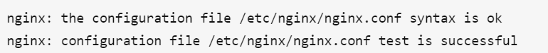
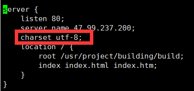

## 静态资源路径包含中文，部署时配置nginx后导致部分静态资源丢失

## 1. nginx配置文件默认编码设置为utf-8

查看配置文件位置

```sh
nginx -t
```




进入对应位置
```text
nginx.conf，这是一个主配置文件
conf.d，这是一个文件夹，里面包含着服务器的独立的配置文件
```

打开conf.d，里面有自定义的配置文件，这里是 builder.conf

默认编码设置为utf-8



## 2.将非UTF-8的文件名转换为UTF-8编码

安装convmv

```sh
yum install convmv -y
convmv -f GBK -t UTF8 -r --notest 目标路径
```

其中-f是源编码，-t是目标编码，-r是递归处理目录，--notest是不移动，实际上对文件进行改名。

重新加载下nginx

```sh
nginx -s reload
systemctl stop nginx
systemctl start nginx
```


